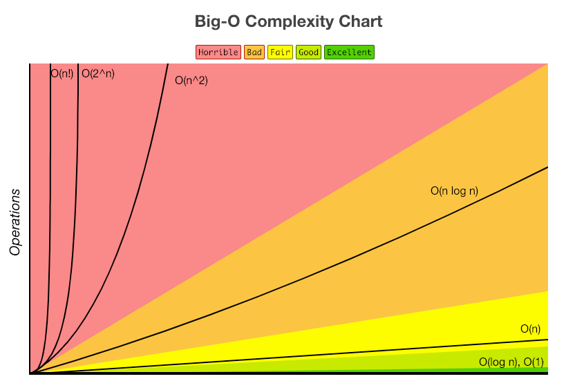

# big-O (시간과 공간 개념)

알고리즘의 효율성을 나타내는 지표로서 알고리즘의 시간 복잡도와 공간 복잡도에 사용하며, **불필요한 연산들을 제거하고 알고리즘 분석을 쉽게 할 목적으로 사용**한다.

### 알고리즘이란

어떠한 문제를 풀어내기 위해 정해진 일련의 절차나 방법을 공식화한 형태로 표현한 것, 계산을 실행하기 위한 단계적 절차

→ 문제 풀이에 필요한 계산 절차 또는 처리 과정의 순서 

### 점근 표기법이란

어떤 함수의 증가 양상을 다른 함수와의 비교로 표현하는 수론과 해석학의 방법, **알고리즘의 복잡도를 단순화**할 때나 무한 급수의 뒷부분을 간소화할 때 쓰인다.

- 시간 복잡도
    - 입력된 N의 크기에 따라 실행되는 조작의 수
    - 실행 시간을 예측, 실행 시간은 연산에 비례해 길어진다.
- 공간 복잡도:
    - 알고리즘이 실행될 때 사용하는 메모리의 양
    - 메모리 공간을 효율적으로 사용(정적 배열이나 해시 테이블처럼 미리 공간을 확보하는 자료구조 )

< 점근 표기법의 세가지 방법 >

- 최상 : 오메가 표기법 (Big-Ω Notation)
- 평균 : 세타 표기법 (Big-θ Notation)
- 최악 : 빅오 표기법 (Big-O Notation)

→ **대문자 O 표기법**이 가장 많이 쓰인다.

### Big-O 표기법

- 가장 높은 차수만 남긴다.

```markdown
O(n² + n) -> O(n²)
```

- 계수 및 상수는 버린다.

```markdown
O(2n + 3) -> O(n)
```



- O(1)
    - Constant, 상수 시간
    - 입력 데이터의 크기에 상관없이 언제나 일정한 시간이 걸리는 알고리즘
    - 한 단계만 처리
- O(log₂ n)
    - Logarithmic, 로그 시간
    - 입력 데이터의 크기가 커질수록 처리 시간이 로그만큼 짧아지는 알고리즘
    - 필요한 단계들이 연산마다 특정 요인에 의해 줄어든다.
- O(n)
    - Linear, 직선적 시간
    - 입력 데이터의 크기에 비례해 처리 시간이 증가하는 알고리즘
    - 입력 n만큼의 단계가 필요하다.
- O(n log₂ n))
    - Linear-Logarithmic,
    - 데이터가 많아질수록 처리 시간이 로그의 배만큼 더 늘어나는 알고리즘
    - 필요한 단계의 수가 n 번에 그 하나의 n번 당 필요한 단계들이 연산마다 특정 요인에 의해 줄어든다.
- O(n²)
    - Quadratic,
    - 데이터가 많아질수록 처리 시간이 기하급수적으로 늘어나는 알고리즘
    - 입력 n의 제곱 만큼의 단계가 필요하다. (이중 루프)
- O(2ⁿ)
    - Exponential
    - 데이터가 많아질수록 처리 시간이 기하급수적으로 늘어나는 알고리즘
    - 주어진 상수값 C의 n 제곱의 단계가 필요하다. (피보나치 수열)


---
참고 및 출처

[알고리즘의 기초 Big-O Notation과 복잡도(Complexity) — 평범한 이야기 (tistory.com)](https://pstudio411.tistory.com/entry/Big-O%EC%99%80-%EB%B3%B5%EC%9E%A1%EB%8F%84Complexity)

[알고리즘 - 위키백과, 우리 모두의 백과사전 (wikipedia.org)](https://ko.wikipedia.org/wiki/%EC%95%8C%EA%B3%A0%EB%A6%AC%EC%A6%98)

[빅-오 표기법(Big-O Notation) & 시간, 공간복잡도(Time, Space Complexity) (velog.io)](https://velog.io/@gillog/%EC%8B%9C%EA%B0%84%EB%B3%B5%EC%9E%A1%EB%8F%84)

[빅오 표기법과 시간 복잡도 계산, 그리고 알고리즘 개선하기 (Big-O notation, time complexity, and algorithm) (velog.io)](https://velog.io/@raram2/big-o-notation-and-time-complexity)

[Big-O 알고리즘이란? (tistory.com)](https://gaaaabal.tistory.com/m/68)

[점근 표기법 - 위키백과, 우리 모두의 백과사전 (wikipedia.org)](https://ko.wikipedia.org/wiki/%EC%A0%90%EA%B7%BC_%ED%91%9C%EA%B8%B0%EB%B2%95)
