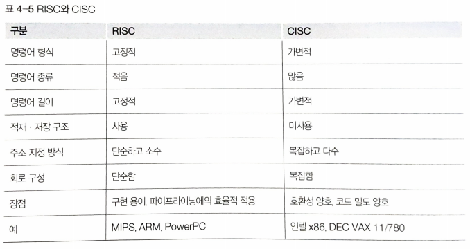

CISC & RISC
===========

#### 하드웨어가 이해할 수 있는 어휘를 의미하는 명령어 집합은 복잡도에 따라 CISC 구조와 RISC구조로 나뉜다.

### CISC(Complex Instruction Set Computer)
- 복합 명령어 집합 구조는 강력한 모델의 명령어 집합 구조이다.
- __하나의 명령어 실행으로 가능한 많고 복잡한 프로세스들을 수행한다.__
- __CPU가 처리할 수 있는 명령어를 모두 내장한다.__
- MCU의 성능을 향상시키기 위해 이용한다.
- MCU의 전반적인 효율성이 가능한 한 많은 복합 프로세스들을 하나의 명령어 안에 집어넣는 방식
 > MCU는 Microcontroller Unit의 약자로 마이크로프로세서와 입출력 모듈을 하나의 칩으로  만들어 정해진 기능을 수행하는 컴퓨터이다.
 > 임베디드 애플리케이션을 위해 디자인되었고 자동적으로 제품이나 장치를 컨트롤하는데 사용된다.

#### <CISC 특성>
- 명령어의 포맷이나 길이에 관한 규칙이 없음
  - 높은 코드 밀도와 강력한 명령어 추구하려면 __가변 명령어 형식__ 을 사용할 수 밖에 없다.
  - 이 형식은 많은 종류의 주소지정 방식을 동반하고, 연산 부호를 해독할 때까지 명령어의 길이를 알 수 없다.
  - 각각의 명령어가 프로세싱 성능을 극대화하도록 설계되었기에 명령어의 길이가 고정되어 있지 않다.
- MICRO-ROM 방식의 명령어 디코딩
- __하나 이상의 클럭 주기로 하나의 명령어 실행__

### RISC(Reduced Instruction Set Computer)
- 축약 명령어 집합 구조는 소수의 명령어를 사용한다.
- __하나의 명령어 실행으로 간단한 프로세스들을 매우 신속하게 수행한다.__ 
- MCU의 전반적인 성능 향상시킨다.
- __파이프라인을 사용__ 해 프로세서들은 파이프라인 내에서 여러 단계로 나눠진 다음 병렬 프로세싱으로 조금씩 수행된다.
> CISC 구조의 복잡한 명령어와 주소 지정방식의 사용 빈도가 매우 낮고, 복잡한 연산은 cpu 설계에 영향을 미친다.
> 복잡하고 강력한 명령어 집합은 간단한 명령어를 포함한 모든 명령어의 해석과 실행 시간을 증가시킨다.
> 이에 따라 더욱 효율적인 방법을 개발해는데 그것이 RISC이다.

#### <RISC 특성>
- __고정길이 명령어__
  - 신속한 프로세싱을 위해  고정길이 명령어를 사용, __클럭 주기당 하나의 명령어 실행__
- 랜덤 로직 방식의 명령어 디코딩
- 단일 클럭 프로세싱
- 파이프라인 프로세싱

