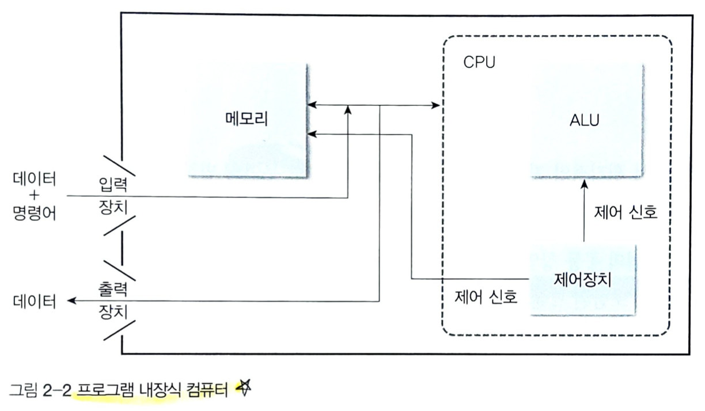
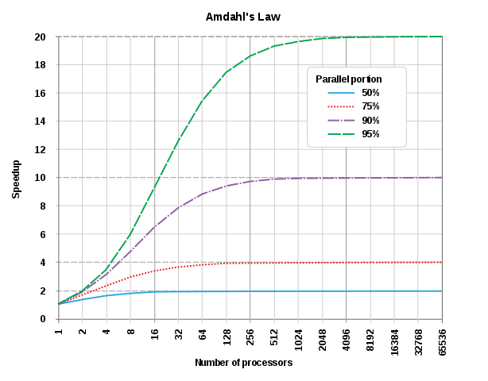
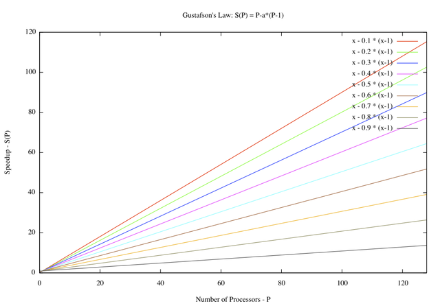

컴퓨터의 발전과 성능
===============

컴퓨터의 세대별 발전
-------------

- 0세대 컴퓨터 
    - 기계적 릴레이와 금속기어등을 사용
- 1세대 컴퓨터 
    - __진공관__ 을 소자로 사용한 컴퓨터, 자기드럼을 기억장치로 사용하고,보조기억장치로 종이테이프나 종이카드 사용
    - 부피가 커서 큰 공간을 차지, 고장이 잦고 수명이 짧음, 많은 전력 소모로 열이 많이 발생하여 냉각장치를 위한 큰 공간도 필요했음
    - 소프트웨어보다 하드웨어 개발에 중점을 두었고 sw 개발은 기계어나 어셈블리어를 사용
    - 과학 기술 계산이나 통계 자료 분류등에 사용
- 2세대 컴퓨터 
    - diode나 __트랜지스터__(transistor)와 같은 반도체 소자를 사용한 컴퓨터, 가지코어를 기억장치로 사용하고, 보조기억장치로 자기드럼, 자기테이프, 자기디스크를 사용
    - 고급언어(FORTRAN, COBOL, ALGOL) 사용, 컴파일러, 운영체제와 같은 시스템 소프트웨어 개념 도입
    - 과학 기술 분야뿐만 아니라 일반 사무, 생산 관리등에도 사용
- 3세대 컴퓨터
    - __집적회로__(SSI: Small Scaled IC, MSI: Mediun Scaled IC)를 사용한 컴퓨터, 기억장치로도 집적회로 사용하여 용량이 커지고 보조기억장치로 자기디스크와 자기테이프를 사용
    - 프린터 외에 비디오 장치르 출력장치로 사용하기 시작
    - PASCAL, LISP와 같은 구조화된 언어를 사용하고 sw의 비중이 점차 커짐, 가상기억장치와 시분할 개념을 도입한 운영체제 개발, 캐시 메모리 사용
    - 과학 기술, 일반 사무뿐만 아니라 경영 정보 처리등에도 사용
- 4세대 컴퓨터
    - 집적도가 크게 향상된 집적회로(LSI: Large Scalde IC, VLSI: Very Large Scaled IC)를 사용한 컴퓨터, RAM(Random Access Memory)를 기억장치로 사용, 보조기억장치로 자기디스크와 광디스크를 사용, 입력장치로 마우스와 스캐너 사용, 출력장치로 비디오와 오디오 장치를 사용
    - C, Javam, 객체지향 언어나 시각언어를 사용하고 네트워크 기술이 발전항 클라이언트/서버 시스켐이 보편화되고 병렬 처리 기능 강화
    - 지식 정보 처리, 인공지능(Artifiacial Intelligence), 로봇등의 분양에 사용
- 5세대 컴퓨터
    - 극초대규모 집적회로(ULSI: Ultra Large Scaled IC), 시스템으 하나의 칩에 집적한 단일 칩 시스템(SoC: System on a Chip)을 사용, 비노이만(non-Neumann)형 추구
    - 음성 입력 마우스와 터치스크린을 입력장치로 사용, 그래픽과 오디오 장치를 출력장칠 사용
    - 수만개의 마이크로프로세서를 연결하여 고속 연산을 할 수 있는 초병렬 컴퓨터, 웨어러블•바이오 컴퓨터와 같은 유비쿼터스 환경의 컴퓨터 등이 5세대 컴퓨터이다.

### 폰노이만 아키텍쳐
- 프로그램을 저장하고 변경할 수 있는 프로그램 내장식 컴퓨터
- 프로그램 자체와 프로그램에서 사용하는 데이터를 동일한 형태로 메모리 저장할 수 있는 구조, 따라서 새로운 프로그램을 만들 수 있고 기존 프로그램을 수정할 수 있음
> von Neumann architecture, princeton architecture이라고도 함
- 프로그램만 변경하면 데이터를 다양한 방식으로 처리할 수 있는 현대 범용 컴퓨터 개념의 시초, 컴퓨터 프로그램, 소프트웨의 개념을 만들었음
- 기능적으로 명령어를 해석하고 데이터를 처리하느 __CPU__, 명령어와 데이터를 저장하느 __메모리__, __입출력장치__ 로 구성됨
    - CPU: 명령어를 해석하고 실행하는 제어장치, 제어 신홍 따라 데이터를 다양한 형태로 연산하는 산술논리장치 등으로 구성됨
    - 메모리
    > __특성__
    > 0, 1, 2, •••, n-1과 같은 순차적인 주소를 가진 워드로 구성됨
    > 명령어와 데이터르 구분 없이 저장함, 명령어가 데이터와 동일한 방법으로 조작될 수 있음
    > 메모리에 저장된 워드는 인출될 때 컴퓨터의 상태에 따라 명령어나 데이터로 해석됨
    - CPU와 메모리 사이의 연결 부분 = 폰노이만 병목: cpu와 메모리 사이에 발생하는 트래픽이 성능에 큰 영향을 미쳐서 지연 현상이 발생하기 때문

### 컴퓨터의 성능
- 컴퓨터의 속도나 효율성
- 개인 사용자는 시스템의 응답 시간(response time)이나 작업 수행 시간에 민감하지만 운영자는 주어진 시간에 시스템이 처리하는 작업량을 나타내는 처리율(throughput)이나 대역폭(bandwidth)에 관심을 가진다.
- 프로그램 응답 시간: 하나의 프로그램을 처리하는 데 소요되는 시간
- 프로그램의 CPU 실행 시간: 프로그램을 수행하는 데 순수하게 사용된 시간, 입출력이나 다르 프로그램의 실행 시간이 포함되지 않음(하나의 프로세서가 다수의 프로그램을 병행적으로 수행하는 시분할일 경우 다른 프로그램의 실행 시간과 운영체제에 대한 부담과 같은 불필요한 시간도 포함될 수 있다)
- 성능 = 1/CPU 실행 시간

### 암달의 법칙
- 시스템의 일부분을 개선하는 경우 전체 시스템에서 얻을 수 있는 최대 성능 향상을 구할 때 사용
- 주로 병렬화에 의한 시스템 성능 향상의 한계를 지적하는 데 사용됨, 시스템 병렬화와 같은 방법으로 도모한 성능 향상은 시스템의 순차적 부분에 필요한 시간에 의해 제한됨
- 시스템의 일부 기능을 아무리 향상하더라도 성능 향상이 되지 않은 부분에 의해 전체 시스템의 성능이 제한됨
> 일부 개선 시 영향을 받는 부분 f, 성능 향상 크기 n
> 시스템 전체 속도 향상 = 1/((f/n)+(1-f))
> 해당 속도 향상 이상으로 올릴 수 없다.

### 구스타프슨의 법칙(Gustafson's Law)
- 대용량 데이터 처리는 효과적으로 병렬화할 수 있다는 법칙
- 성능 향상 S, 프로세서으 수 P, 어떤 병렬 프로세스에서 병렬화되지 않는 순차적인 부분의 비 a
- S(P) = P - a * (P-1)
- S(P)는 단일 프로세스의 총 실행 시간 대비 프로세스당 병렬 처리 시간의 비율이다.
- 암달의 반대되는 개념, 단일 프로세스 실행 시간이 고정되었다고 생각하여 단축된 단일 프로세스당 실행시간과 비교하는 암달의 법칙과는 반대이다. 암달은문제 크기가 고정되었다는 가정에 설립된 법칙
- 그 반해 구스타프의 법칙은 처리 어려운 대용량 문제를 처리 가능하 문제 크기로 정하거나 가공하여 주어진 동일 시간안에 풀 수 있도록 바꿈

