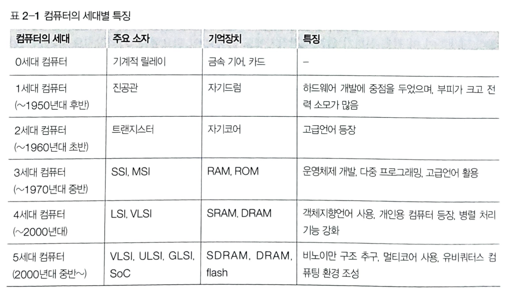

컴퓨터의 발전과 성능
===============

컴퓨터의 세대별 발전
-------------

- 0세대 컴퓨터 
    - 기계적 릴레이와 금속기어등을 사용
- 1세대 컴퓨터 
    - __진공관__을 소자로 사용한 컴퓨터, 자기드럼을 기억장치로 사용하고,보조기억장치로 종이테이프나 종이카드 사용
    - 부피가 커서 큰 공간을 차지, 고장이 잦고 수명이 짧음, 많은 전력 소모로 열이 많이 발생하여 냉각장치를 위한 큰 공간도 필요했음
    - 소프트웨어보다 하드웨어 개발에 중점을 두었고 sw 개발은 기계어나 어셈블리어를 사용
    - 과학 기술 계산이나 통계 자료 분류등에 사용
- 2세대 컴퓨터 
    - diode나 __트랜지스터__(transistor)와 같은 반도체 소자를 사용한 컴퓨터, 가지코어를 기억장치로 사용하고, 보조기억장치로 자기드럼, 자기테이프, 자기디스크를 사용
    - 고급언어(FORTRAN, COBOL, ALGOL) 사용, 컴파일러, 운영체제와 같은 시스템 소프트웨어 개념 도입
    - 과학 기술 분야뿐만 아니라 이반 사무, 생산 관리등에도 사용
- 3세대 컴퓨터
    - __집적회로__(Small Scaled IC, Mediun Scaled IC)를 사용한 컴퓨터, 기억장치로도 집적회로 사용하여 용량이 커지고 보조기억장치로 자기디스크와 자기테이프를 사용
    - 프린터 외에 비디오 장치르 출력장치로 사용하기 시작
    - PASCAL, LISP와 같은 구조화된 언어를 사용하고 sw의 비중이 점차 커짐, 가상기억장치와 시분할 개념을 도입한 운영체제 개발, 캐시 메모리 사용
    - 과학 기술, 일반 사무뿐만 아니라 경영 정보 처리등에도 사용
- 4세대 컴퓨터
    - 집적도가 크게 향상된 집적회로(Large Scalde IC, Very Large Scaled IC)를 사용한 컴퓨터, RAM(Random Access Memory)를 기억장치로 사용, 보조기억장치로 자기디스크와 광디스크를 사용, 입력장치로 마우스와 스캐너 사용, 출력장치로 비디오와 오디오 장치를 사용
    - C, Javam, 객체지향 언어나 시각언어를 사용하고 네트워크 기술이 발전항 클라이언트/서버 시스켐이 보편화되고 병렬 처리 기능 강화
    - 지식 정보 처리, 인공지능(Artifiacial Intelligence), 로봇등의 분양에 사용
- 5세대 컴퓨터
    - 

