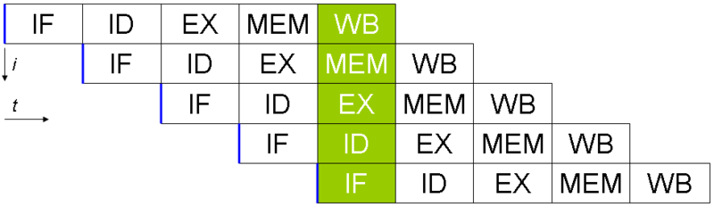

Pipeline
========

### 파이프라인(pipeline)
- 컴퓨터 시스템에서 데이터 경로를 여러 단계로 분할하여 명령어가 수행할 작업을 병행 처리하는 것
- 명령어를 중첩적으로 수행함
- 파이프(Pipe) : 분할된 시스템의 각 파이프라인 단계
- 파이프라인의 깊이(depth) : 파이프의 수

#### 파이프라인의 성능
- 명령어 처리량을 증대시켜 성능을 향상시킴
- 프로세서가 산술 연상을 수행하는 동안 다음 명령어를 가져오고, 그것을 다음 명령어 연산이 수행될 때까지 프로세서 근처의 버퍼에 가져다둠
- 명령어의 종류, 파이프라인의 깊이와 같은 다양한 요소의 영향을 받기 때문에 파이프라인의 깊이만큼 반드시 성능이 향상되지는 않음

**파이프라인의 성능 향상 조건**
1. 처리할 데이터가 충분해야 한다.
2. **파이프의 크기가 거의 균등해야 한다.(= 파이프라인의 각 단계를 균등하게 분할해야 한다.)**
3. 명령어나 데이터 사이의 의존성이 없어야 한다.
4. 하나의 파이프에서 이웃한 파이프로 이동할 때 동기화되어야 한다.

#### 파이프라인의 구성(MIPS 파이프라인 5단계)
1. IF(Instruction Fetch) : 명령어 인출 단계
2. ID(Instruction Decode) : 명령어 해독 및 레지스터 읽기 단계 (동시에 일어남)
3. EX(Execution) : ALU 연산 단계, 실행 및 주소 계산 단계
4. MEM(Memory) : 메모리 접근 단계
5. WB(Write Back) : 레지스터 쓰기 단계

#### MIPS란
- RISC의 구조를 이용한 프로세서
- Microprocessor without Interlocked Pipeline Stages
- 파이프라인을 위한 명령어집합 설계 특징
  -  MIPS 명령어는 같은 길이를 갖는다
  -  MIPS는 몇 가지 안 되는 명령어 형식을 가지고 있다 -> 명령어 디코딩 시간이 일정하다
  -  MIPS에서는 메모리 접근이 적재(load)와 저장(store) 명령을 통해서만 수행된다
  -  피연산자는 메모리에 정렬되어 있다 -> 하나의 데이터 전송 명령어가 메모리에 두 번 접근할 필요없다.

#### Pipeline Architechture 종류
1. Super Scalar - 여러개의 파이프라인으로 병렬적으로 명령어를 실행
2. Super Pipeline - 파이프라인의 단계들을 더욱 작게 분할하여 처리시간 차이를 최소화
3. Superpipelined, Superscalar - 슈퍼파이프라인을 베이스로 하고 슈퍼스칼라를 수행
4. VLIW (Very Long Instruction Word) - 몇 개의 명령을 하나로 묶어 매우 긴 명령어 형식, RISC 방식의 복잡한 하드웨어 설계 문제를 해결하기 위함
