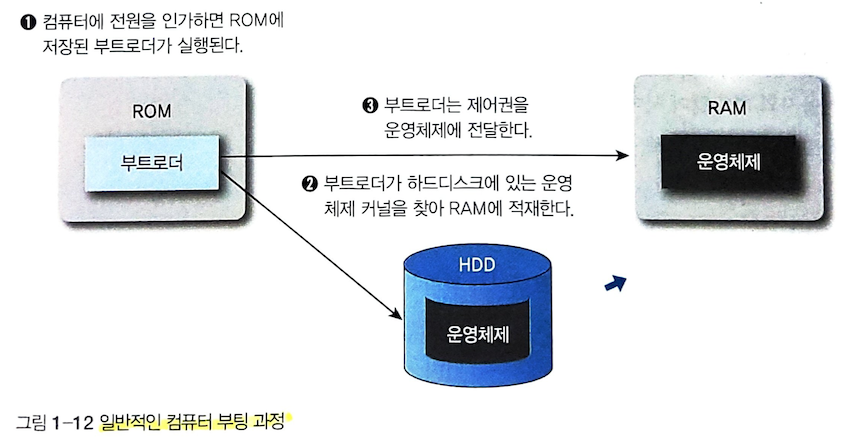

[Computer Architecture]
=======================
OS & Booting
---------------
#### 1. 운영체제
- 하드웨어 자원을 효율적으로 관리하고, 응용 프로그램의 공통된 서비스를 제공하는 소프트웨어의 모음
  - 컴퓨터 시스템으 하드웨어 자원 관리
  - 사용자와 하드웨어 사이의 인터페이스 역할
  - 하드웨어의 고장 탐색, 오류 처리, 보안 유지

#### 2. 부팅 (= bootstrap, Initial Program Load)
- 운영체제가 컴퓨터 하드웨어를 관리하고 응용 소프트웨어를 실행할 수 있도록 컴퓨터에 시동을 거는 것
- 보조기억장치에 저장된 운영체제를 메인 메모리에 불러들이는 과정

##### 부트로더(bootloader)와 ROM
> 모든 소프트웨어는 하드웨어에서 동작하기 위해 메인 메모리인 RAM에 적재되어야 한다. cpu는 RAM에 적재된 프로그램만 실행할 수 있기 때문인다. 
> 하지만 RAM은 휘발성 기억장치이므로 컴퓨터 전원을 새로 킬때 운영체제를 실행할 수 없다.

- __ROM__: 메인 메모리로 사용되는 RAM처럼 CPU가 프로그램을 수행할 수 있는 기억 공간, 저장된 내용을 수정할 수 없으며, 전원 제고 여부와 상관없는 비휘발성 메모리이다.
- __부트로더__: 보조기억장치에 저장된 운영체제를 메인 메모리에 단계적으로 적재하는 소규모 프로그램, ROM에 저장된 고정 프로그램으로 펌웨어에 속함. ROM에 저장되어 있는 부트로더는 운영체제의 위치를 알기 때문에 운영체제를 RAM에 적재할 수 있다.

