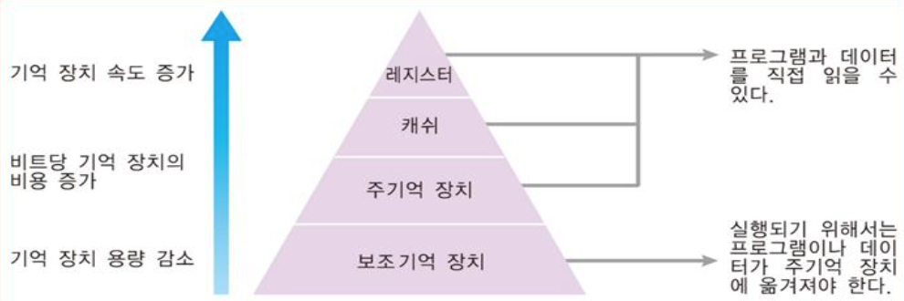
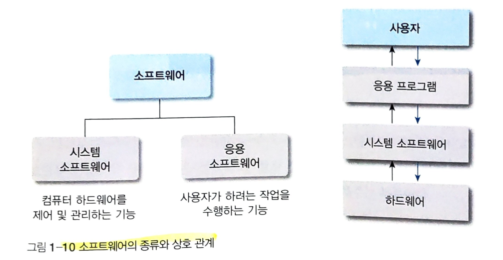

[Computer Architecture]
=======================
Computer System
---------------
#### 1. 개념적 구성
> 하드웨어와 소프트웨어로 2가지로 구성됨
> 
> 펌웨어(firmware) : 하드웨어에서 분리하여 3가지로도 나타냄, 하드웨어를 제어하기 위한 필수적인 프로그램을 하드웨어로 만든 것으로 하드웨어와 소프트웨어의 중간, 고정도가 높은 기본적인 제어 프로그램으로 효율을 높이기 위해 ROM(Read Only Memory)에 내장됨
#### 2. 4대 기능
- __입력__: 입력장치를 통해 컴퓨터 외부 세계에서 내부로 정보를 받아들이는 기능
- __처리__: 입력된 정보를 중앙처리장치를 통해 산술, 논리 연산을 수행하여 정보를 변화하거나 가공하는 기능
- __저장(보관)__: 입력된 정보나 처리된 정보를 저장장칭 저장하는 기능 
- __출력__: 입력, 처리, 저장된 정보를 출력장치를 통해 컴퓨터 내부 세계에서 외부로 내보내는 기능
#### 3. 비트, 바이트, 워드
- __비트(bit)__: 정보를 구성하는 최소 단위, 0과 1의 두 가지 상태만을 나타냄 (기호를 비트로 조합)
- __바이트(byte)__: 정보 표현의 기본 단위, 8개의 비트를 나타냄 (기호 표현)
- __워드(word)__: 중앙처리장치(CPU)에서 한 번에 처리할 수 있는 비트의 집합, 바이트보다 큰 정보 처리 단위,컴퓨터에 따라 워드를 구성하는 단위가 다름(32bit 컴퓨터 = 4byte, 64bit 컴퓨터 = 8byte)
> 비트와 달리 바이트와 워드는 의미를 가진 정보이다

Computer Hardware
-----------------
#### 1. 중앙처리장치(Central Processing Unit)
> 컴퓨터 시스템에 부착된 모든 장치의 동작을 제어하고 명령을 실행하는 장치(microprocessor)
- 제어장치(명령어장치): 메인 메모리로부터 적절한 순서로 명령어르 인출 및 해독하여 컴퓨터 시스템에 연결되 장치에 __제어 신호를 보냄__
- 연산장치(실행장치, 산술논리장치(ALU: Arithmetic & Logic Unit)): 제어장치가 지시하는 순서에 따라 데이터를 실행하기 위해 CPU 내부에서 __데이터를 처리하는 장치__
- 레지스터: 데이터를 처리하는 동안 사용하 값이나 연산의 중가 결과를 일시적으로 기억하는 __고속 기억장치__
- CPU 내부 버스: CPU 내부 구성 요소(제어장치, 연산장치, 레지스터)를 연결하는 배선(wire)의 집합

#### 2. 기억장치
- 컴퓨터 시스템에 의해 처리될 프로그래뫄 데이터를 저장하기 위한 장치
- 계층적 기억장치: CPU 내부의 기억장치인 레지스터, 캐시 메모리(cache memory), 메인 메모리, 보조 기억장치로 구분된다. 
               CPU에 가까운 기억장치는 고속, 고가, 소용량, 먼 기억장치는 저속, 저가, 대용량이다.
               기억 장치의 계층 구조는 기억 장치를 효율적으로 배치하여 CPU의 처리 속도와 I/O 속도의 차이를 해소하기 위한 전략이다.
> 메인 메모리(DRAM: Dynammic Random Access memory): CPU에서 즉각적으로 수행할 프로그램과 필요한 데이터를 기억하기 위한 장치

             
#### 3. 주변장치
> 입력 장치, 출력 장치, 저장 장치

#### 4. 기타 하드웨어
- bus: 컴퓨터 시스템의 구성 요소들이 유기적으로 연결되도록 각 기능장치들을 연결하는 배선의 집합. 컴퓨터 시스템의 구성 요소는 버스를 통해 서로 각종 신호를 전달 교환함
- [System Bus]
  - 데이터 버스: 각 장치들 사이에 데이터를 전송하는 배선의 집합, 해당 배선의 수는 CPU가 한 번에 전송하 수 있는 비트 수이다.
  - 주소 버스: CPU가 시스템 구성 요소를 식별하기 위한 주소 정보를 전송하는 배선의 집합, 해당 배선의 수는 CPU와 접속할 수 있는 최대 메모리의 용량이다.
  - 제어 버스: CPU가 시스템 구성 요소의 동작을 제어하는데 사용되는 배선의 집합, 연산장치의 연산 종류 및 메인 메모리의 읽기, 쓰기 동작이 결정됨
- [main board]
  - 컴퓨터의 실행 환경을 설정하고, 설정 정보를 유지해주고, 컴퓨터가 안정적으로 구동되게 해주며, 모든 장치의 데이터 입출력 교환을 원활하게 해주는 부분
  - 기능 장치 사이의 호환성이나 확장의 범위를 결정하고 시스템 전반의 안정적인 동작 여부를 좌우한다.
    - MCH(Memory Controller Hub): Northbridge는 메모리 컨트롤러를 포함하며 주로 고속 장치(RAM, ROM, 그래픽 카드)를 구동한다.
    - ICH(I/O Cintroller Hub): Southbridge는 I/O 컨트롤러를 포함하며 주로 저속 장치를 구동한다.
    - 두 가지 칩셋을 탑재, 주변 장치의 클락 속도를 따라가지 못하여 CPU에서 분리됨

Computer Software
-----------------
#### [Software]
- 명령(command)의 집합으로 구성되 컴퓨터 프로그램 및 그와 관련된 문서를 총칭하는 개념. 데이터의 이동 방향과 데이터 처리의 종류를 지정하며, 또한 이와 같은 이벤트가 발생하는 시간을 지정하는 명령의 집합 
- 소프트웨어의 품질은 컴퓨터 하드웨어의 사용 효율과 사용 환경을 결정한다.

#### 1. 시스템 소프트웨어
- 하드웨어의 기능을 실행하기 위해 필수적인 작업(명령어 해석, 하드디스크에 데이터 저장, 주변장치와의 통신)을 하거나 응용 소프트웨어의 실행을 지원하는 소프트웨어
  - 운영체제: 컴퓨터 자원을 관리하고 응용 프로그램의 실행 환경을 제공하는 소프트웨어
  - 장치 드라이버: 컴퓨터에 온라인을 연결된 주변 기기를 제어하는 운영체제 모듈
  - 컴파일러와 인터프리터: 고급언어로 작성된 원시 프로그램(source program)을 컴퓨터가 이해하는 저급 언어로 변환하는 소프트웨어로서 일종의 번역기
  - 링커: 다수로 분할하여 작성된 프로그램 의 생성된 목적 프로그램(object program) 또는 라이브러리 루틴을 결합하 실행 가능한 하나의 프로그램으로 연결하는 소프트웨어
  - 로더: 저장장치에 보관된 프로그램을 읽어 메인 메모링 적재한 후 실행 가능한 상태로 만드는 소프트웨어

#### 2. 응용 소프트웨어
- 컴퓨터 시스템을 특정 분야에 사용하기 위해 제작된 소프트웨어. 직접 사용하는 최상위 계층의 소프트웨어
