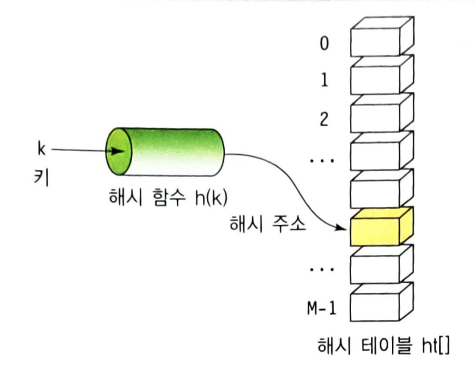
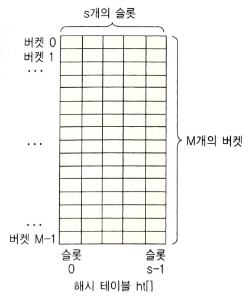
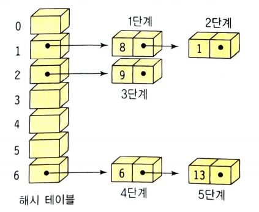

Hashing
=======

### 해싱(Hashing)
- 해시 테이블을 이용한 탐색 방법
- 배열을 사용하여 데이터를 저장하기에 검색 속도가 빠르다
- 탐색키의 비교가 아닌 탐색키에 수식을 적용시켜서 바로 탐색 키가 저장된 위치를 얻는다.
  - 사전과 같은 자료구조를 구현할 때 최상의 방법이다.
  - 사전 구조(dictionary) 추상 자료형은 탐색 키에 의해서만 관리된다.(=map, table)
  - 탐색키, 탐색키 관련 값으로 구성된 2가지 종류의 필드(search key, value)를 가진다.

### 해시 테이블(Hash tables / Hash map)
- (Key, Value)로 데이터를 저장하는 자료구조
- 대량의 정보를 저장하고 특정 요소를 효율적으로 검색할 수 있다.
- key 저장 시 데모리 공간을 더 사용하도록, 다양한 길이를 가진 key를 일정한 길이의 hash로 바꾸어 저장소 사용이 효율적이다.
- 각각의 키값에 해시 함수를 적용해 해시를 생성한다.
- 생성된 해시를 활용해 값을 저장하거나 검색한다.
- 배열이 저장되는 곳은 저장소(bucket, slot)이다.

  - 키 Key : 다양한 길이의 고유한 값, 해시 함수의 input
  - 해시 함수 Hash Function : key를 hash로 바꿔주는 함수
  - 해시 Hash : hash function의 결과물, bucket, slot에 value와 매칭되어 저장
  - 값 Value : bucket, slot에 최종적으로 저장되는 값으로 키와 매칭되어 저장, 삭제, 검색, 접근이 가능

#### Key는 Hash Function을 통해 Hash로 변경되고, Hash는 Value와 매칭되어 저장소(Bucket, Slot)에 저장된다.

### 해싱의 특징
1. 이진 탐색 보다 탐색 속도가 빠르다.
2. 이진 탐색 보다 삽입, 삭제가 쉽다.
3. 동적 메모리 크기를 가진다.
4. 순서가 없다.

### 해시 함수
- 해싱의 [시간 복잡도](https://github.com/triflingness/CSnCT-Study/blob/main/Data%20Structure/%ED%83%90%EC%83%89%20%EB%B0%A9%EB%B2%95%20%EC%8B%9C%EA%B0%84%EB%B3%B5%EC%9E%A1%EB%8F%84.md)는 O(1)이다.
- 충돌이 적어야 한다.
- 해시 함수 값이 해시 테이블의 주소 영역내에 고르게 분포되어야한다.
- 계산이 빨라야 한다.

> 해싱 함수로 제산 함수, 폴딩 함수, 중간 제곱 합수, 비트 추출 방법, 숫자 분석 방법 등이 있다.

### 버켓(bucket)과 슬롯(slot)
- 하나의 버켓은 s개의 슬롯을 가질수 있으며, 하나의 슬롯에는 하나의 항목이 저장된다.
- 서로 다른 두 개의 키가 해시 함수에 의해 동일한 해시 주소로 변환될 수 있기에 여러개의 항목을 동일한 버켓에 저장할 수 있다.
- 하지만 대부분 하나의 버켓은 하나의 슬롯을 가진다.

> 여러 개의 서로 다른 탐색 키가 해시 함수에 의해 같은 해시 주소로 사상(mapping)되는 경우가 자주 발생한다. 
> 이 경우를 __충돌(collision)__ 이라하고, 해당 경우의 키를 __동의어(synonym)__ 라 한다.
> 충돌이 버켓에 할당된 슬롯 수 보다 많이 발생하게 되면 버켓에 더이상 항목을 저장할 수 없게 되는 __오버플로(overflow)__ 가 발생한다.

### 충돌(collision)
: 서로 다른 탐색 키를 갖는 항복들이 같은 해시 주소를 가지는 현상이다. 모든 값이 하나의 버켓에 집중될 때, 최악의 시간복잡도는 O(n)이다.
 
#### <해결책>
1. 충돌이 일어난 항목을 해시 테이블의 다른 위치에 저장 (선형 조사법)
    >  해당 방법은 탐색 시간이 많이 소요됨, 탐색 키들이 한번 충돌하기 시작하면 그 위치에 항목들이 집중되는 군집화와 이 요소들이 겹합하는 현상때문이다.
2. 해시 테이블이 하나의 위치가 여러 개의 항목을 저장할 수 있도록 해시 테이블의 구조를 변경 (__체이닝 chaining__)
  - __체이닝(chaining)__ 은 오버플로 문제를 각 버켓에 삽입과 삭제가 용이한 연결 리스트를 할당하여 해결한다.
  - 해시 주소가 같은 탐색 키들을 하나의 리스트로 묶어 저장한다.

***
Java의 HashMap(해시맵)과 HashTable(해시테이블) 차이: 동기화 보장 유무, 키와 값에 null 가능 여부 

동기화가 필요없다면 해시맵을, 동기화 보장이 필요하다면 해시테이블 사용  

출처: [해시테이블 vs 해시맵](https://12216715011126.tistory.com/53)

