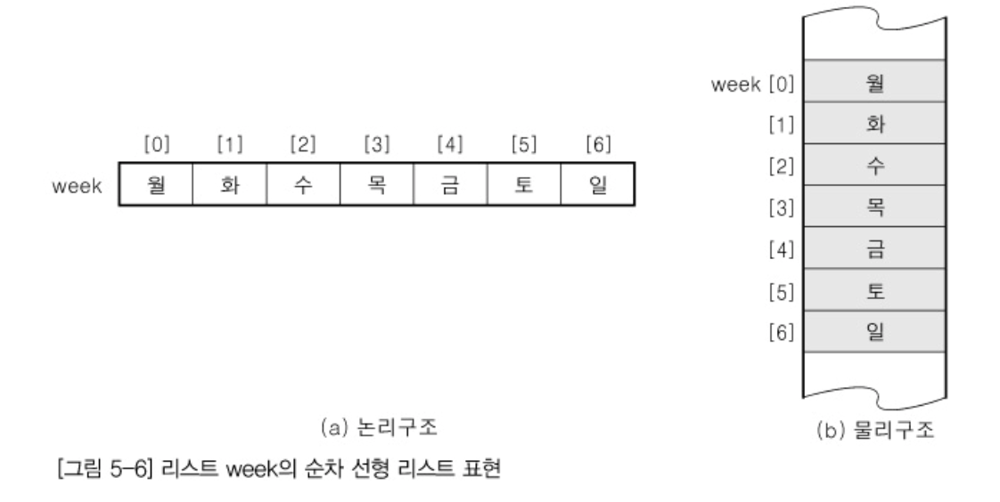
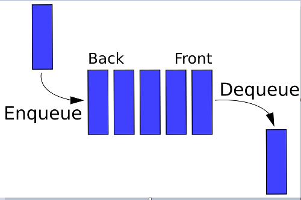

## Data Structure
   - 컴퓨터상 자료를 효율적으로 저장하기 위해 만들어진 논리적인 구조
   - 효율적인 알고리즘을 사용할 수 있게 하여 성능을 향상시킴
   - 선형 구조와 비선형 구조로 나뉨

### 자료 구조 이용
  - 정렬(Sort) : 기억장치 내의 자료를 일정한 순서에 의해 나열하는 것
  - 검색(Search) : 기억장치 내의 자료를 찾는 것
  - 파일 편성 : 자료를 기억 매체에 저장할 때의 파일 구조
  - 인덱스 : 파일에서 특정 자료를 빠르게 찾기 위한 색인표

### Linear List
  - 데이터를 연속적으로 연결한 자료구조 (리스트, 스택, 큐, 데크)
  - 배열과 같이 연속되는 기억 장소에 저장되는 리스트
  - 선형 리스트의 대표적인 구조로 배열(Array)가 있음
  - 가장 간편한 자료 구조, 접근 구조가 빠름
  - 자료의 삽입, 삭제 시 기존 자료의 이동이 필요하기에 작업이 번거로움
  - 자료의 개수가 n 개 일때, 삽입 시 평균 이동 횟수 `(n+1)/2`, 삭제 시 평균 이동 횟수 `(n-1)/2`

  <!--[선형 겁색_파이썬](https://velog.io/@keemun/1)
  [선형 검색_자바](https://hyeon424.tistory.com/entry/Java-검색의-개념-및-알고리즘-종류선형-검색)-->
  ```python
  class ArrayList(BaseList):
  def __init__(self):
      self.list = []
      self.count = 0

  def append(self, data):
      self.list.append(data)
      self.count += 1

  def search(self, data):
      return [index for index, stored in enumerate(self.list) if stored == data]

  def get(self, index):
      if 0 <= index < self.count:
          return self.list[index]
      else:
          raise IndexError

  def pop(self):
      val = self.list[self.count - 1]
      self.remove(self.count - 1)
      return val

  def remove(self, index):
      for _index in range(index, self.count - 1):
          self.list[_index] = self.list[_index + 1]

      del self.list[self.count - 1]
      self.count -= 1

  def display(self):
      for index in range(self.count):
          print(self.list[index])
  ```
  
  
### Stack
  - 한 방향으로만 자료를 넣고 꺼낼 수 있는 LIFO(Last-In First-Out)형식의 자료구조
  - 한 방향으로만 PUSH와 POP을 이용하여 자료를 넣고 꺼냄
  - Top은 스택에서 가장 위에 있는 데이터로, 스택 포인터(Stack Pointer)라고 함
  - PUSH 연산 : 데이터를 차례대로 스택에 넣는 연산
  - POP 연산 : 스택에서 가장 위에 있는 데이터를 하나씩 꺼내는 연산
   <!-- https://ooeunz.tistory.com/7 -->
   ```java
   import java.util.*;
   Stack<T> stack = new Stack<>();
   push() : 스택에 삽입
   pop() : 스택에서 가장 위에 있는 값 반환하고 없앰
   peek() : 스택에서 가장 위에 있는 값 반환
   isEmpty() : 스택이 비어있는지를 반환
   size() : 스택에 있는 요소의 크기 반환
   ```
   

### Queue
   - 한쪽 끝에서는 삽입 작업이 이뤄지고, 반대쪽 끝에서는 삭제 작업이 이루어지는 FIFO(First-In First_Out) 형식의 자료 구조
   - ENQUEUE 연산을 이용하여 데이터를 넣고, DEQUEUE 연산을 이용하여 데이터를 꺼낸다
   - 데이터를 꺼내는 쪽에서 가장 가까운 데이터를 Front라고 하고, 데이터를 넣는 쪽에서 가장 가까운 데이터를 Rear라고 함
   - ENQUEUE : 데이터를 차례대로 넣는 연산
   - DEQUEUE : 처음 저장된 데이터부터 하나씩 꺼내는 연산
   

```java
   import java.util.*;
   Queue<T> queue = new LinkedList<>();
   add() : 큐에 삽입
   peek() : 가장 먼저 큐에 들어간 요소 반환
   remove() : 가장 먼저 큐에 들어간 요소 삭제하면서 반환
   isEmpty() : 큐가 비어있는지 반환
   size() : 큐에 있는 요소의 크기 반환
```


### Deque(Double Ended Queue)
   - 큐의 양쪽 끝에서 삽입과 삭제를 할 수 있는 자료구조
   - 두 개의 포인터를 사용하여, 양쪽의 삭제/삽입이 가능.
   - 데크를 이용한 스택과 큐의 구현이 가능
   - PUSH : 데이터를 차례대로 데크에 넣는 연산
   - POP : 데크에서 Front와 Rear에 있는 데이터를 하나씩 꺼내는 연산
```java
   import java.util.*;
   Deque<T> deque = new LinkedList<>();
   addFirst() : 앞에 요소 삽입
   addLast() : 뒤에 요소 삽입
   peekFirst() : 앞 요소 반환
   peekLast() : 뒤 요소 반환
   pollFirst() : 앞 요소 없애면서 반환
   pollLast() : 뒤 요소 없애면서 반환
```


                     
  
