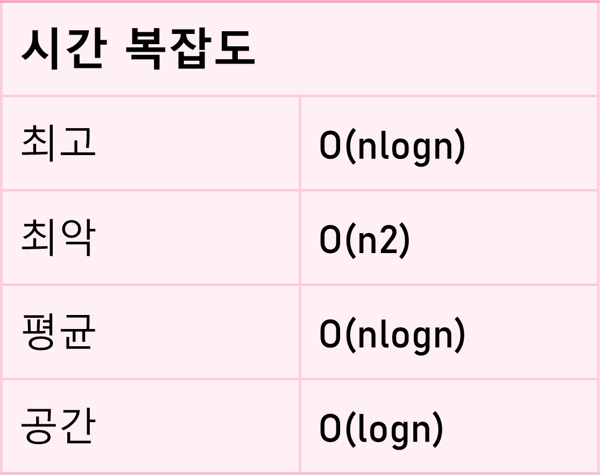

# Quick Sort(퀵 정렬)

Quick Sort는 ‘찰스 앤터니 리처드 호어’가 개발한 정렬 알고리즘이다. 분할 정복을 사용하는 재귀 알고리즘이다.

- 병합 정렬과의 다른 점
    
    병합 정렬은 분할 단계에서 아무 작업도 하지 않고, 결합 단계에서 중요 작업을 하지만, 퀵 정렬은 분할 단계에서 중요 작업을 한다.
    

- 분할 정복 방법
    
    문제를 작은 2개의 문제로 분리하고 각각을 해결한 다음, 결과를 모아서 원래의 문제를 해결하는 전략이다.
    

- 시간 복잡도
    
    n개의 데이터를 정렬할 때 평균적으로 **O(n log2 n)번의 비교**를 수행하기에 매우 빠른 수행을 한다. 최악의 경우에는 O(n2)번의 비교를 수행한다.
    
    
    

### 특징

- 대부분 순환 호출을 이용하여 구현한다.
- 평균적으로 **매우 빠른 속도**로 수행한다.
- 원소들 중 같은 값이 있는 경우 같은 값들의 정렬 이후 순서가 초기 순서와 달라질 수 있어 **불안정 정렬**에 속한다.
- 다른 원소와의 비교만으로 정렬을 수행하는 **비교 정렬**에 속한다.
- **배열을 비균등하게 분할**한다.

### 퀵 정렬 알고리즘 과정

1️⃣ **Pivot**(피벗) 고르기

- 리스트 중에서 하나의 원소를 고른다.(예시에서는 가장 오른쪽 원소를 피벗으로 선택한다.)

2️⃣ 배열 재정렬

- 피벗보다 작은 원소가 왼쪽에 배치되고 피벗보다 큰 원소는 오른쪽에 배치된다.
- 재배열 방법
1. 포인터는 피벗 원소에 고정된다. 첫 번째 인덱스로 시작하는 원소부터 비교된다.
2. 원소가 피벗 원소보다 크면 해당 원소에 대해 2 번째 포인터가 설정된다.
3. 다른 원소를 비교하다가 피벗보다 작은 원소가 나타나면 해당 원소와 2 번째 포인터가 가리키는 원소가 교체된다.
4. 다시, 다음 큰 원소를 2 번째 포인터로 설정하고, 다른 작은 원소와 바꾼다. 
5. 마지막 비교 원소까지 비교를 한 후 피벗 요소를 2 번째 포인터로 바꾼다.

3️⃣ 부분 배열 나누기

- 왼쪽 및 오른쪽 하위 배열에 대해 개별적으로 피벗 요소가 선택된다. 그리고 2 단계가 반복한다.
- 각 절반의 피벗 요소를 선택하고 재귀를 사용하여 올바른 위치에 놓는다.

→ 분할(Divide) : 입력 배열을 피벗을 기준으로 비균등하게 2개의 부분 배열로 분할한다.

→ 정복(Conquer) : 부분 배열을 정렬한다. 부분 배열의 크기가 충분히 작지 않으면 순환 호출을 이용하여 다시 분할 정복 방법을 적용한다.

→ 결합(Combine) : 정렬된 부분 배열들을 하나의 배열에 합병한다.

⇒ 순환 호출이 한 번 진행될 때마다 최소한 하나의 원소는 최종적으로 위치가 정해지므로, 이 알고리즘은 반드시 끝난다.

#### **pseudo code**

```basic
function quicksort(a, left, right)
      if right > left then
          select a pivot value a[pivotIndex]
          pivotNewIndex := partition(a, left, right, pivotIndex)
          quicksort(a, left, pivotNewIndex-1)
          quicksort(a, pivotNewIndex+1, right)
```

#### Python

```python
# Quick sort in Python

# function to find the partition position
def partition(array, low, high):

  # choose the rightmost element as pivot
  pivot = array[high]

  # pointer for greater element
  i = low - 1

  # traverse through all elements
  # compare each element with pivot
  for j in range(low, high):
    if array[j] <= pivot:
      # if element smaller than pivot is found
      # swap it with the greater element pointed by i
      i = i + 1

      # swapping element at i with element at j
      (array[i], array[j]) = (array[j], array[i])

  # swap the pivot element with the greater element specified by i
  (array[i + 1], array[high]) = (array[high], array[i + 1])

  # return the position from where partition is done
  return i + 1

# function to perform quicksort
def quickSort(array, low, high):
  if low < high:

    # find pivot element such that
    # element smaller than pivot are on the left
    # element greater than pivot are on the right
    pi = partition(array, low, high)

    # recursive call on the left of pivot
    quickSort(array, low, pi - 1)

    # recursive call on the right of pivot
    quickSort(array, pi + 1, high)

data = [8, 7, 2, 1, 0, 9, 6]
print("Unsorted Array")
print(data)

size = len(data)

quickSort(data, 0, size - 1)

print('Sorted Array in Ascending Order:')
print(data)
```

#### Java

```java
// Quick sort in Java

import java.util.Arrays;

class Quicksort {

  // method to find the partition position
  static int partition(int array[], int low, int high) {
    
    // choose the rightmost element as pivot
    int pivot = array[high];
    
    // pointer for greater element
    int i = (low - 1);

    // traverse through all elements
    // compare each element with pivot
    for (int j = low; j < high; j++) {
      if (array[j] <= pivot) {

        // if element smaller than pivot is found
        // swap it with the greatr element pointed by i
        i++;

        // swapping element at i with element at j
        int temp = array[i];
        array[i] = array[j];
        array[j] = temp;
      }

    }

    // swapt the pivot element with the greater element specified by i
    int temp = array[i + 1];
    array[i + 1] = array[high];
    array[high] = temp;

    // return the position from where partition is done
    return (i + 1);
  }

  static void quickSort(int array[], int low, int high) {
    if (low < high) {

      // find pivot element such that
      // elements smaller than pivot are on the left
      // elements greater than pivot are on the right
      int pi = partition(array, low, high);
      
      // recursive call on the left of pivot
      quickSort(array, low, pi - 1);

      // recursive call on the right of pivot
      quickSort(array, pi + 1, high);
    }
  }
}

// Main class
class Main {
  public static void main(String args[]) {

    int[] data = { 8, 7, 2, 1, 0, 9, 6 };
    System.out.println("Unsorted Array");
    System.out.println(Arrays.toString(data));

    int size = data.length;

    // call quicksort() on array data
    Quicksort.quickSort(data, 0, size - 1);

    System.out.println("Sorted Array in Ascending Order: ");
    System.out.println(Arrays.toString(data));
  }
}
```

### 장단점

- 다른 정렬 알고리즘과 비교했을 때 가장 빠르다.
- 정렬하려는 배열 안에서 교환하는 방식이므로, 다른 메모리 공간을 필요로 하지 않는다.

- 불안정 정렬이다.
- 정렬된 배열에서는 수행 시간이 더 많이 걸린다.

---

출처 및 참고

[퀵 정렬 - 위키백과, 우리 모두의 백과사전 (wikipedia.org)](https://ko.wikipedia.org/wiki/%ED%80%B5_%EC%A0%95%EB%A0%AC)

[[알고리즘] 퀵 정렬(quick sort)이란 - Heee's Development Blog (gmlwjd9405.github.io)](https://gmlwjd9405.github.io/2018/05/10/algorithm-quick-sort.html)

[퀵 정렬(Quick Sort) | 👨🏻‍💻 Tech Interview (gyoogle.dev)](https://gyoogle.dev/blog/algorithm/Quick%20Sort.html)

[QuickSort (With Code) (programiz.com)](https://www.programiz.com/dsa/quick-sort)
