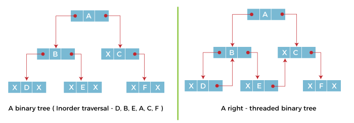
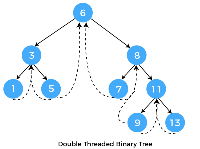
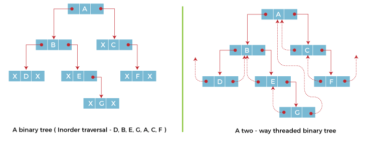

# 스레드 이진 트리(Threaded binary tree)

이진 트리의 한 종류로 가리키는 곳이 없는 모든 오른쪽 널 포인터(null pointer)를 중위 후속자 노드로 연결하고, 가리키는 곳이 없는 모든 왼쪽 널 포인터를 중위 선행자 노드로 연결한 것이다.
- 재귀적인 중위 순회를 빠르게 할 수 있는 방법이다.
- 부모 포인터나 스택을 사용하지 않고도 노드의 부모를 찾을 수 있게 해준다.
    - 스택 공간을 쓸 수 없거나, 부모 노드의 위치를 알 수 없을 때 유용하게 사용될 수 있다.
</br>

✔️중위 순회
- 이진 탐색 트리에서 사용되는 트리이다.
- 왼쪽 서브 트리를 중위 순회한다. 노드를 방문한다. 오른쪽 서브 트리를 중위 순회한다.
- 
- 중위 순회: A, B, C, D, E, F, G, H, I (left, root, right)
- 이진 탐색 트리의 구현은 트리의 높이에 비례한 호출 스택 공간이 필요하다.
</br>

> 스레드 이진 트리 탐색은 전부 중위 순회이다.
</br>

### 스레드 이진 트리란?

- 이진 트리의 연결 표현에서 링크 필드의 절반 이상이 null 값을 포함하므로 저장 공간이 낭비 된다.
    - 
    - ⬆️ 일반적인 이진 트리
    - 이진 트리가 n개의 노드로 구성된 n+1개의 링크 필드에는 null 값이 포함된다.
    - 스레드 이진 트리는 이를 효율적으로 사용하기 위해 null 링크를 스레드로 대체한다.
- 스레드 이진 트리의 각 노드에는 자식 노드에 대한 링크나 트리의 다른 노드에 대한 스레드가 포함되어 있다.
    - 
    - ⬆️ 단방향 스레드 이진 트리
    - 
    - 노드의 오른쪽 링크 필드에 스레드를 넣는다. 
    → 각 리프 노드들의 오른쪽 링크 필드에 다음 노드를 가리키는 스레드를 넣는다.
- 양방향 스레드 이진 트리에서 노드의 *오른쪽 필드*는 노드의 중위 **후속 노드**를 가리키는 스레드를 넣고, *왼쪽 필드*는 노드의 중위 **선행 노드**를 가리키는 스레드를 넣는다.
    - 
    - ⬆️ 양방향 스레드 이진 트리
    - 
- 양방향 스레드 이진 트리에서 첫 번째 노드의 왼쪽 스레드, 마지막 노드의 오른쪽 스레드는 각각 선행 노드와 후속 노드가 없기 때문에 아무데도 가리키지 않는다.
- 스레드의 균일성을 유지하기 위해 __헤더 노드(header node)__ 를 추가한다.
    - 
    - ⬆️ **스레드 이진 트리**
    - 헤더 노드(header node)는 데이터 부분이 없으며 왼쪽 링크 필드는 루트 노드를 가리키고 오른쪽 링크 필드는 자신을 가리킨다.
    - 헤더 노드는 첫 번째 노드의 선행 작업이 되고 마지막 노드의 후속 작업이다.
</br>

### 단일 스레드 이진 트리 구조

#### 스레드 노드

```c
struct Node
{
    int data;
    struct Node *left, *right;
    bool rightThread; 
}
```

</br>

```java
static class Node
{
    int data;
    Node left, right;
    boolean rightThread; 
}
```

</br>

#### 스레드 트리 순서 정렬

```c
struct Node* leftMost(struct Node* n)
{
    if (n == NULL)
        return NULL;
 
    while (n->left != NULL)
        n = n->left;
 
    return n;
}
 
// 스레드 이진 트리 중위 순회
void inOrder(struct Node* root)
{
    struct Node* cur = leftMost(root);
    while (cur != NULL) {
        printf("%d ", cur->data);
 
        // 만약 스레드 노드인 경우 중위 후속자로 이동
        if (cur->rightThread)
            cur = cur->right;
        else 
						// 아닐 경우 오른쪽 하위 트리의 가장 왼쪽 자식으로 이동
            cur = leftmost(cur->right);
    }
}
```

</br>

```java
// n이 루트인 트리에서 가장 왼쪽 노드를 찾는 함수
Node leftMost(Node n)
{
    if (n == null)
        return null;
 
    while (n.left != null)
        n = n.left;
 
    return n;
}
 
// 스레드 이진 트리 중위 순회
static void inOrder(Node root)
{
    Node cur = leftMost(root);
    while (cur != null) {
        System.out.printf("%d ", cur.data);
 
        // 스레드 노드인 경우 중위 후속자로 이동
				if (cur.rightThread)
            cur = cur.right;
        else 	
						// 아닐 경우 오른쪽 하위 트리의 가장 왼쪽 자식으로 이동
            cur = leftmost(cur.right);
    }
}
```

</br>

### 스레드 이진 트리의 장단점

#### 장점

- 트리의 노드를 순차적으로 빠르게 탐색하므로 **스택이 필요하지 않다.**
    - 스택을 사용하면 많은 메모리와 시간이 소비됨
- 스레드와 링크를 따라가면 **모든 노드의 후임자와 선행자를 효율적으로 결정**할 수 있다.

#### 단점

- 스레드 이진 트리는 각 노드의 링크 필드가 일반 노드를 가리키는지 아니면 노드의 후임자 선행자를 가리키는지를 알기 위해 **각 노드에 대한 추가 정보를 유지해야 한다**.
- 스레드 이진 트리에 대한 **삽입 및 삭제는** 스레드와 일반 링크 모두를 유지 관리해야 되기 때문에 **더 많은 시간이 소요된다**.
</br>
</br>

### 스레드 이진 트리 삽입 코드

```java
import java.util.*;
class solution
{
static class Node
{
    Node left, right;
    int info;
   
		//링크 필드가 자식 노드를 연결하면 F, 선행자 또는 후속자를 가리키면 T
    boolean lthread;
    boolean rthread;
};
   
// 노드 삽입
static Node insert( Node root, int ikey)
{
    // 주어진 값으로 노드 검색
    Node ptr = root;
    Node par = null; // 삽입할 키의 부모
    while (ptr != null)
    {
        // 이미 키가 있는 경우 반환
        if (ikey == (ptr.info))
        {
            System.out.printf("Duplicate Key !\n");
            return root;
        }
   
        par = ptr; // Update parent pointer
   
        // Moving on left subtree.
        if (ikey < ptr.info)
        {
            if (ptr . lthread == false)
                ptr = ptr . left;
            else
                break;
        }
   
        // Moving on right subtree.
        else
        {
            if (ptr.rthread == false)
                ptr = ptr . right;
            else
                break;
        }
    }
   
    // Create a new node
    Node tmp = new Node();
    tmp . info = ikey;
    tmp . lthread = true;
    tmp . rthread = true;
     
    if (par == null)
    {
        root = tmp;
        tmp . left = null;
        tmp . right = null;
    }
    else if (ikey < (par . info))
    {
        tmp . left = par . left;
        tmp . right = par;
        par . lthread = false;
        par . left = tmp;
    }
    else
    {
        tmp . left = par;
        tmp . right = par . right;
        par . rthread = false;
        par . right = tmp;
    }
   
    return root;
}
   
// rthread를 사용하여 중위후속자를 반환
static  Node inorderSuccessor( Node ptr)
{
    // If rthread is set, we can quickly find
    if (ptr . rthread == true)
        return ptr.right;
   
    // Else return leftmost child of right subtree
    ptr = ptr . right;
    while (ptr . lthread == false)
        ptr = ptr . left;
    return ptr;
}
   
// Printing the threaded tree
static void inorder( Node root)
{
    if (root == null)
        System.out.printf("Tree is empty");
   
    // Reach leftmost node
     Node ptr = root;
    while (ptr . lthread == false)
        ptr = ptr . left;
   
    // One by one print successors
    while (ptr != null)
    {
        System.out.printf("%d ",ptr . info);
        ptr = inorderSuccessor(ptr);
    }
}
   
// Driver Program
public static void main(String[] args)
{
     Node root = null;
   
    root = insert(root, 20);
    root = insert(root, 10);
    root = insert(root, 30);
    root = insert(root, 5);
    root = insert(root, 16);
    root = insert(root, 14);
    root = insert(root, 17);
    root = insert(root, 13);
   
    inorder(root);
} 
}
```

---
참고

[Threaded Binary Tree - javatpoint](https://www.javatpoint.com/threaded-binary-tree)

[Threaded Binary Tree - GeeksforGeeks](https://www.geeksforgeeks.org/threaded-binary-tree/?ref=lbp)
