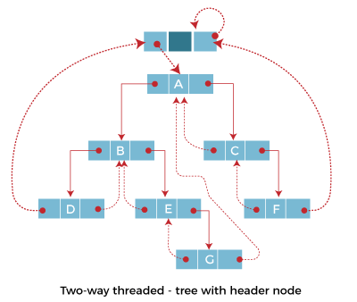

# 스레드 이진 트리(Threaded binary tree)

이진 트리의 한 종류로 가리키는 곳이 없는 모든 오른쪽 널 포인터(null pointer)를 중위 후속자 노드로 연결하고, 가리키는 곳이 없는 모든 왼쪽 널 포인터를 중위 선행자 노드로 연결한 것이다.
- 재귀적인 중위 순회를 빠르게 할 수 있는 방법이다.
- 부모 포인터나 스택을 사용하지 않고도 노드의 부모를 찾을 수 있게 해준다.
    - 스택 공간을 쓸 수 없거나, 부모 노드의 위치를 알 수 없을 때 유용하게 사용될 수 있다.
 

✔️중위 순회
- 이진 탐색 트리에서 사용되는 트리이다.
- 왼쪽 서브 트리를 중위 순회한다. 노드를 방문한다. 오른쪽 서브 트리를 중위 순회한다.
- 
- 중위 순회: A, B, C, D, E, F, G, H, I (left, root, right)
- 이진 탐색 트리의 구현은 트리의 높이에 비례한 호출 스택 공간이 필요하다.
 

> 스레드 이진 트리 탐색은 전부 중위 순회이다.
 

### 스레드 이진 트리란?

- 이진 트리의 연결 표현에서 링크 필드의 절반 이상이 null 값을 포함하므로 저장 공간이 낭비 된다.
    - 
    - ⬆️ 일반적인 이진 트리
    - 이진 트리가 n개의 노드로 구성된 n+1개의 링크 필드에는 null 값이 포함된다.
    - 스레드 이진 트리는 이를 효율적으로 사용하기 위해 null 링크를 스레드로 대체한다.
- 스레드 이진 트리의 각 노드에는 자식 노드에 대한 링크나 트리의 다른 노드에 대한 스레드가 포함되어 있다.
    - 
    - ⬆️ 단방향 스레드 이진 트리
    - 
    - 노드의 오른쪽 링크 필드에 스레드를 넣는다. 
    → 각 리프 노드들의 오른쪽 링크 필드에 다음 노드를 가리키는 스레드를 넣는다.
- 양방향 스레드 이진 트리에서 노드의 *오른쪽 필드*는 노드의 중위 **후속 노드**를 가리키는 스레드를 넣고, *왼쪽 필드*는 노드의 중위 **선행 노드**를 가리키는 스레드를 넣는다.
    - 
    - ⬆️ 양방향 스레드 이진 트리
    - 
- 양방향 스레드 이진 트리에서 첫 번째 노드의 왼쪽 스레드, 마지막 노드의 오른쪽 스레드는 각각 선행 노드와 후속 노드가 없기 때문에 아무데도 가리키지 않는다.
- 스레드의 균일성을 유지하기 위해 __헤더 노드(header node)__ 를 추가한다.
    - 
    - ⬆️ **스레드 이진 트리**
    - 헤더 노드(header node)는 데이터 부분이 없으며 왼쪽 링크 필드는 루트 노드를 가리키고 오른쪽 링크 필드는 자신을 가리킨다.
    - 헤더 노드는 첫 번째 노드의 선행 작업이 되고 마지막 노드의 후속 작업이다.
 

---
참고
[Threaded Binary Tree - javatpoint](https://www.javatpoint.com/threaded-binary-tree)
