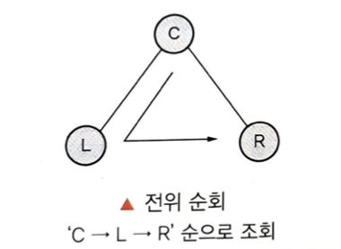
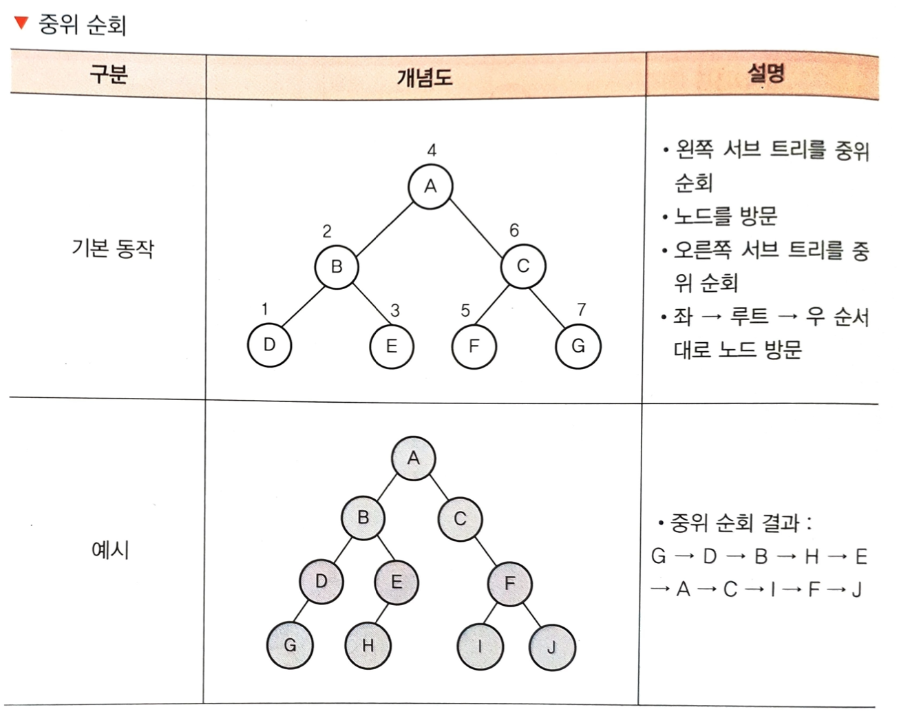
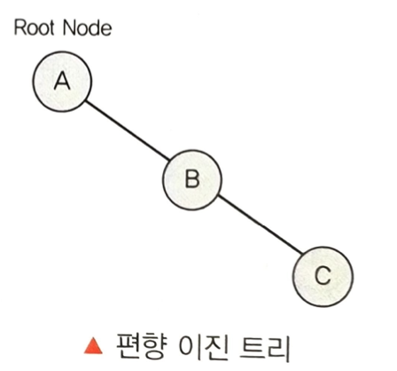
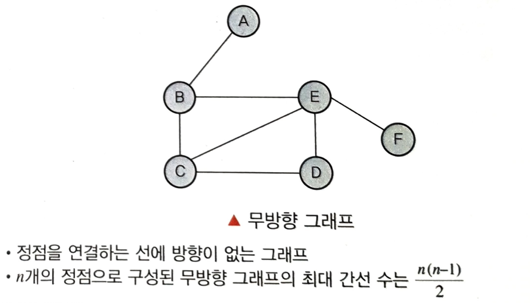

## 비선형 구조 

 1. 트리
	- 트리는 데이터들을 계층화시킨 자료구조이다.
	- 인덱스를 조작하는 방법으로 가장 많이 사용하는 구조이다.
	- 트리는 node와 노드를 연결하는 link로 구성된다.
	- 배열과 달리 노드들이 포인터로 연결되어 노드의 상한선이 없다
	- __개념__
	 	
		- 루트 노드(Root Node) : 트리에서 부모가 없는 최상위 노드, 트리의 시작점
		- 단말 노드(Leaf Node) : 자식이 없는 노드, 트리의 가장 말단에 위치
		- 레벨(Level) : 루트 노드를 기준으로 특정 노드까지의 경로 길이
		- 조상 노드(Ancestor Node) : 특정 노드에서 루트에 이르는 경로상 모든 노드
		- 자식 노드(Child Node) : 특정 노드에 연결된 다음 레벨의 노드
		- 부모 노드(Parent Node) : 특정 노드에 연결된 이전 레벨의 노드
		- 형제 노드, Sibling : 같은 부모를 가진 노드
		- 깊이(Depth) : 루트 노드에서 특정 노드에 도달하기 위한 간선의 수
		- 차수(Degree) : 특정 노드에 연결된 자식 노드의 수

 2. 트리 순회방법
 
 	
	- 전위 순회(Pre-Order Traversal) : ‘Root -> Left -> Right’순으로 방문, 노드를 방문하고, 왼쪽 서브 트리를 방문한 후, 오른쪽 서브 트리를 방문하는 순으로 순회하는 방식
	
	
	
	- 중위 순회(In-Order Traversal) : ‘Left -> Root -> Right’순으로 방문, 왼쪽 서브 트리를 중위 순회하고, 노드를 방문한 후, 다시 오른쪽 서브 트리를 중위 순회하는 방식
	

	
	- 후위 순회(Post-Order Traversal) : ‘Left -> Right -> Root’순으로 방문, 왼쪽 서브 트리를 후위 순회하고, 다시 오른쪽 서브 트리를 후ㅇ위 순회한 뒤에 노드를 방문하는 방식
	
	
 3. 이진 트리
	- 차수(Degree)가 2 이하인 노드로 구성되어 자식이 둘 이하로 구성된 트리
	
	- 이진 트리의 유형 
		- 포화 이진 트리(Full Binary Tree) : 모든 레벨에서 노드가 꽉 채워진 트리	
		- 
		- 완전 이진 트리(Complete Binary Tree) : 마지막 레벨을 제외하고 노드가 채워진 트리
		- 
		- 편향 이진 트리(Skewed Binary Tree) : 노드의 왼쪽ㅇ이나 오른쪽한 곳만 노드가 존재하는 트리
		- 
 4. 그래프
	- 노드(N; Node)와 노드를 연결하는 간선(E; Edge)을 하나로 모아 놓은 자료 구조
	- 트리(Tree)는 사이클이 없는 그래프
	
	- 방향성의 유무에 구분됨
		- 방향 그래프 : 정점을 연결하는 선에 방향이 있는 그래프, n개의 정점으로 구성된 방향 그래프의 최대 간선 수는 n(n-1)
		- 
		- 무방향 그래프 : 정점을 연결하는 선에 방향이 없는 그래프, n개의 정점으로 구성된 무방향 그래프의 최대 간선 수는 n(n-1)/2
		- 
		- 그래프의 표현 방법 
	- 그래프  G = (V, E)
		V(G) = 정점(Vertices)
		E(G) = 간선(Edges)

	- 그래프 용어 정리
		- 경로(Path) : 임의 정점에서 다른 정점으로 이르는 길
		- 경로 길이(Path Length) :  경로상 있는 간선의 수
		- 단순 경로(Simple Path) : 한 경로의 모든 간선이 다를 때의 경로
		- 사이클(Cycle) : 동일 정점에서 시작과 끝이 이어지는 경로
