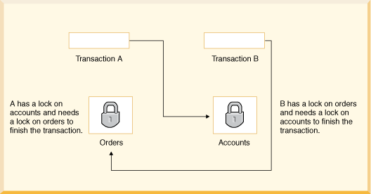

# DB DeadLocks(교착 상태)

### 데이터베이스에서 교착 상태란

둘 이상의 트랜잭션이 잠금을 해제하기 위해 서로 기다리는 상황을 말한다.

 

### ⬇️ Deadlock 해결 방법

### Deadlock 탐지

- 트랜잭션이 잠금된 자원을 얻기 위해 특정 시간 이상을 기다리는 상태 : **Deadlock timeout**
- 위의 상태일 때 교착 상태인지 여부 탐지를 한다.
- 일반적으로 하나의 트랜잭션을 중단하면 교착 상태가 제거된다.
- 하나의 트랜잭션을 희생자로 선택하고 해당 트랜잭션을 중단한다.

 

### 트랜잭션 처리 속도 최소화

 

### Deadlock 회피

- *일관적인 트랜잭션의 진행 방식*
- LOCKTABLE 문
    - 트랜잭션은 다른 트랜잭션이 태이블의 공유 잠금을 얻는 것을 방지할 때 독점 모드에서 잠금을 할 수 있다.

 

### 잠금 대기 시간 초과

- 트랜잭션이 교착 상태에 빠지지 않아도 장시간 실행되거나 필요한 테이블의 잠금을 보유한 트랜잭션에 대한 잠금을 확보하기 위해 오랜 시간 기다릴 수 있다.
- 이러한 경우 트랜잭션 무한 대기를 적절한 시간이 경과한 후 대기 중인 트랜잭션을 중지하거나 시간 초과할 수 있다. → *`lock wait timeout`*
    - SET LOCK_TIMOUT
    

 

---

출처 및 참고

[Deadlocks (oracle.com)](https://docs.oracle.com/javadb/10.6.2.1/devguide/cdevconcepts28436.html)

[[DB] MSSQL 데드락(교착상태) 해결방법 (tistory.com)](https://sosopro.tistory.com/55)
