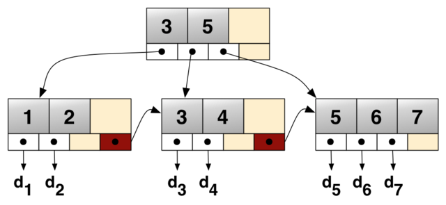

# INDEX(2)

### 1. 클러스터 인덱스(Clustered Index)

- 테이블 당 한 개만 생성 가능
- 행 데이터를 인덱스로 지정한 열에 맞춰서 자동 정렬
- 테이블 자체가 인덱스 (따로 인덱스 페이지를 만들지 않음)
- 데이터 입력, 수정, 삭제 시 항상 테이블 전체 정렬 유지
- 항상 정렬을 유지, 기본적인 성능 보장
- 30% 이내에서 사용해야 좋은 선택도

### 2. 비클러스터형 인덱스(Nonclustered Index)

- 테이블 당 여러 개 생성 가능
- 테이블 자체는 정렬되지 않고, 인덱스 페이지만 정렬
- 인덱스 페이지를 따로 만듦
- 데이터 입력, 수정, 삭제 시 인덱스 페이지만 정렬
- 잘 선택해서 사용해야 성능이 나옴
- 3%이내에서 사용해야 좋은 선택도

### 3. 인덱스 생성

**(1) B-tree**

- key 값을 이용해 찾고자 하는 데이터를 트리 구조를 이용해 찾는 것이다.
- 균형 트리 이기에 루트에서 리프까지의 거리가 일정하여 성능이 안정적이다.

**(2) B+tree**

- branch node에 key만 담아두고 data는 담지 않는다.
- 오직 leaf node에만 key와 data를 저장하고 leaf node끼리 `linked list`로 연결되어 있다.

**장점**

- Leaf node를 제외하고 데이터를 담지 않기 때문에 더 많은 key를 사용할 수 있다.
- Leaf node에서 선형 탐색을 하기에 빠르다.

 

---

참고 및 출처

[DB - 클러스터드 인덱스, 넌 클러스터드 인덱스 차이점은? (tistory.com)](https://gocoder.tistory.com/1826)

[[MySQL] B-tree, B+tree란? (인덱스와 연관지어서) :: Carry On Progamming (tistory.com)](https://zorba91.tistory.com/293)

[클러스터 인덱스 vs 넌클러스터 인덱스 | zinirun](https://zinirun.github.io/2020/10/23/database-index/)
