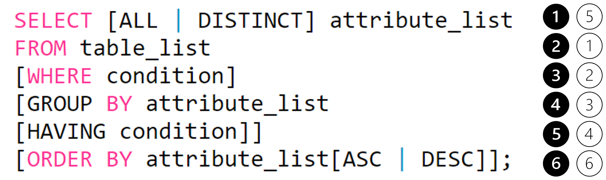

# SELECT문



➊ **검색할 테이블에 대한 ATTRIBUTE** 즉, 필드(데이터항목)에 대한 이름들을 기술하고 **모든 필드를 검색**할 경우에는 `*`(와일드 카드)를 기술. 또한 통계처리를 위한 **집단 함수**인 `MAX(), MIN(), AVG(), SUM(), COUNT(), COUNT(*)`등을 기술할 수도 있음.

➋ 데이터를 **검색할 테이블을 기술**하며, 관계를 맺는 두 개 이상의 테이블로부터 조인 검색을 하는 경우에는 해당 테이블을 모두 기술.

➌ **조건을 지정**, **기술하지 않으면** 무조건적인 검색이 되어 **모든 튜플에 대한 검색** 결과를 가져오게 됨

➍ **GROUP 단위**로 질의를 실행 위해 기술, 기술된 애트리뷰트(필드)가 있다면 **애트리뷰트의 값이 동일한 튜플(행)들을 모아서 먼저 GROUPING을 수행**하고, **GROUPING된 결과로부터 한 개의 튜플(레코드)씩 질의 결과를 생성**

➎ **GROUP BY 절에 대한 조건**을 기술, GROUPING을 할 때 조건을 부여 함

➏ 질의된 결과에 대하여 **특정 애트리뷰트(필드)를 중심으로 정렬**한 결과를 얻기 위하여 기술

⭐ ① ~ ⑥: **SELECT문의 실행 순서**

# 조건검색(WHERE 절)

> WHERE 절 이후에 **관계(비교) 연산자와 논리 연산자를 조합**하여 기술

- 비교 연산자

    |비교 연산자|설명|
    |:-:|:-:|
    |=|같은 것을 조회|
    |<|작은 것을 조회|
    |<=|작거나 같은 것을 조회|
    |>|큰 것을 조회|
    |>=|크거나 작은 것을 조회|

- 부정 비교 연산자

    |비교 연산자|설명|
    |:-:|:-:|
    |!=|같지 않을 것을 조회|
    |^=|같지 않은 것을 조회|
    |<>|같지 않은 것을 조회|
    |NOT 칼럼명 = |같지 않은 것을 조회|
    |NOT 칼럼명 > | 크지 않은 것을 조회|

- 논리 연산자

    |비교 연산자|설명|
    |:-:|:-:|
    |AND|조건을 모두 만족해야 참(True)|
    |OR|조건 중 하나만 만족해도 참(True)|
    |NOT|참이면 거짓(False)로 바꾸고 거짓이면 참(True)으로 바꿈|

- SQL 연산자
    - 집합원소 검색(`IN`)

        `IN (list)`: OR을 의미하며 list 값 중에 하나만 일치해도 조회

        ```sql
        SELECT *
        FROM STUDENT
        WHERE NUMBER IN (100, 200, 300);
        ```

    - `BETWEEN`검색

        `BETWEEN A AND B`: A와 B 사이의 값을 조회

        ```sql
        SELECT *
        FROM STUDENT
        WHERE NUMBER BETWEEN 100 AND 200
        ```

    - 패턴매칭 검색(`LIKE`)

        `LIKE '%비교 문자열%'`: 비교 문자열을 조회

        - `%`: 어떤 문자를 포함한 모든 것을 조회
        - `_`(underscore): 한 개인 단일 문자를 의미

        ```sql
        -- **좌** 기준 매칭
        WHERE NAME LIKE "ABC%"       

        -- **우** 기준 매칭
        WHERE NAME LIKE "%ABC"

        -- **좌우** 기준 매칭
        WHERE NAME LIKE "AB%CD"

        -- **포함** 기준 매칭
        WHERE NAME LIKE "%ABC%"
        ```

        ```sql
        SELECT *
        FROM STUDENT
        WHERE NAME LIKE "ABC...N";
        ```

    - `IS NULL`: NULL 값을 조회
        - NULL의 특징
            - 모르는 값을 의미
            - 값의 부재를 의미
            - 숫자 혹은 날짜를 더하면 NULL
            - NULL과 어떤 값을 비교할 때, '알 수 없음'이 반환
        - NULL 관련 함수

            |함수|설명|예시|
            |:-:|:-:|-|
            |NVL|NULL이면 다른 값으로 바꿈|'NVL(MGR, 0)'은 MGR 칼럼이 NULL이면 0으로 바꿈|
            |NVL2|NVL 함수와 DECODE 함수를 하나로 만든 것|'NVL2(MGR, 1, 0)은 MGR 칼럼이 NULL이 아니면 1, NULL이면 0을 반환|
            |NULLIF|두 개의 값이 같으면 NULL을 같지 않으면 첫 번째 값을 반환|'NULLIF(exp1, exp2)'은 exp1과 exp2가 같으면 NULL을, 같지 않으면 exp1을 반환|
            |COALESCE|NULL이 아닌 최초의 인자 값을 반환|'COALESCE(exp1, exp2, exp3, ...)'은 exp1이 NULL이 아니면 exp1의 값을, 그렇지 않으면 그 뒤의 값의 NULL 여부를 판단하여 값을 반환|

        ```sql
        -- MGR 칼럼이 NULL인 것을 조회
        SELECT *
        FROM EMP
        WHERE MGR IS NULL;
        ```

- 부정 SQL 연산자

    |비교 연산자|설명|
    |:-:|:-:|
    |NOT BETWEEN A AND B|A와 B 사이의 해당되지 않는 값을 조회|
    |NOT IN (list)|list와 불일치한 것을 조회|
    |IS NOT NULL|NULL  값이 아닌 것을 조회|

# GROUP 연산

- 그룹질의(`GROUP BY`)를 이용한 검색

    ```sql
    SELECT PROFESSOR_ID, AVG(GRADE) AS 평균성적
    FROM STUDENT
    GROUP BY PROFESSOR_ID;
    ```

- 그룹 탐색 조건절(`HAVING`)을 이용한 검색

    ```sql
    SELECT ROFESSOR_ID, AVG(GRADE) AS 평균성적
    FROM STUDENT
    GROUP BY PROFESSOR_ID
    HAVING COUNT(*) >= 10;
    ```

    |집계 함수|설명|
    |:-:|:-:|
    |COUNT()|행 수를 조회|
    |SUM()|합계를 계산|
    |AVG()|평균을 계산|
    |MAX()와 MIN()|최댓값과 최소값을 계산|
    |STDDEV()|표준편차를 계산|
    |VARIAN()|분산을 계산|

- 순서를 명세한 검색(`ORDER BY`)

    ```sql
    SELECT PROFESSOR_ID, STUDENT_ID, NAME, PHONE_NUM
    FROM STUDENT
    WHERE STUDENT_ID >=5000
    ORDER BY PROFESSOR_ID ASC, STUDENT_ID DESC;
    ```
