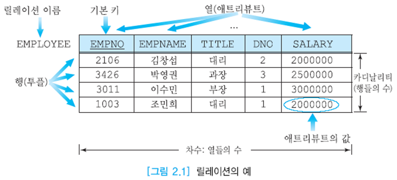
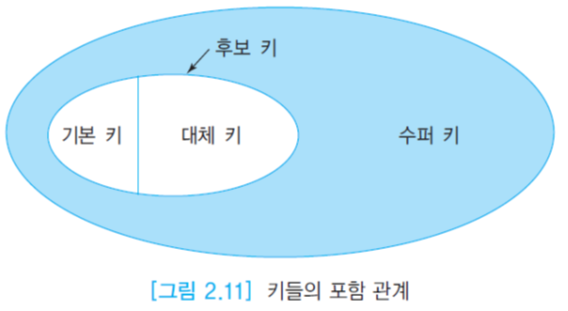
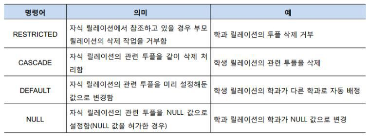

# 관계 데이터 모델과 제약조건

> 관계 데이터 모델은 **동일한 구조(릴레이션)의 관점**에서 모든 데이터를 논리적으로 구성하며 선언적인 질의어를 통한 데이터 접근을 제공

## 목적

**높은 데이터 독립성을 제공**하는 것

- 데이터베이스와 사용자의 상호 작용은 데이터의 내부 단계, 특히 레코드들의 순서와 접근 경로의  변경에 영향을 받지 않음
- 관계 모델에서는 질의를 작성하기 쉬움 → 사용자는 원하는 데이터(what)만 명시하고 어떻게 이 데이터를 찾을 것인가(how)는 명시할 필요 없음

## 용어

- 관계 데이터 모델의 가장 큰 장점은 **구조가 단순**하다는 것
- **릴레이션**(relation): 2차원의 **테이블**
    - 정보는 행(row)과 열(column)으로 표현
    - 한 릴레이션은 데이터베이스에서 표현되는 한 **엔티티**에 관한 정보를 저장
    - 고유한 이름을 가짐
- **레코드**: 릴레이션의 각 행(=**투플**)
    - 릴레이션이 나타내는 엔티티의 특정 인스턴스에 관한 사실(값)들의 모임
    - 한 투플은 그 릴레이션이 나타내는 엔티티의 한 인스턴스를 의미
- **애트리뷰트**: 릴레이션에서 이름을 가진 하나의 열
    - 한 릴레이션에서 모든 애트리뷰트들의 이름은 서로 달라야 함
- **도메인**: 한 애트리뷰트에서 나타날 수 있는 값들의 집합
    - 각 애트리뷰트의 도메인의 값들은 **원자값**
    - 프로그래밍 언어의 데이터 타입과 유사
    - 동일한 도메인이 여러 애트리뷰트에서 사용 가능
    - 관계 데이터 모델에서 복합 애트리뷰트나 다치 애트리뷰트는 허용되지 않음 → **제1정규형**

    > 복합 애트리뷰트: 분할이 가능한 애트리뷰트(ex. 주소 → 시, 구, 동, 번지로 분할 가능)
    다치 애트리뷰트: 각 엔티티마다 여러 개의 값을 가질 수 있는 애트리뷰트(ex. 취미는 여러 개의 값을 가질 수 있음)

- **차수**(degree): 한 릴레이션이 들어 있는 애트리뷰트들의 수
    - 모든 릴레이션은 적어도 한 개의 애트리뷰트를 가져야 함 → 즉, 유효한 릴레이션의 최소 차수는 1
- **카디널리티**(cardinality): 릴레이션의 투플 수
    - 투플이 하나도 갖지 않은 릴레이션이 가능 → 즉, 유효한 릴레이션은 카디널리티 0을 가질 수 있음

## 특성

- 각 릴레이션은 오직 하나의 레코드 타입만 포함 → 각 릴레이션에 **오직 한 가지 유형의 정보만 저장됨**을 보장
- 한 애트리뷰트 내의 값들은 모두 같은 유형
- 애트리뷰트의 순서는 중요하지 않음
- 릴레이션이 투플들의 집합이기 때문에 **동일한 투플이 두 개 이상 존재하지 않음**
- 한 투플의 각 애트리뷰트는 원자값을 가짐
- 릴레이션이 투플들의 집합이기 때문에 투플들의 순서는 중요하지 않음
- 각 애트리뷰트의 이름은 한 릴레이션 내에서만 고유함

## 키

> 각 투플을 고유하게 식별할 수 있는 하나 이상의 애트리뷰트들의 모임

1. **슈퍼 키**(super key): 한 릴레이션 내의 **특정 튜플을 고유하게 식별**하는 하나의 애트리뷰트 또는 애트리뷰트들의 집합
2. **후보 키**(candidate key): 각 튜플을 고유하게 식별하는 **최소한**의 애트리뷰트들의 모임
    - 후보 키도 **두 개 이상의 애트리뷰트**로 이루어질 수 있으며 이런 경우에 **복합 키**라고 부름
    - 한 애트리뷰트 또는 애트리뷰트들의 모임이 후보 키라는 것을 입증하기 위해서 릴레이션의 한 인스턴스를 사용해서는 안됨 → 후보 키로 선정한 애트리뷰트에 중복된 값들이 나타날 수 있는지 고려해야 함
3. **기본 키**(primary key): **후보 키**가 두 개 이상 있으면 설계자 또는 데이터베이스 관리자가 이들 **중에서 하나**를 기본 키로 선정
    - 한 릴레이션 내의 모든 튜플을 고유하게 식별할 수 있어야 하므로 널값이나 중복된 값을 가질 수 없음
    - 고유한 값을 가져야 함
    - 애트리뷰트의 값이 변경될 가능성이 높은 애트리뷰트는 기본 키로 선정하지 말 것
    - 가능하면 작은 정수 값이나 짧은 문자열을 갖는 애트리뷰트로 선정
    - 가능하면 복합 기본 키는 피할 것
4. **대리 키**(surrogate key): 자연스러운 기본 키를 찾을 수 없는 경우, **인위적으로 추가된 기본 키**
5. **대체 키**(alternate key): 기본 키로 **선정되지 않은** 후보 키

    

6. **외래 키**(foreign key): 어떤 릴레이션의 기본 키를 **참조**하는 애트리뷰트
    - 릴레이션들 간의 관계를 나타내기 위해서 사용
    - 참조되는 릴레이션의 기본 키와 동일한 도메인을 가져야 함
    - 자체 릴레이션 참조 가능
    - 자신이 속한 릴레이션의 기본 키의 구성요소가 되거나 되지 않을 수 있음

## 무결성 제약조건

- 목적: 일관된 데이터베이스 상태를 정의하는 규칙들을 묵시적으로 또는 명시적으로 정의하는 것
- 데이터베이스의 **보안** 문제는 **권한이 없는 사용자**가 데이터베이스를 접근하여 검색하거나 갱신하지 못하도록 데이터베이스를 보호하는 반면에, 데이터베이스 **무결성**은 **권한을 가진 사용자**들로부터 데이터베이스의 정확성을 지키는 것
- 장점은 스키마를 정의할 때 **일관성 조건을 오직 한 번만 명시**하고, 데이터베이스가 갱신될 때 DBMS가 자동적으로 일관성 조건을 검사하므로 응**용 프로그램들은 일관성 조건을 검사할 필요가 없음**

### 특징

- 스키마의 한 부분
- 데이터베이스의 상태(또는 상태들의 순서)에 대한 제한
- DBMS가 시행
- 릴레이션 내의 무결성 제약조건(오직 한 릴레이션만 포함): 릴레이션 스키마의 한 부분
- 릴레이션 사이의 무결성 제약조건(여러 릴레이션을 포함): 릴레이션 스키마 또는 데이터베이스 스키마의 한 부분

### 종류

1. **도메인 제약조건**(domain constraint)
    - 각 애트리뷰트의 값이 반드시 원자값
    - 데이터 형식을 통해 값들의 유형을 제한
    - 애트리뷰트의 디폴트 값 지정
    - 애트리뷰트에 저장되는 값들의 범위를 제한
    - `NOT NULL`: 모든 튜플에서 해당 애트리뷰트의 값이 존재하도록 보장
2. **키 제약조건**(key constraint): **키 애트리뷰트에 중복된 값이 존재해서는 안된다**는 것
    - 릴레이션을 정의할 때 기본 키로 정의하거나 `UNIQUE`로 명시한 애트리뷰트에는 중복된 값이 허용되지 않음
3. 기본 키와 **엔티티 무결성 제약조건**(entity integrity constraint): 릴레이션의 **기본 키**를 구성하는 어떤 애트리뷰트도 **널값을 가질 수 없다**는 것
    - 대체 키에는 적용되지 않음
    - 어떤 엔티티에 관한 정보를 릴레이션에 저장하려면 식별이 가능해야 하기 때문에 엔티티 무결성 제약조건이 필요
4. 외래 키와 **참조 무결성 제약조건**(referential integrity constraint): 두 릴레이션의 연관된 튜플들 사이의 일관성을 유지하는데 사용

## 무결성 제약조건의 유지

> 갱신 연산(삽입, 삭제, 수정)에 대하여 무결성 제약조건을 유지하는 방법

1. **삽입**
    - **참조되는 릴레이션**에 새로운 튜플이 삽입되면 도메인 제약조건, 키 제약조건, 엔티티 무결성 제약조건은 위배 가능하지만 **참조 무결성 제약조건은 위배되지 않음**
    - **참조하는 릴레이션**에 새로운 튜플이 삽입되면 도메인 제약조건, 키 제약조건, 엔티티 무결성 제약조건 외에 **참조 무결성 제약조건도 위배 가능**
2. **삭제**
    - **참조하는 릴레이션**에서 튜플이 삭제되면 도메인 제약조건, 키 제약조건, 엔티티 무결성 제약조건, 참조 무결성 제약조건 등 **모든 제약조건을 위배하지 않음**
    - **참조되는 릴레이션**에서 튜플이 삭제되면 **참조 무결성 제약조건을 위배하는 경우가 생기거나 생기지 않을 수 있음**

    

3. **수정**
    - 주어진 릴레이션에서 하나 이상의 튜플의 하나 이상의 애트리뷰트 값을 수정하는 것
    - 수정하는 애트리뷰트가 기본 키인지 외래 키인지 검사
    - 수정하려는 애트리뷰트가 **기본 키도 아니고 외래 키도 아니면 수정 연산이 참조 무결성 제약조건을 위배하지 않음**
    - **기본 키나 외래 키를 수정하는 것**은 **하나의 튜플을 삭제**하고 새로운 튜플을 그 자리에 삽입하는 것과 **유사**하므로 삭제의 제한, 연쇄, 널값, 디폴트 값 **규칙이 수정 연산에도 적용**
