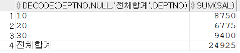
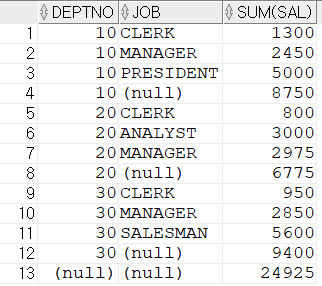

# 그룹 함수

## ROLLUP

- ROLLUP은 GROUP BY의 칼럼에 대해서 Subtotal을 만들어 줌
- ROLLUP을 할 때 GROUP BY구에  칼럼이 두 개 이상 오면 순서에 따라서 결과가 달라짐

```sql
SELECT DECODE(DEPTNO, NULL, '전체합계', DEPTNO), SUM(SAL)
FROM EMP
GROUP BY ROLLUP(DEPTNO);
-- 부서별 합계 및 전체합계가 계산됨
-- DEPTNO에 대해서 GROUP BY로 급여함계를 계산하고 부서별 전체합계를 추가해서 계산함
-- ROLLUP은 DEPTNO에 대해서 기존 GROUP BY와는 다르게 부서별 전체합계를 계산하게 됨
```



```sql
SELECT DEPTNO, JOB, SUM(SAL)
FROM EMP
GROUP BY ROLLUP(DEPTNO, JOB);
-- 부서별, 직업별 ROLLUP을 실행하면 부서별 합계, 직업별 합계, 전체합계가 모두 조회됨
-- ROLLUP으로 실행되는 칼럼별로 Subtotal을 만들어 줌
```



## GROUPING 함수

- GROUPING 함수는 ROLLUP, CUBE, GROUPING SETS에서 생성되는 합계값을 구분하기 위해서 만들어진 함수
- 예를 들어 소계, 합계 등이 계산되면 GROUPING 함수는 1을 반환하고 그렇지 않으면 0을 반환해서 합계값을 식별할 수 있음

```sql
SELECT DEPTNO, GROUPING(DEPTNO), JOB, GROUPING(JOB), SUM(SAL)
FROM EMP
GROUP BY ROLLUP(DEPTNO, JOB);
-- ROLLUP, CUBE, GROUPING SETS으로 계산된 합계는 '1'로 표시됨
-- '1'의 값으로 소계와 전체합계를 개발자가 구분할 수 있게 됨
```


```sql
-- DECODE를 사용해서 전체 합계와 부서합계를 구분함
SELECT DEPTNO, 
			 DECODE(GROUPING(DEPTNO), 1, '전체합계') TOT, 
			 JOB, 
			 DECODE(GROUPING(JOB), 1, '부서합계') T_DEPT,
			 SUM(SAL)
FROM EMP
GROUP BY ROLLUP(DEPTNO, JOB);
```


## GROUPING SETS 함수

- GROUPING SETS 함수는 GROUP BY에 나오는 칼럼의 순서와 관계없이 다양한 소계를 만들 수 있음
- GROUPING SETS 함수는 GROUP BY에 나오는 칼럼의 순서와 관계없이 개별적으로 모두 처리함

```sql
SELECT DEPTNO, JOB, SUM(SAL)
FROM EMP
GROUP BY GROUPING SETS(DEPTNO, JOB);
-- DEPTNO, JOB의 순서가 바뀌어도 결과는 같음
-- DEPTNO와 JOB을 각각의 그룹으로 합계를 계산함
-- 즉, 서로 관계 없이 조회됨
```


## CUBE 함수

- CUBE는 CUBE 함수에 제시한 칼럼에 대해서 결합 가능한 모든 집계를 계산함
- 다차원 집계를 제공하여 다양하게 데이터를 분석할 수 있게 함
- 예를 들어 부서과 직업을 CUBE로 사용하면 부서별 합계, 직업별 합계, 부서별 직업별 합계, 전체합계가 조회됨
- 즉, 조회할 수 있는 경우의 수가 모두 조회됨

```sql
SELECT DEPTNO, JOB, SUM(SAL)
FROM EMP
GROUP BY CUBE(JOB, DEPTNO);
```


