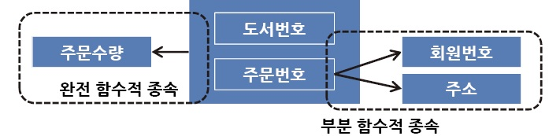

관계형 데이터베이스의 설계에서 중복을 최소화하게 데이터를 구조화하는 프로세스.

### 정규화의 목적

1. **중복을 배제하여 삽입, 삭제, 갱신 이상의 발생을 방지**
2. 각 릴레이션에 중복된 종속성을 여러 개의 릴레이션에 분할
3. 어떠한 릴레이션이라도 데이터베이스 내에서 표현 가능하게 함
4. 데이터 삽입 시 릴레이션을 재구성할 필요성 감소
5. 효과적인 검색 알고리즘을 생성 가능

### 정규화의 대상

온라인 거래 시스템 같은 OLTP(OnLine Tranaction Processing) 데이터베이스는 CRUD(Create, Read, Update, Delete)가 많이 일어나기 때문에 정규화 되는 것이 좋다. 

### 정규화의 과정

각각의 정규형(Normal Form, NF)이 되기 위한 조건들을 충족시키는 과정

→ 1 ~ 6 정규화까지 있다. 대체로 1 ~ 3 정규화까지의 과정을 거친다.

 

- **제 1 정규화(1NF)**
    - 도메인이 원자값이어야 한다.
    - 모든 애트리뷰트에 반복되는 그룹이 나타나지 않는다.
    
    📌 발생할 수 있는 이상
    
    - 갱신이상
    - 삭제이상
- **제 2 정규화(2NF)**
    - 부분적 함수 종속성을 제거해야 한다.
    - 완전 함수 종속이 되도록 테이블을 분해해야 한다.
        - 기본 키의 부분 집합이 결정자가 되어선 안된다.
        > 결정자
            주어진 릴레이션에서 다른 애트리뷰트를 고유하게 결정하는 하나 이상의 애트리뷰트
            
    📌 발생할 수 있는 이상
    
    - 갱신이상
    - 삭제이상
    - 삽입이상
- **제 3 정규화(3NF)**
    - 이행적 함수 종속을 제거해야 한다.
        - 이행적 함수 종속: A→B 이고 B→C 일 때 A→C 인 관계
    
    📌 발생할 수 있는 이상
    
    - 갱신이상
    - 삭제이상
    - 삽입이상
- **BCNF**(Boyce and Codd Normal Form)
    - 결정자이면서 후보 키가 아닌 것을 제거해야 한다.
   
    📌 발생할 수 있는 이상
    
    - 갱신이상
    - 삭제이상
    - 삽입이상
- 제 4 정규화(4NF)
    - 다치 종속성 제거
- 제 5 정규화(5NF)
    - 조인 종속성 제거
- 제 6 정규화(6NF)
    - 모든 관계가 후보 키와 하나 이상의 다른 속성으로 구성

---

참고

[[DB이론] 정규화 ( Normalization ) :: victolee (tistory.com)](https://victorydntmd.tistory.com/132)

[[Database] 정규화(Normalization) 쉽게 이해하기 - MangKyu's Diary (tistory.com)](https://mangkyu.tistory.com/110)

[데이터베이스 정규화 - IT위키 (itwiki.kr)](https://itwiki.kr/w/%EB%8D%B0%EC%9D%B4%ED%84%B0%EB%B2%A0%EC%9D%B4%EC%8A%A4_%EC%A0%95%EA%B7%9C%ED%99%94)
