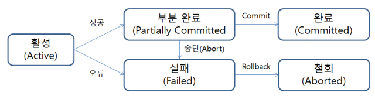

# Transaction(트랜잭션)

- 데이터 베이스 트랜잭션(Database Transaction)은 DBMS 또는 유사한 시스템에서 상호작용의 단위, 업무 처리의 **최소한의 단위**이다.
- 데이터베이스의 상태를 변환시키는 하나의 논리적 기능을 수행하기 위한 *작업의 단위* 또는 한꺼번에 모두 수행되어야 할 **일련의 연산**들을 의미한다.
- 데이터베이스의 상태를 변경(SELECT, UPDATE, INSERT, DELETE)시키기 위해 수행하는 작업의 단위이다.

→ 트랜잭션이 정상적으로 완료되면 commit, 오류가 발생할 경우 rollback한다.

### 트랜잭션의 목적

- 데이터 부정합 방지 → DB 서버에 여러 개의 클라이언트가 동시에 액세스하거나 응용프로그램이 갱신을 처리하는 과정에서 중단되는 경우
- 데이터베이스 완전성(integrity) 유지 확신 → 트랜잭션 조작 기능을 통해 수행된 일부 쿼리 중 오류가 발생됐을 경우(rollback)

### 트랜잭션의 특징

1. **Atomicity (원자성)**
    - 트랜잭션과 관련된 작업들이 부분적으로 실행되다가 중단되지 않는 것을 보장하는 능력
    - 트랜 잭션 내의 모든 명령은 반드시 완벽히 수행되어야 한다. 그렇지 않을 경우 트랜잭션 전부가 취소되어야한다.
    - All or Nothing
2. **Consistency (일관성)**
    - 트랜잭션이 실행을 성공적으로 완료하면 언제나 일관성 있는 데이터베이스 상태로 유지하는 것
    - 시스템의 고정 요소는 트랜잭션 수행 전과 완료 후의 상태가 같아야 한다.
    - 데이터 타입이 반환 전과 후가 동일해야한다.

1. **Isolation (독립성, 고립성)**
    - 트랜잭션을 수행 시 다른 트랜잭션의 연산 작업이 끼어들지 못하도록 보장하는 것
    - 수행중인 트랜잭션은 완전히 완료될 때까지 다른 트랜잭션에서 수행 결과를 참조할 수 없다.
    - 각각의 트랜잭션은 독립적이라 서로 간섭이 불가능하다.

1. **Durability (지속성)**
    - 성공적으로 수행된 트랜잭션은 영원히 반영되어야 함

### 트랜잭션의 연산

**Commit**

- 하나의 트랜잭션이 **성공적으로 끝나서 데이터베이스가 일관성있는 상태에 있음**을 의미한다.
- 처리 과정을 데이터베이스에 영구적으로 저장하는 것

**Rollback**

- 트랜잭션의 원자성이 깨질 때, 즉 **하나의 트랜잭션 처리가 비정상적으로 종료**되었을 때의 상태를 뜻한다.
- 작업 중 문제가 발생하여 **트랜잭션의 처리과정에서 발생한 변경 사항을 취소하는 명령어**

**Save point**

- 전체가 아닌 특정 부분에서 트랜잭션을 취소하기 위해 사용한다.

### 트랜잭션의 상태

**활동(Active)**

- 트랜잭션이 실행중인 상태

**실패(Failed)**

- 트랜잭션 실행에 오류가 발생하여 중단된 상태

**철회(Aborted)**

- 트랜잭션이 비정상적으로 종료되어 Rollback 연산을 수행한 상태

**부분 완료(Partially Committed)**

- 트랜잭션의 마지막 연산까지 실행했지만, Commit 연산이 실행되기 직전의 상태

**완료(Committed)**

- 트랜잭션이 성공적으로 종료되어 Commit 연산을 실행한 후의 상태

---

출처 및 참고

[http://wiki.hash.kr/index.php/트랜잭션](http://wiki.hash.kr/index.php/%ED%8A%B8%EB%9E%9C%EC%9E%AD%EC%85%98)

[https://ko.wikipedia.org/wiki/데이터베이스_트랜잭션](https://ko.wikipedia.org/wiki/%EB%8D%B0%EC%9D%B4%ED%84%B0%EB%B2%A0%EC%9D%B4%EC%8A%A4_%ED%8A%B8%EB%9E%9C%EC%9E%AD%EC%85%98)

[https://coding-factory.tistory.com/226](https://coding-factory.tistory.com/226)

[https://wonit.tistory.com/462](https://wonit.tistory.com/462)

[https://brunch.co.kr/@skeks463/27](https://brunch.co.kr/@skeks463/27)

[https://velog.io/@wldus9503/데이터베이스-트랜잭션Transaction란](https://velog.io/@wldus9503/%EB%8D%B0%EC%9D%B4%ED%84%B0%EB%B2%A0%EC%9D%B4%EC%8A%A4-%ED%8A%B8%EB%9E%9C%EC%9E%AD%EC%85%98Transaction%EB%9E%80)

[https://junghn.tistory.com/entry/DataBase기초-트랜잭션이란-무엇인가-Transaction](https://junghn.tistory.com/entry/DataBase%EA%B8%B0%EC%B4%88-%ED%8A%B8%EB%9E%9C%EC%9E%AD%EC%85%98%EC%9D%B4%EB%9E%80-%EB%AC%B4%EC%97%87%EC%9D%B8%EA%B0%80-Transaction)

[https://itwiki.kr/w/트랜잭션](https://itwiki.kr/w/%ED%8A%B8%EB%9E%9C%EC%9E%AD%EC%85%98)
