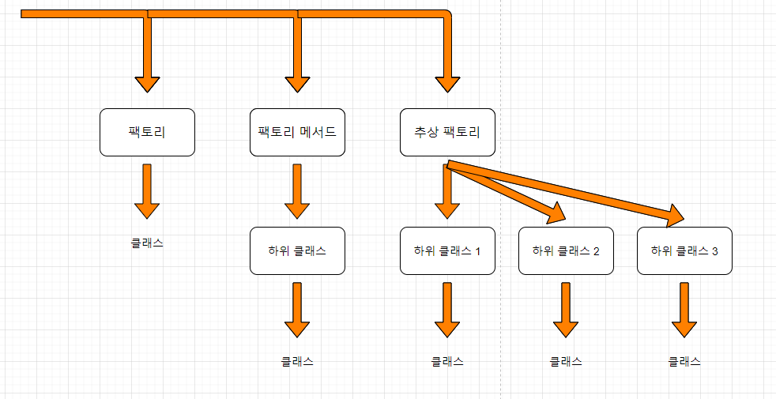

# Abstract Factory

- 구체적인 클래스에 의존하지 않고 **서로 연관되거나 의존적인 객체들의 조합을 만드는 인터페이스를 제공하는 패턴**으로 이 패턴을 통해 생성된 클래스에서는 사용자에게 인터페이스(API)를 제송하고, 구체적인 구현은 Concrete Product 클래스에서 이루어지는 특징을 갖는 디자인 패턴
- 상세화된 서브클래스를 정의하지 않고도 서로 관련성이 있거나 독립적인 여러 객체의 군을 생성하기 위한 인터페이스를 제공
- 동일한 주제의 다른 팩토리를 묶음

## 구조


- **AbstractFactory**: **개념적** 제품에 대한 **객체를 생성하는 연산**으로 **인터페이스 정의**
- **ConcreteFactory**: **구체적**인 제품에 대한 **객체를 생성하는 연산을 구현**
- **AbstractProduct**: **개념적** 제품 객체에 대한 **인터페이스 정의**
- **ConcreteProduct**: 구체적으로 팩토리가 생성할 객체를 정의하고, AbstractProduct가 정의하는 **인터페이스 구현**
- **Client**: AbstractFactory와 AbstractProduct 클래스에 선언된 **인터페이스 사용**

## 활용

- 객체가 생성되거나 구성, 표현되는 방식과 무관하게 시스템을 독립적으로 만들고자 할 때
- 여러 제품군 중 하나를 선택해서 시스템을 설정해야 하고 한번 구성한 제품을 다른 것으로 대체할 수 있을 때
- 관련된 제품 객체들이 함께 사용되도록 설계되었고, 이 부분에 대한 제약이 외부에도 지켜지도록 하고 싶을 때
- 제품에 대한 클래스 라이브러리를 제공하고, 그들의 구현이 아닌 인터페이스를 노출시키고 싶을 때

## 예제

```java
/* 마피아 게임에서 사용자를 나타내는 class */
abstract class User {
    String name;    //사용자 이름
    String skill;   //스킬

    User(String name) { this.name = name; }
    
    String getName() { return name; }
    
    String getSkill() { return skill; }
}
```

```java
/* 마피아 게임에서 시민을 나타내는 class */
public class Citizen extends User{
    Citizen(String name) {
        super(name);
        System.out.println(name + " 님은 시민으로 생성 되었습니다.");
        setSkill();
    }
    
    void setSkill() {
        this.skill = "투표를 행사 할 수 있음.";
        System.out.println(name + " 님은 시민 스킬을 장착하였습니다.\n");
    }
}
```

```java
/* 마피아 게임에서 마피아를 나타내는 class */
public class Mafia extends User {
    Mafia(String name) {
        super(name);
        System.out.println(name + " 님은 마피아로 생성 되었습니다.");
        setSkill();
    }
    
    void setSkill() {
        this.skill = "시민을 죽일 수 있음.";
        System.out.println(name + " 님은 마피아 스킬을 장착하였습니다.\n");
    }
}
```

```java
/* 마피아 게임에서 경찰을 나타내는 class */
public class Police extends User {
    Police(String name) {
        super(name);
        System.out.println(name + " 님은 경찰로 생성 되었습니다.");
        setSkill();
    }
    
    void setSkill() {
        this.skill = "마피아를 찾을 수 있음.";
        System.out.println(name + " 님은 경찰 스킬을 장착하였습니다.\n");
    }
}
```

---

```java
/* 객체 생성의 위임을 위한 Factory class */
abstract class Factory {
    /* 추상화를 결합한 추상 팩토리 패턴의 상위 클래스 */
    public final User create(String name) {
        //하위 클래스로 위임
        return this.createUser(name);
    }

    abstract public User createUser(String name);
}
```

- **추상클래스**에서 정의한 **추상 메서드**인 `createUser()`를 통해 **하위 클래스에** **구현부를** **위임**하고, `create()`를 통해 **하위클래스**에 **위임한 함수**를 실행하도록 설계
- 이에 따라 해당 **Factory**를 상속받는 **하위 클래스**들은 저마다 **특징에 맞도록 구현부를 다르게 작성** 가능(**다형성**)

---

### Factory를 상속받을 각각의 하위 클래스

- **기존 팩토리 메서드 패턴**과 달리 각각의 **하위클래스**에서 **목적에 해당되는 객체를 생성**

```java
/* Citizen 객체 생성을 담당할 하위 Factory */
public class CitizenFactory extends Factory {

    @Override
    public User createUser(String name) {
        return new Citizen(name); //Citizen 객체를 생성.
    }
}
```

```java
/* Mafia 객체 생성을 담당할 하위 Factory */
public class MafiaFactory extends Factory {
    @Override
    public User createUser(String name) {
        return new Mafia(name); //Mafia 객체를 생성.
    }
}
```

```java
/* Police 객체 생성을 담당할 하위 Factory */
public class PoliceFactory extends Factory {
    @Override
    public User createUser(String name) {
        return new Police(name); //Police 객체를 생성.
    }
}
```

---

- **팩토리 메서드 패턴**에서는 하나의 **하위 클래스**를 통하여 `create()`
- **추상 팩토리 패턴**에서는 각각의 객체 생성을 담당하는 **하위** **Factory**를 결합하여 `create()`를 호출

```java
public class AbstractFactoryPattern {

    /* 마피아 게임 */
    public static void main(String[] args) {
        Factory factory = new MafiaFactory();
        User user1 = factory.create("성민");

        factory = new PoliceFactory();
        User user2 = factory.create("영성");

        factory = new CitizenFactory();
        User user3 = factory.create("승주");
        User user4 = factory.create("수지");

        System.out.println("이름 :  " + user1.getName() + ",  스킬 : " + user1.getSkill());
        System.out.println("이름 :  " + user2.getName() + ",  스킬 : " + user2.getSkill());
        System.out.println("이름 :  " + user3.getName() + ",  스킬 : " + user3.getSkill());
        System.out.println("이름 :  " + user4.getName() + ",  스킬 : " + user4.getSkill());
    }
}
```

## Factory Method와 차이



- `팩토리 메서드 패턴`은 **추상화**를 통하여 **하위 클래스**에게 구현을 위임하였으며, **1개의 하위 클래스** 안에서 **매개변수**를 통하여 **조건**에 따라 각각의 **객체 생성**

    👉 **다형성**을 배제한 방법

    - **1개의 하위클래스** 내 **매개변수** 를 통해 생성을 선택적으로 처리하기에 **다형성**의 단점은 해결할 수 있지만, **새로운 객체**가 추가된다면 **조건이 추가** 되어야 하고 확장 시 **하위클래스**의 덩치가 커지기 때문에 **유지보수**가 어려울 수 있음
- `추상 팩토리 패턴`은 생성해야 될 각각의 객체마다 **하위 클래스(Factory)** 를 생성하여, 원하는 **하위 클래스(Factory)** 를 결합하도록 하는 방식

    👉 복수의 **하위 클래스(Factory)** 를 갖는 구조

    - **팩토리 메서드 패턴의 확장**이라고 볼 수 있지만, 더 좋은 패턴이라고는 단정 지을 수 없음
    - 장점: 동일한 처리 로직의 하위클래스의 결합을 통해 선택적으로 객체를 생성 가능
    - 새로운 객체가 추가된다면 하위 클래스도 같이 추가돼야 하고 **확장 시 모든 하위클래스의 수정이 필요 가능**
##### 참고
- https://johngrib.github.io/wiki/abstract-factory-pattern/
- https://yeah.tistory.com/13
