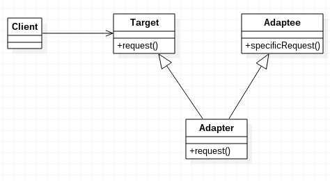

# Adapter Pattern (Wrapper)

한 클래스의 인터페이스를 클라이언트에서 사용하고자 하는 다른 인터페이스로 변환하는 패턴이다.  

- 호환성이 없는 인터페이스 때문에 함께 동작할 수 없는 클래스들을 어댑터를 이용하여 함께 동작할 수 있도록 한다.
- 클라이언트가 서로 다른 2개의 클래스에 의존하고자 할 때, 클래스 사이에 어댑터를 두어 클래스를 수정할 필요 없이 사용할 수 있다.

### Adapter pattern 구조

- **Client**
    - Third patry livrary 나 외부 시스템을 *요청하는 사용자*이다.
- **Adaptee**
    - Client의 요청을 처리하는 *Third patry livrary 나 외부 시스템*이다.
- **Target Interface**
    - *Client의 요청을 받는 인터페이스*이다.
    - Client가 Target Interface를 통해 Adaptee를 사용한다.
- **Adapter**
    - Target Ingterface 를 구현하고, Target Ingterfaced 에서 받은 Client 의 요청을  Adaptee 가 이해하는 방법으로 전달한다.
    - 호환성이 없는 Client 와 Adaptee 를 연결한다.

→ 클라이언트는 Target Interface에 요청을 보내고, 해당 인터페이스를 구현한 Adapter는 자신이 감싸고 있는 Adaptee에 요청을 전달하여 처리를 한다. 

### Adapter 종류

- Class Adapter

    

    - 다중 상속을 활용
    - Adapter 클래스가 Target 클래스와 Adaptee클래스를 모두 상속 받는다.
- Object Adapter

    

    - 복합 객체, 합성을 활용
    - Adapter가 Target 인터페이스를 구현하고 Adaptee의 인스턴스를 가진다.

### 사용 예시

[https://blog.seotory.com/post/2017/09/java-adapter-pattern](https://blog.seotory.com/post/2017/09/java-adapter-pattern)

### 장점

- 호환되지 않는 인터페이스를 같이 사용할 수 있다.
- 기존의 코드를 변경하지 않아도 된다.
- 클래스의 재활용성이 증가된다.
- 소스코드가 간단해지고 유지보수가 원활하다.

### 단점

- 어댑터 클래스의 코드를 구현해야되기 때문에 효율적이지 못하다.

> JDK에서 사용되는 어댑터 패턴  
> InputStreamReader

---

참고

[https://gdtbgl93.tistory.com/141](https://gdtbgl93.tistory.com/141)

[https://siyoon210.tistory.com/166](https://siyoon210.tistory.com/166)

[https://yaboong.github.io/design-pattern/2018/10/15/adapter-pattern/](https://yaboong.github.io/design-pattern/2018/10/15/adapter-pattern/)

[https://sonseungha.tistory.com/502](https://sonseungha.tistory.com/502)
