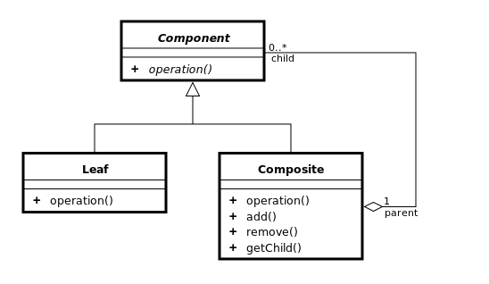

# Composite Pattern

`단일 객체(Single Instance)` 와 `객체들의 집합(Group of Instance)` 을 동일하게 취급하며, 트리 구조로 객체들을 구성하는 패턴이다.

- 트리의 구조로 작성하여 **전체-부분의 관계**(Ex. Directory - File)를 갖는 객체들 사이의 관계를 정의할 때 유용하다.
- 클라이언트에서 부분, 관계 객체를 균일하게 처리하고 싶을 경우에 사용한다.

    
    <br/>
### Composite Pattern 구조

- **Component**
    - *표현할 모든 요소들(Leaf, Composite)의 추상적인 인터페이스*
    - Leaf와 Composite가 구현해야하는 Interface 로, Leaf와 Composite는 Component라는 같은 타입으로 다뤄진다.
- **Leaf**
    - Component 인터페이스를 구현한 것
    - *단일 객체로 Composite 의 부분(자식) 객체*, Component 형태로 들어간다.
    - 구체적인 부분의 클래스
- **Composite**
    - Component 요소를 자식으로 가지는 것
    - *집합 객체로 Leaf 나 Composite 를 부분(자식)으로 둔다*
    - 클라이언트는 Composite 를 통해 부분 객체들(Leaf, Composite)을 다룬다.
    - 여러 개의 Component 를 가질 수 있으므로 여러 개의 Leaf 와 여러개의 Composite 객체를 부분으로 가질 수 있다.
    - 전체 클래스

    

    → `Client`클래스는 공통 `Interface`인 `Component`를 참조하여 `Leaf`와 `Conposite` 를 참조한다. 

    → `Leaf` 클래스는 `Component` 인터페이스를 구현한다.

    → `Composite` 클래스는 `Component` 객체 자식들을 유지하고, operation()과 같은 요청을 통해 자식들에게 전달한다.
    <br/>
    ### 사용 예시 - 도형 색 입히기

    - **Component**

        *Shape.java* 

        - 구현하는 클래스들이 동일한 처리를 하는 메소드

        ```java
        public interface Shape {
        		
            public void draw(String fillColor);
        }
        ```

    - **Leaf**

        *Triangle.java*

        ```java
        public class Triangle implements Shape {
         
            @Override
            public void draw(String fillColor) {
                System.out.println("Drawing Triangle with color "+fillColor);
            }
        }
        ```

        *Circle.java*

        ```java
        public class Circle implements Shape {
         
            @Override
            public void draw(String fillColor) {
                System.out.println("Drawing Circle with color "+fillColor);
            }
        }
        ```

    - **Composite**

        *Drawing.java*

        - *Leaf 객체 포함, Component 구현, Leaf 그룹 추가 제거 메소드 구현*

        ```java
        public class Drawing implements Shape {
         
            //collection of Shapes
            private List<Shape> shapes = new ArrayList<Shape>();
        	
            @Override
            public void draw(String fillColor) {
                for(Shape sh : shapes) {
                    sh.draw(fillColor);
                }
            }
        	
            //adding shape to drawing
            public void add(Shape s) {
                this.shapes.add(s);
            }
        	
            //removing shape from drawing
            public void remove(Shape s) {
                shapes.remove(s);
            }
        	
            //removing all the shapes
            public void clear() {
                System.out.println("Clearing all the shapes from drawing");
                this.shapes.clear();
            }
        }
        ```

    - 예제 테스트 코드

        ```java
        public class TestCompositePattern {
         
            public static void main(String[] args) {
                Shape tri = new Triangle();
                Shape tri1 = new Triangle();
                Shape cir = new Circle();
        		
                Drawing drawing = new Drawing();
                drawing.add(tri1);
                drawing.add(tri1);
                drawing.add(cir);
        		
                drawing.draw("Red");
        		
                List<Shape> shapes = new ArrayList<>();
                shapes.add(drawing);
                shapes.add(new Triangle());
                shapes.add(new Circle());
                
                for(Shape shape : shapes) {
                    shape.draw("Green");
                }
            }
        }
        ```
    
    
    <br/>

    ### 장점

    - 객체들을 일괄적으로 관리할 수 있다.
    - 객체들을 모두 같은 타입으로 취급하기 때문에 새로운 클래스 추가가 용이하다.

    ### 단점

    - 설계를 일반화시켜 객체간의 구분, 제약이 힘들다.
    <br/>
    
------
참조

[https://dailyheumsi.tistory.com/193#recentComments](https://dailyheumsi.tistory.com/193#recentComments)
[https://jdm.kr/blog/228](https://jdm.kr/blog/228)
[https://mygumi.tistory.com/343](https://mygumi.tistory.com/343)
[https://gmlwjd9405.github.io/2018/08/10/composite-pattern.html](https://gmlwjd9405.github.io/2018/08/10/composite-pattern.html)
[https://readystory.tistory.com/131](https://readystory.tistory.com/131)
