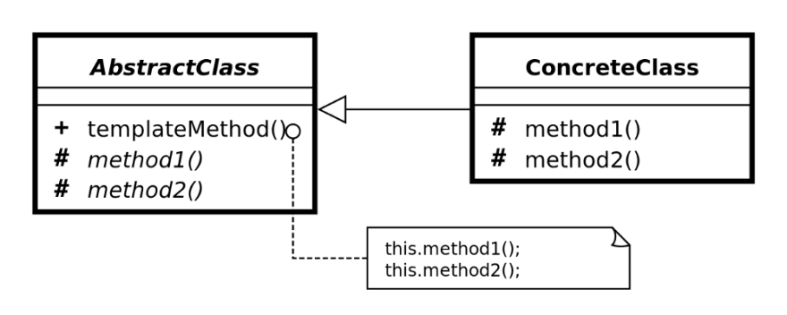

# Template Method Pattern

메소드의 알고리즘의 골격을 정의하고, 여러 단계를 서브 클래스로 연기하는 패턴이다.

- 서브 클래스는 알고리즘의 구조를 변경하지 않고 알고리즘의 특정 단계를 다시 정의할 수 있다.
- 기본 클래스에서 "hook"를 선언하고, 파생 클래스는 이를 구현한다.

> hook  
> 추상 클래스에서 선언되는 메소드로 기본적인 내용만 구현하거나 아무 코드도 들어있지 않은 메소드

</br>

### Template Method Pattern 구조



- **Abstract Class**
    - 알고리즘의 단계를 정의하고, 해당 단계를 특정 순서로 호출하는 실제 `template method` 를 구현한다.
    - `Abstract method` 와 `hook method` , `final method` 를 사용해 알고리즘의 흐름만을 정의한다.
- **Concrete Class**
    - 구체적인 구현을 하는 클래스이다.
    - 모든 단계를 재정의할 수 있지만, 템플릿 메소드 자체를 재정의할 수 없다.

→ 공통적인 부분을 추상 클래스로 정의한다.

</br>

### 사용 예시

**Abstract Class**

```jsx
public abstract class Game {
   abstract void initialize();
   abstract void startPlay();
   abstract void endPlay();

   //template method
   public final void play(){

      //initialize the game
      initialize();

      //start game
      startPlay();

      //end game
      endPlay();
   }
}
```

→ final 메소드와 abstract 메소드로 로직의 흐름만을 정의하고 구체적인 구현은 하위 클래스에 위임

**Concrete Class**

*Cricket.java*

```jsx
public class Cricket extends Game {

   @Override
   void endPlay() {
      System.out.println("Cricket Game Finished!");
   }

   @Override
   void initialize() {
      System.out.println("Cricket Game Initialized! Start playing.");
   }

   @Override
   void startPlay() {
      System.out.println("Cricket Game Started. Enjoy the game!");
   }
}
```

*Football.java*

```jsx
public class Football extends Game {

   @Override
   void endPlay() {
      System.out.println("Football Game Finished!");
   }

   @Override
   void initialize() {
      System.out.println("Football Game Initialized! Start playing.");
   }

   @Override
   void startPlay() {
      System.out.println("Football Game Started. Enjoy the game!");
   }
}
```

Main

```jsx
public class TemplatePatternDemo {
   public static void main(String[] args) {

      Game game = new Cricket();
      game.play();
      System.out.println();
      game = new Football();
      game.play();		
   }
}
```

</br>

### Template Method Pattern 장단점

- 장점
    - 중복 코드를 줄일 수 있다.
    - 자식 클래스의 역할을 줄여 핵심 알고리즘의 관리가 쉽다.
    - 코드를 좀 더 객체지향적으로 구성할 수 있다.
- 단점
    - 추상 메소드가 많아짐에 따라 클래스 관리가 복잡해진다.
    - 서브 클래스를 통해 기본 단계 구현을 억제함으로써, 리스코프 치환 원칙(Liskov Substitution Principle)에 위반 될 수 있습니다.

</br>

### 사용 이유

- 단일 알고리즘의 단계만을 확장시켜, 알고리즘 전체나 구조를 확장시키고 싶지 않을 경우
- 거의 동일한 알고리즘을 포함한 여러 클래스가 있는 경우
(→ 알고리즘 변경 시 모든 클래스 변경)

</br>

---

참고

[https://sourcemaking.com/design_patterns/template_method](https://sourcemaking.com/design_patterns/template_method)

[https://coding-factory.tistory.com/712](https://coding-factory.tistory.com/712)

[https://refactoring.guru/design-patterns/template-method](https://refactoring.guru/design-patterns/template-method)
