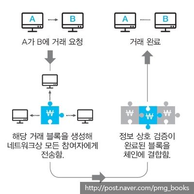

# Blockchain

네트워크에 참여하는 모든 사용자가 모든 거래 내역 등의 데이터를 분산, 저장하는 기술

- `데이터 분산 처리 기술` , 공공 거래 장부, 분산 거래 장부라고 불림
- `블록` : 개인과 개인을 거래(P2P)의 데이터가 기록되는 장부
- `사슬` 의 구조 : 블록들이 형성된 후 시간의 흐름에 따라 순차적으로 연결된 구조

→ 거래 내역을 네트워크 참가자의 수 만큼 블록을 생성하여 모두에게 전송, 저장한다.

 

### 블록체인 원리

네트워크에 참가하는 모든 공동체가 거래를 기록하고 관리하는 P2P 거래이다.

거래 정보를 블록에 담아 차례대로 연결하고 이를 모든 참여자가 공유한다.

1️⃣ 사용자 간의 거래 요청

2️⃣ 거래 정보가 담긴 블록 생성

3️⃣ 네트워크 상의 모든 참여자에게 블록 전송

4️⃣ 참여자들은 거래 정보의 유효성 상호 검증

5️⃣ 검증 완료된 블록은 이전 블록에 연결되고, 그 사본이 만들어져 각 사용자의 컴퓨터에 분산 저장된다.

- 참여자 과반수의 데이터와 일치하는 거래 내역은 정상 장부로 확인한다.

6️⃣ 거래 완료

 

### 블록체인 특징

- `분산 저장`
- `중앙 관리자가 필요 없다`
- 높은 `보안성` : 분산 처리와 암호화 기술 적용, Hash 함수 사용

→ 다수가 데이터를 저장, 증명하기 때문이다.

- 확장성 : 소스가 공개되어 있다.
- 투명성 : 공개적으로 거래 기록에 접근 가능하다.
- 안정성

 

### 블록체인 장단점

- 장점
    - 보안성 향상
    - 비용 감소
    - 거래 속도 향상
    - 가시성 극대화
- 단점
    - 거래 검증 주체
    - 처리 비용 낭비
    - 확장성의 제한 : 대량의 거래 데이터 처리 불가능
    - 프라이버시 노출
    - 익명성의 한계

 

### 비트코인

- 중앙 관리자가 없기 때문에 화폐 발행이 가능하다.
- 비트코인을 사람들이 직접 채굴, 발행할 수 있다.

 

---

출처 및 참고

[https://www.banksalad.com/contents/블록체인-개념-완벽-정리-dh1do](https://www.banksalad.com/contents/%EB%B8%94%EB%A1%9D%EC%B2%B4%EC%9D%B8-%EA%B0%9C%EB%85%90-%EC%99%84%EB%B2%BD-%EC%A0%95%EB%A6%AC-dh1do)

[http://www.freedomnews.co.kr/news/articleView.html?idxno=7069](http://www.freedomnews.co.kr/news/articleView.html?idxno=7069)

[https://www.kiri.or.kr/pdf/연구자료/연구보고서/nre2018-24_02.pdf](https://www.kiri.or.kr/pdf/%EC%97%B0%EA%B5%AC%EC%9E%90%EB%A3%8C/%EC%97%B0%EA%B5%AC%EB%B3%B4%EA%B3%A0%EC%84%9C/nre2018-24_02.pdf)

[https://steemit.com/kr/@sungyu1223/3krc2h](https://steemit.com/kr/@sungyu1223/3krc2h)
