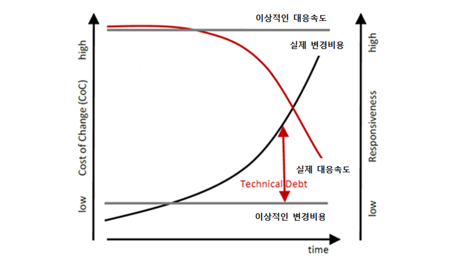

# 클린코드

- 군더더기 없이 깔끔하며 기능을 수행하는 코드를 최대한 작은 라인으로 구현한 코드
- 직접적이고 에러 처리가 잘 되어 있으며 하나의 역할을 수행하는 코드
- 단순하고 직접적인 코드
- **가독성이 좋은 코드**. 즉, 모든 팀원이 이해하기 쉽도록 작성된 코드

## 가독성의 중요성

- 일반적으로 기존 코드를 변경하고자 할 때, **해석하는 시간과 수정하는 시간의 비율이 10:1**
    - 코드를 변경하기 위해서 걸리는 전체 시간이 10시간이라고 하면, 사전에 코드를 분석하는 시간이 9시간 이상 걸림
- **오류의 위험성 최소화**
    - 대부분의 결함은 기존 코드를 수정하는 동안 발생

## **Technical Debt**

> **이상적인 변경 비용과의 차이가 나는 부분**으로 클린코드 작성을 위해 개발자들이 언젠가 해결해야 되는 부채

- 프로젝트 초기에 클린코드로 개발하기 보다는 좀더 빠르고 쉬운 방법을 선택하기 때문에 발생 ex) copy & paste

- 이상적인 변경비용은 일관되게 낮지만 실제 변경비용은 증가
- 이상적인 고객 요구사항의 대응속도는 일관되게 높지만 실제 대응속도는 점점 낮아짐

## 주요 원칙

### General
1. **Follow Standard Conventions**: Coding 표준, 아키텍처 표준 및 설계 가이드를 준수하라
2. **Keep it Simple, Stupid (KISS)**: 단순한 것이 효율적이며, 복잡함을 최소화하라
3. **Boy Scout Rule**: 캠핑장을 떠나기 전에 원래보다 깨끗하게 해야 한다(참조되거나 수정되는 코드는 원래보다 clean하게 해야 함)
4. **Root Cause Analysis**: 항상 근본적인 원인을 찾아라. 그렇지 않으면 반복될 것이다
5. **Do Not Multiple Languages in One Source File**: 하나의 파일은 하나의 언어로 작성하라

### Class Design
> **SOLID**: 소프트웨어 작업에서 프로그래머가 소스 코드가 읽기 쉽고 확장하기 쉽게 될 때까지 소프트웨어 소스 코드를 **리팩터링**하여 **코드 냄새**(더 심오한 문제를 일으킬 가능성이 있는 코드)를 제거하기 위해 적용할 수 있는 지침

1. **SRP; Simple Responsibility Principle**: 하나의 클래스는 하나의 책임만 가져야 함
2. **OCP; Open/Closed Principle**: 클래스는 확장에 대하여 열려 있어야 하고, 변경에 대해서는 닫혀 있어야 함
3. **LSP; Liskov Substitution Principle**: 파생 클래스의 메서드는 기반 클래스의 메서드를 대체하여 사용될 수 있어야 함
4. **ISP; Interface Segregation Principle**: 클라이언트가 사용하지 않는 메서드에 의존하지 않아야 함
5. **DIP; Dependency Inversion Principle**: 추상화된 것은 구체적인 것에 의존하면 안됨(자주 변경되는 구체적인 것에 의존하지 말고 추상화된 것을 참조)

###### 참고

- [https://www.samsungsds.com/kr/story/cleancode-0823.html](https://www.samsungsds.com/kr/story/cleancode-0823.html)
