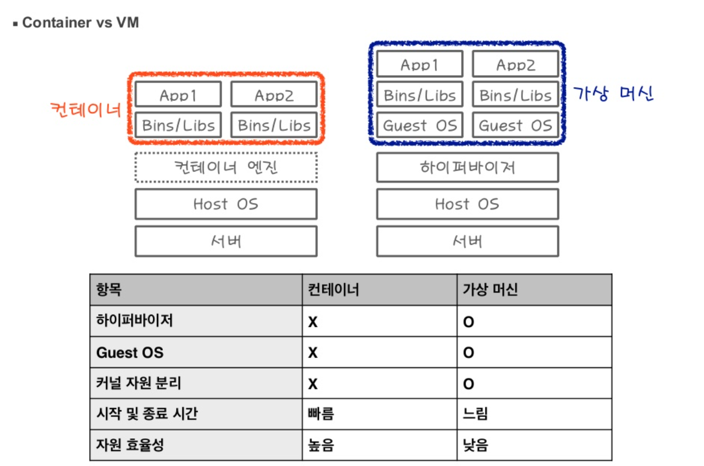
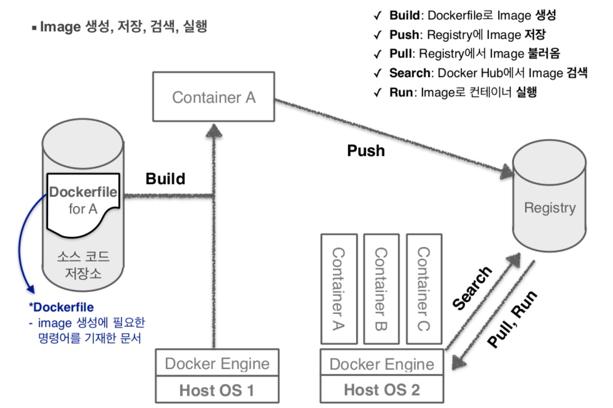
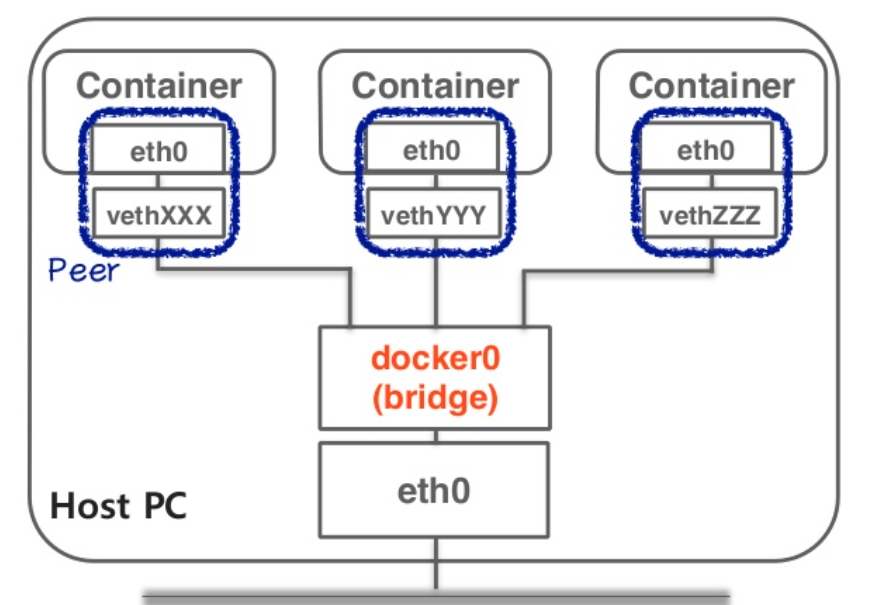

# 도커(Docker)

> 애플리케이션을 신속하게 구축, 테스트 및 배포할 수 있는 소프트웨어 플랫폼

- 소프트웨어를 **OS 가상화** 기술인 **컨테이너**라는 표준화된 유닛으로 패키징하며, 이 컨테이너에는 라이브러리, 시스템 도구, 코드, 런타임 등 소프트웨어를 실행하는 데 필요한 모든 것이 포함되어 있음

> 가상화(Virtualization)란 **물리적인 자원을 동시에 다수의 논리적인 자원으로 사용**하는 것

- **환경에 구애받지 않고** 애플리케이션을 신속하게 배포 및 확장할 수 있으며 코드가 문제없이 실행될 것임을 확신할 수 있도록 함

## 컨테이너 vs 가상머신

> 애플리케이션을 관련 라이브러리 및 종속 항목과 함께 패키지로 묶어 소프트웨어 서비스 구동을 위한 격리 환경을 마련

> 하이퍼바이저: 리소스가 파티셔닝되어 VM 전용으로 할당될 수 있도록 리소스를 물리 머신에서 분리하는 소프트웨어

**컨테이너**

- 서버 **운영 체제**를 가상화
- 앱보다 크거나 실행하는 데 필수적인 모든 파일이 컨테이너에 패키징되는 것은 아니며, **특정 작업을 수행하는 단일 기능**(마이크로서비스라고 함)이 **컨테이너에 패키징**되는 경우가 많음
- **경량화 속성과 공유 운영 체제(OS)**로 인해 여러 환경 간에 매우 쉽게 이동 가능
- 가상 머신보다 **리소스를 더 적게 사용**하고 호스트 메모리에 가해지는 부담을 줄일 수 있도록 **운영 체제 환경(커널)을 공유**
- 쉽게 이동할 수 있는 **작은 인스턴스(컨테이너)가 필요**할 때 사용

**가상머신**

- 서버 **하드웨어**를 가상화
- VM에서 사용할 수 있는 리소스가 늘어남에 따라 전체 서버, OS, 데스크톱, 데이터베이스, 네트워크를 추상화, 분할, 복제, 에뮬레이션 가능
- **각 가상 머신마다 전용 운영 체제**가 있기 때문에 가상 머신에 구축된 애플리케이션을 실행할 때 **메모리 사용량이 필요 이상으로 많아져** 가상 머신이 호스트에 필요한 리소스를 모두 사용할 수 있음
- 사용자 정의 IT 리소스의 **반영구적 할당이 필요**할 때 사용

## 장점

1. **더 많은 소프트웨어를 더 빨리 제공:** 개발자와 관리자의 업무를 분리(개발자는 컨테이너 내부만, 관리자는 컨테이너 관리만)
2. **운영 표준화**: 작은 컨테이너식 애플리케이션을 사용하면 손쉽게 배포하고, 문제를 파악하고, 수정을 위해 롤백 가능
3. **원활하게 이전**
4. **비용 절감**

## 구성요소

1. **Server(Docker Daemon):** 사용자와 Docker Client를 통해 연결되며 Host machine에서 컨테이너를 관리하고 실행
2. **Client**: Docker와 사용자 간 인터페이스 제공하며 사용자 명령을 받아 Docker Daemon으로 전달(소켓 통신 사용)
3. **Registry**: Image 저장소로 Private 또는 public registry(ex. Docker Hub: Docker, Inc에서 제공하는 public registry)가 존재
4. **Image**: 라이브러리, 실행 파일, 소스코드 들이 패키지화된 것
5. **Container**: 하나 이상의 Image가 동작하는 독립된 애플리케이션 플랫폼으로 애플리케이션 실행을 위한 모든 것을 포함

## 동작방식

## Docker Networking

> 도커 컨테이너가 외부로 통신하기 위한 구조

- **Default gateway**로 Linux bridge인 **docker0**를 만듦
    - 외부 네크워크와 교환하는 패킷에 NAT 작업 수행

    > 네크워크 주소 변환(NAT; Network Address Translation)은 IP 패킷의 TCP/UDP 포트 숫자와 소스 및 목적지의 IP 주소 등을 재기록하면서 라우터를 통해 네트워크 트래픽을 주고 받는 기술

    - 컨테이너 간 네트워크 연결
- 각 컨테이너에 격리된 네트워크 공간을 만들고 컨테이너의 eth0에 static IP 할당

> eth0란 랜카드에 두개의 IP 주소를 지정함으로써 둘 중 어느 주소로도 접근을 허용하는 것

- 컨테이너 내부의 eth0와 docker0로 연결된 veth 인터페이스를 연결해 컨테이너 외부와 통신

> veth란 하나의 network를 여러 개의 namespace로 격리하여 외부와 통신가능하도록 하는 인터페이스

**참고**

- Docker Container [https://www.slideshare.net/rkawkxms/docker-container](https://www.slideshare.net/rkawkxms/docker-container)
- 네트워크 주소 변환 [https://ko.wikipedia.org/wiki/네트워크_주소_변환](https://ko.wikipedia.org/wiki/%EB%84%A4%ED%8A%B8%EC%9B%8C%ED%81%AC_%EC%A3%BC%EC%86%8C_%EB%B3%80%ED%99%98)
- 컨테이너와 VM 비교[https://www.redhat.com/ko/topics/containers/containers-vs-vms](https://www.redhat.com/ko/topics/containers/containers-vs-vms)
- 도커 명령어 [https://docs.docker.com/reference/](https://docs.docker.com/reference/)
