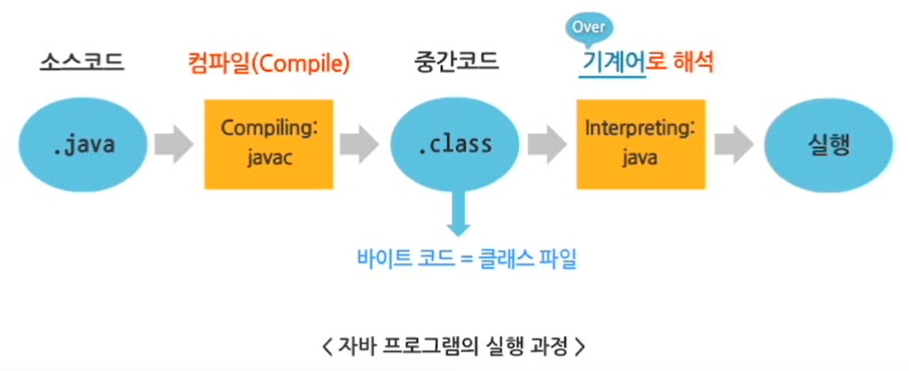
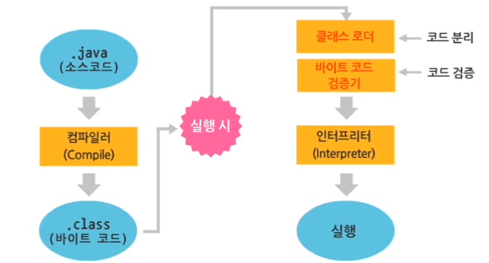
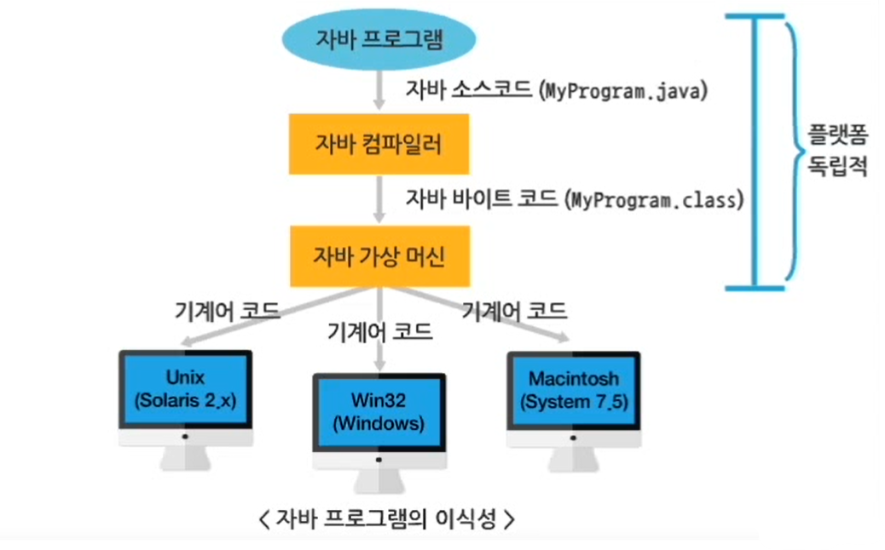
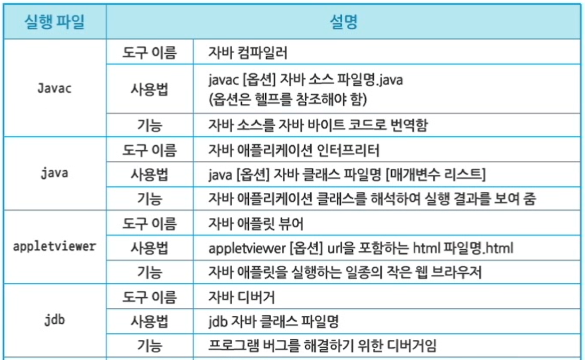
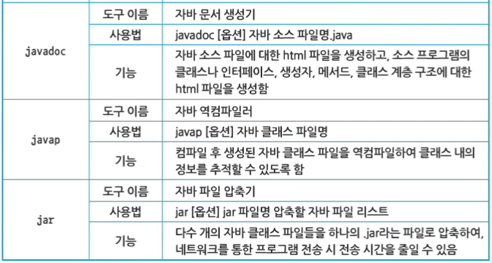
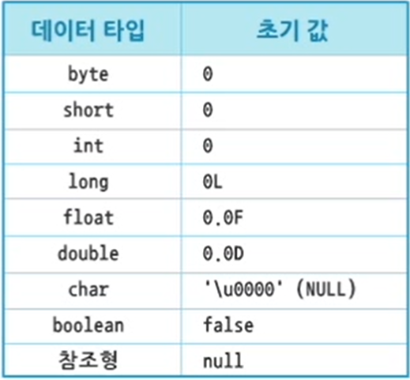
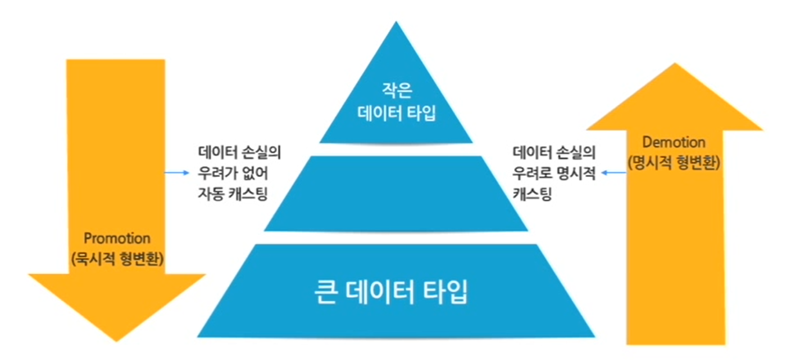
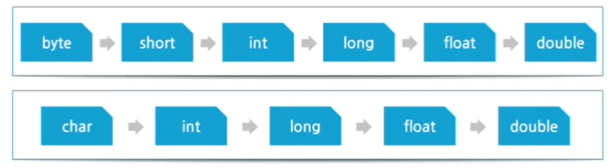

# Java
## 특징

1. **단순**(Simple)하다.
    - **C/C++ 언어의 복잡한 기능을 제외**하여 코드를 단순하게 작성 가능
    - C++의 전위처리, 포인터 사용, 다중 상속, 구조체, goto문 사용, 연산자 중복 기능 등 제외
    - **가비지 컬렉터에 의한 자동 메모리 관리**로 할당된 메모리 해제를 신경쓰지 않아도 됨
2. **객체지향(Object-Oriented)적**이다.
    - 객체지향 개념이 적용된 C++을 기초로 하여 만들어진 언어
    - 객체지향을 하게 되면 재사용성(Reusability)을 높일 수 있음
3. **분산 처리(Distributed)에 용이**하다.
    - **분산 환경에서 TCP/IP 등의 프로토콜을 통해 효율적으로 실행할 수 있도록 설계된 언어**
    - TCP/IP 네트워크 기능 내장
    - HTTP, FTP 등과 같은 프로토콜을 쉽게 사용할 수 있도록 라이브러리 제공
    - 서로 다른 컴퓨터 상의 객체들도 원격으로 호출하여 실행할 수 있는 **원격 메서드 호출과 관련된 RMI(Remote Method Invocation) 기능의 라이브러리 제공**
4. **인터프리터(Interpreter)에 의해 실행**된다.

    

    - 컴파일 언어임과 동시에 인터프리터 언어
5. **견고**(Robust)하다.
    - 다양한 플랫폼(컴퓨터) 상에서 실행되기 위해 에러의 원인이 되는 요소들을 제거하거나 자동으로 해결 → 높은 신뢰성
    - 포인터를 사용하지 않음
    - 자동으로 가비지 컬렉션 기능을 수행함
    - 엄격한 데이터 타입의 검사를 통해 에러를 조기에 발견함
    - 실행 시간에 발생하는 에러를 처리함
6. **안전**(Secure)하다.
    - 컴파일 시에 엄격하게 데이터 타입을 검사함으로써 프로그램 실행 시 발생할 수 있는 비정상적인 상황을 미리 방지

    

7. **플랫폼 독립적**(Architecture Neutral)이다.
    - 사용하는 운영체제나 CPU 등의 하드웨어 사양에 관계 없이 실행될 수 있음

    

8. **높은 성능**(High Performance)을 제공한다.
    - 가비지 컬렉션 기능이 추가되어 있어 자동으로 메모리 관리가 가능
    - 메모리가 할당된 객체의 상태를 추적 관리
    - 더 이상 참조되지 않으면 자동으로 할당된 메모리 해제 → 불필요한 메모리 낭비 방지
9. **멀티스레드(Multithread)를 지원**한다.
    - 스레드: 독자적으로 수행하는 하나의 작은 프로그램
    - 멀티스레드
        - 한 번에 여러 개의 스레드가 동시에 수행되는 과정
        - 하나의 CPU가 여러 개의 프로그램을 동시에 수행하도록 함 → 수행 속도를 빠르게 함
10. **동적**(Dynamic)이다.
    - 자바 언어는 변화되는 환경에 잘 적응되도록 설계됨
    - 기존의 프로그램에 영향을 주지 않고, 라이브러리에 새로운 메서드나 속성들을 추가할 수 있음
    - 프로그램과 프로그램에서 사용되는 라이브러리와의 연결을 **실행시간에 수행**함 → 라이브러리의 변화에 곧바로 적용할 수 있음

## 주요 패키지

- java.applet
    - 애플릿 작성에 필요한 기능을 모아 놓은 패키지
- java.awt
    - GUI 작성과 관련된 패키지
    - javax.swing 패키지와 함계 자바 GUI 애플리케이션 작성 시 필수적으로 사용함
    - 버튼, 텍스트필드, 메뉴 등 관련 컴포넌트와 이벤트 기능을 제공
- xjava.io
    - 자바 입출력 기능과 관련된 패키지
    - 파일이나 버터 등의 입출력 기능을 제공
- java.lang
    - 자바 언어의 기초적인 사항을 정의한 클래스와 관련된 패키지
    - Object 클래스, 문자열 관련, 시스템 관련, 멀티스레드 관련 기본적인 기능을 포함함
- java.net
    - 자바의 네트워크에 관련된 패키지
    - 이 패키지 내에는 소켓과 관련된 기능을 제공
- javax.swing
    - java.awt 패키지와 더불어 자바 GUI 애플리케이션 기능과 관련된 패키지
    - java.awt 포함 내용보다 다양하고, 융통성 있는 컴포넌트를 제공
- java.util
    - 유틸리티성 기능과 관련된 패키지
    - 날짜 표현이나 여러 자료형을 하나로 취급하는 컬렉션과 관련된 기능을 제공

# JDK 폴더 구조

|폴더명|설명|
|:-:|-|
|bin|- 자바 개발 환경과 관련된 각종 **명령들을 포함**한 폴더  
- 자바 컴파일러와 인터프리터 명령도 여기에 포함됨|
|include|플랫폼 별로 필요한 **JDK의 각종 헤더 파일**들을 포함한 폴더|
|jre|자바 실행 환경 관련 **명령어와 라이브러리**를 포함한 폴더|
|lib|자바 개발 환경에서 사용될 **라이브러리**를 포함한 폴더|

## JDK 내 bin 폴더에 있는 주요 명령어





# Default 초기화

> 변수의 값이 **자동으로 초기화**되는 것



- 변수에 값을 할당하지 않은 경우 자동으로 초기화
- 메서드(함수) 안에서 선언된 변수인 **지역변수는 자동으로 초기화되지 않음**

# 형변환

> 데이터 타입의 변환



## 묵시적 형변환(Promotion)

- 형변환 연산자를 사용하지 않아도 자동으로 형변환이 이루어지는 경우(**자동 형변환**)

```java
int age = 25;
// 형변환 연산자인 (double) 생략
double avgAge = age; // double avgAge = (double)age; 와 같음
```

### 규칙



## 명시적(Demotion) 형변환

- 더 작은 범위를 나타내는 데이터 타입으로 변환되는 경우(**축소 형변환**)
- 데이터 타입이 축소되어 변환된 후에도 **해당 값을 표현**할 수 있어야 함

```java
double avgAge = 24.56;
int age = (int)avgAge;
```
