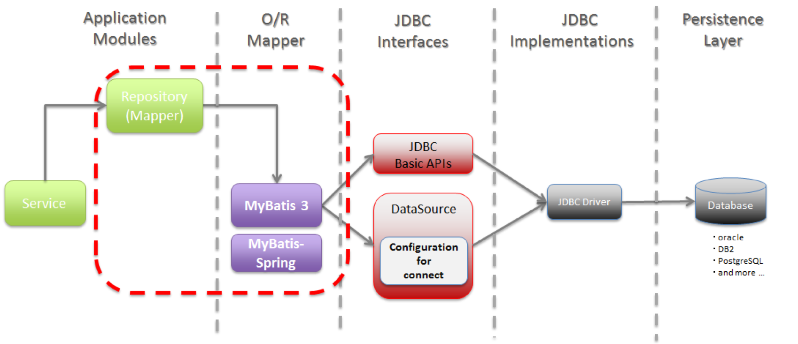

# 영속성(Persistence)

> 데이터를 생성한 프로그램이 종료되더라도 **사라지지 않는 데이터 특성**

- 영속성을 갖지 않는 데이터는 단지 메모리에서만 존재하기 때문에 프로그램을 종료하면 모두 잃어버림
- **Object Persistence**(영구적인 객체)
    - **메모리 상의 데이터**를 파일 시스템, 관계형 데이터베이스 또는 객체 데이터베이스 등을 활용하여 **영구적으로 저장**하여 영속석 부여

    

    - **데이터를 데이터베이스에 저장하는 3가지 방법**
        1. JDBC(java에서 사용)
        2. Spring JDBC(ex. JdbcTemplate)
        3. Persistence Framework(ex. Hibernate, Mybatis 등)
- **Persistence Layer**
    - 프로그램 아키텍처에서 **데이터의 영속성을 부여해주는 계층**
    - JDBC를 이용하여 직접 구현할 수 있지만 Persistence Framework를 이용한 개발이 많이 이루어짐

    

    - 계층
        - 프레젠테이션 계층(Presentation layer) - UI 계층 (UI layer) 이라고도 함
        - 애플리케이션 계층(Application layer) - 서비스 계층 (Service layer) 이라고도 함
        - 비즈니스 논리 계층(Business logic layer) - 도메인 계층 (Domain layer) 이라고도 함
        - 데이터 접근 계층(Data access layer) - 영속 계층 (Persistence layer) 이라고도 함
- **Persistence Framework**
    - JDBC 프로그래밍의 복잡함이나 번거로움 없이 **간단한 작업만으로 데이터베이스와 연동되는 시스템을 빠르게 개발**할 수 있으며 안정적인 구동을 보장
    - Persistence Framework는 **SQL Mapper**와 **ORM**으로 나눌 수 있음 ex) JPA, Hibernate, Mybatis 등
    - **ORM**은 데이터베이스 객체를 자바 객체로 매핑함으로써 객체 간의 관계를 바탕으로 **SQL을 자동으로 생성**해주지만 **SQL Mapper는 SQL을 명시해줘야 함**
    - **ORM은 관계형 데이터베이스의 ‘관계’를 Object에 반영하자는 것이 목적**이라면, **SQL Mapper는 단순히 필드를 매핑시키는 것이 목적**이라는 점에서 지향점의 차이가 있음
    - **SQL Mapper**: Mybatis, JdbcTempletes 등

# JDBC(Java Database Connectivity)

> 모든 Java의 Data Access 기술의 근간으로 **DB에 접근할 수 있도록 Java에서 제곻하는 API**

- 모든 Persistence Framework는 내부적으로 JDBC API를 이용
- 데이터베이스에서 자료를 쿼리하거나 업데이트하는 방법을 제공

# ORM(Object Relation Mapping)

> 객체와 관계형 데이터베이스의 데이터를 **자동으로 매핑(연결)해주는 것**

- ORM을 이용하면 SQL Query가 아닌 직관적인 코드(메서드)로 데이터를 조작 가능
- 객체 지향 프로그래밍은 **클래스**를 사용하고, 관계형 데이터베이스는 **테이블**을 사용
- 객체 모델과 관계형 모델 간에 불일치가 존재
- ORM을 통해 객체 간의 관계를 바탕으로 **SQL을 자동으로 생성하여 불일치를 해결**
- 객체를 통해 간접적으로 데이터베이스 데이터를 다룸
- Persistant API라고도 할 수 있음 ex. JPA, Hibernate 등

### 장점

- 객체 지향적인 코드로 인해 더 **직관적**이고 **비즈니스 로직에 더 집중**할 수 있게 도와줌
- **재사용 및 유지보수**의 편리성 증가
- **DBMS에 대한 종속성이 줄어듬**
    - 객체 간의 관계를 바탕으로 SQL을 자동으로 생성하기 때문

### 단점

- ORM 으로만 완벽한 서비스 구현이 어려움
- **프로시저가 많은 시스템**에선 ORM의 객체 지향적인 장점을 활용하기 어려움

## JPA(Java Persistence API)

> **자바 ORM 기술에 대한 표준 명세**로, 자바에서 제공하는 API

- 자바 어플리케이션에서 관계형 데이터베이스를 사용하는 방식을 정의한 인터페이스
- **ORM을 사용하기 위한 표준 인터페이스를 모아둔 것**
- JPA 구성 요소 (세 가지)
    1. `javax.persistance` 패키지로 정의된 API
    2. JPQL(Java Persistence Query Language)
    3. 객체/관계 메타데이터
- 사용자가 원하는 JPA 구현체를 선택해서 사용 가능
    - JPA의 대표적인 구현체로는 Hibernate, EclipseLink, DataNucleus, OpenJPA, TopLink Essentials 등
    - 이 구현체들을 **ORM Framework**라고 부른다.

## Hibernate

> 자바 언어를 위한 객체 관계 매핑 프레임워크

- 관계형 DB 테이블을 자바 객체로 맵핑 시켜 사용하는 것
- SQL을 직접 사용하지 않는다고 해서 JDBC API를 사용하지 않는다는 건 아님
    - Hibernate가 지원하는 메서드 **내부에서는 JDBC API가 동작**하고 있으며, 단지 **개발자가 직접 SQL을 직접 작성하지 않음**
- **HQL(Hibernate Query Language)**이라 불리는 매우 강력한 쿼리 언어를 포함

### 장점

- 객체지향적으로 데이터를 관리할 수 있기 때문에 **비즈니스 로직에 집중** 할 수 있으며, **객체지향 개발 가능**
- 테이블 생성, 변경, 관리가 쉽다. (JPA를 잘 이해하고 있는 경우)
- 로직을 쿼리에 집중하기 보다는 객체자체에 집중 가능
- 빠른 개발 가능

### 단점

- 어려움(많은 내용이 감싸져 있기 때문에 알아야 할 것이 많다.)
- 잘 이해하고 사용하지 않으면 데이터 손실이 있을 수 있음(persistence context)
- 성능상 문제가 있을 수 있음(이 문제 또한 잘 이해해야 해결이 가능하다.)

## Mybatis

> 개발자가 지정한 SQL, 저장 프로시저 그리고 몇 가지 고급 매핑을 지원하는 **SQL Mapper**

- JDBC로 처리하는 상당 부분의 코드와 파라미터 설정 및 결과 매핑을 대신해줌
    - 기존에 JDBC를 사용할 때는 DB와 관련된 여러 복잡한 설정(Connection)들을 다루어야 했지만 SQL Mapper는 자바 객체를 실제 SQL문에 연결함으로써, 빠른 개발과 편리한 테스트 환경 제공
- 데이터베이스 record에 원시 타입과 Map 인터페이스 그리고 자바 POJO를 설정해서 매핑하기 위해 xml과 Annotation을 사용 가능

### 장점

- SQL에 대한 모든 컨트롤을 하고자 할때 매우 적합
- SQL쿼리들이 매우 잘 최적화되어 있을 때 유용

### 단점

- 애플리케이션과 데이터베이스 간의 설계에 대한 모든 조작을 하고자 할 때는 부적합
    - 애플리케이션과 데이터베이스 간에 서로 잘 구조화되도록 많은 설정이 바뀌어야 하기 때문
