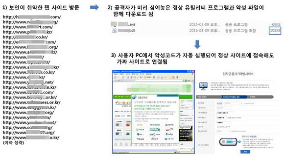

# 파밍(Pharming)

호스트 파일 변조 등을 통해 가짜 사이트로 접속을 유도하여 개인정보 등을 탈취하는 사기 수법이다.

- Private Data + Farming의 합성어이다.
- **합법적으로 소유하고 있던 사용자의 도메인을 탈취하거나 도메인 네임 시스템(DNS) 이름을 속여 사용자들이 진짜 사이트로 오인하도록 유도, 개인정보를 훔치는 수법**이다.
- 금융기관 등의 사이트가 공식적으로 운영하고 있던 도메인 자체를 중간에서 탈취한다. 사용자들은 **늘 이용하는 사이트로 알고 의심하지 않고 개인 ID, 패스워드, 계좌 정보 등을 노출하는 것**이 특징이다.

 

### 파밍 공격 과정

1. 가짜 사이트를 설치
2. DNS 해킹
3. 피해자의 정상 도메인의 IP 조회 및 제공
4. 가짜 사이트로 접속, 개인정보 노출

 

### 파밍 공격의 유형

DNS(Domain Name Service) 프로토콜을 조작, 사용자 요청을 리디렉션(Redirection)해 대상 IP 주소를 범죄자가 제어하는 IP 주소로 리라우팅하는 데, 이는 2가지 방법으로 이행할 수 있다.

- 로컬 해킹 - 피해자 pc 해킹, 호스트 파일의 변경
    - 공격자는 피해자의 컴퓨터를 해킹하고 **기기의 로컬 호스트 파일(IP 주소의 로컬 디렉토리)을 변경**한 후, 다음에 **피해자가 사이트에 액세스하려고 할 때** 리디렉션하는데 보통 피해자의 의도된 목적지처럼 위장한다. 이 공격에는 종종 피싱 공격이나 호스트 파일을 조작하는 다른 **악성코드 배포 방법이 선행**된다. 공유기는 드라이브 바이 파밍(drive-by pharming) 공격의 잠재적 대상이 되는 엔드포인트 기기다.
- DNS 서버 해킹 - DNS 서버 해킹, DNS 이름을 속여서 접속 유도
    - 공격자는 DNS 서버 취약점을 악용해 **DNS 포이즈닝(Poisoning)을 통해 트래픽을 리디렉션**한다. 이는 피해자가 무언가를 클릭하거나 가짜 웹 사이트로 전송하기 위해 실수하지 않아도 실행되기 때문에 대응하기 어려운 위협일 수 있다. 이는 때때로 미끼가 없는 피싱으로 알려져 있다.
- 도메인 탈취

 

❗파밍은 금융 정보를 수집해 악용 또는 판매하거나, 판매할 수 있는 로그인 자격 증명을 수집하는 것이 목표일 수 있다.

 

### 파밍 공격의 대응 방안

- 사용자에게 가짜 웹 사이트에 대한 의심스러운 링크를 찾는 방법과 같은 우수한 보안 위생 관행에 대해 설명하라.
- 기기를 패치하고 정기적인 바이러스 검사와 캐시/브라우저 쿠키를 정리하라.
- DNS 서버를 완전히 패치, 감사, 모니터링해 악용될 가능성을 줄여라.
- 기업 웹 사이트에 TLS 인증서를 배포해 해당 사이트가 스푸핑될 가능성이 줄여라.
- 직원 컴퓨터를 패치하고 엔드포인트 보안 제어, 모니터링을 활성화하라.
- 드라이브 바이 공격을 방지하기 위해 공유기에 강력한 비밀번호 보안을 유지하라.
- 자사의 도메인과 유사한 스푸핑 도메인을 모니터링하도록 위협 인텔리전스를 설정하라.
- 서비스에서 이중 인증을 사용해 사용자 자격 증명이 유출됐을 시 영향력을 줄여라.

 

---
참조

[파밍 - IT위키 (itwiki.kr)](https://itwiki.kr/w/%ED%8C%8C%EB%B0%8D)

[[IT키워드]파밍(pharming) - 전자신문 (etnews.com)](https://m.etnews.com/200503180071?obj=Tzo4OiJzdGRDbGFzcyI6Mjp7czo3OiJyZWZlcmVyIjtOO3M6NzoiZm9yd2FyZCI7czoxMzoid2ViIHRvIG1vYmlsZSI7fQ%3D%3D)

[가짜 웹사이트를 통해 데이터를 훔치는 '파밍'이란 무엇인가 - ITWorld Korea](https://www.itworld.co.kr/tags/60540/%ED%8C%8C%EB%B0%8D/151084)

[[IT키워드]파밍(pharming) - 전자신문 (etnews.com)](https://m.etnews.com/200503180071?obj=Tzo4OiJzdGRDbGFzcyI6Mjp7czo3OiJyZWZlcmVyIjtOO3M6NzoiZm9yd2FyZCI7czoxMzoid2ViIHRvIG1vYmlsZSI7fQ%3D%3D)
