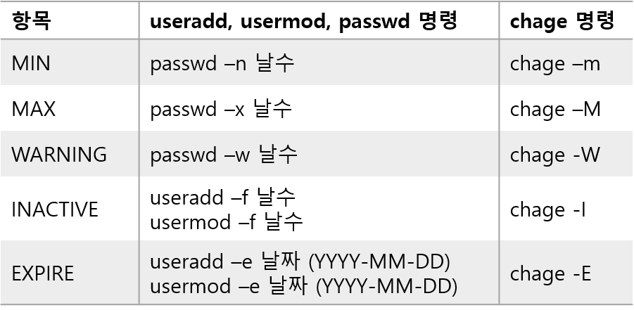

리눅스 사용자 관리
==================

### 리눅스는 다중 사용자 시스템이므로 사용자를 구별하고 각 사용자에게 적절한 자원을 할당해주어야 한다.

#### 사용자 계정의 역할

- 사용자 구별
- 시스템 접근
- 사용자의 접근 권한 통제

#### 사용자 계정 관리 

- 사용자 계정 생성, 수정, 삭제


#### 사용자 계정 관련 파일
1. /etc/passwd 파일 → 로그인 ID : x : UID : GID : 설명 : 홈 디렉터리 : 로그인 쉘
    - 사용자 계정 정보가 저장되는 기본 파일
    -  `:`(쌍점, 콜론)으로 7개의 항목을 구별
    - 로그인 ID → 사용자 계정 이름
    - x :  사용자 암호를 저장하던 항목, 현재는 /etc/shadow 파일에 별도로 저장함
    - UID → 사용자 ID 번호, 시스템이 구별을 위해 사용하는 번호
    - GID → 그룹 ID, 사용자는 무조건 하나 이상의 그룹에 소속됨
    - 설명 → 사용자의 일반적인 정보, GECOS
    - 홈 디렉터리 → 계정에 할당된 홈 디렉터리의 절대 경로
2. /etc/shadow 파일
    - 사용자 암호에 관한 정보를 별도로 관리하는 파일
    - root 사용자만이 읽고 쓸 수 있으며 shadow 그룹은 읽기만 가능함
3. /etc/login.defs 파일
    - 사용자 계정의 설정과 관련된 기본 값을 정의한 파일
4. /etc/group 파일
    - 그룹에 관한 정보가 저장된 파일
    - /etc/passwd 파일의 GID 그룹이 기본 그룹, /etc/group 파일의 그룹은 2차 그룹
5. /etc/gshoadow 파일
    - 그룹 암호가 저장된 파일
6. /etc/skel 파일
    - 사용자 계정 생성 시 공통으로 배포할 파일이나 디렉터리를 저장

#### 사용자 계정 관리
  - `useradd [옵션] 로그인 ID`
    - 사용자 계정 생성
    - `-u uid` : UID 지정
    - `-o` : UID 중복 허용
    - `-g gid` : 기본 그룹의 GID 지정
    - `-G gid` : 2차 그룹의 GID 지정
    - `-m` : 홈 디렉터리 생성
    - `-d 디렉터리명` : 홈 디렉터리 지정
    - `-s 쉘` : 기본 셸 지정
    - `-c 설명` : 사용자의 추가적인 설명 지정
    - `-f 비활성 일수` : 계정 비활성화(INACTIVE) 항목 설정
    - `-e 유효기간` : 계정 만료(EXPIRE) 항목 설정 (YYYY-MM-DD)
    - `-D` : 기본 설정 값 설정이나 출력
    - `-k 리렉터리` : 계정 생성 시 복사할 초기 파일이나 디렉터리를 설정해 놓은 디렉터리 지정
  - `usermod [옵션] 로그인 ID`
    - 사용자 계정 수정
    - `-u uid` : UID 수정
    - `-o` : UID 중복 허용
    - `-g gid` : 기본 그룹의 GID 수정
    - `-G gid` : 2차 그룹의 GID 수정
    - `-d 디렉터리명` : 홈 디렉터리 수정
    - `-s 쉘` : 기본 셸 수정
    - `-c 설명` : 사용자의 추가적인 설명 수정
    - `-f inactive` : INACTIVE 날짜 수정
    - `-e expire` : EXPIRE 날짜 수정
    - `-l  새 로그인 이름` : 계정 이름 수정
  - `userdel [옵션] 로그인 ID`
    - 사용자 계정 삭제
    - `-r` : 홈 디렉터리와 메일 디렉터리 삭제
    - `-f` : 사용자가 로그인 중이어도 강제로 삭제
  - 패스워드 에이징
    - 패스워드를 강력하게 보안하기 위해 사용
    - 사용자 계정에 대한 사용 기간, 패스워드 유효 날짜, 경고 날짜, 종료일, 길이 등을 설정한다.
    - 패스워드 변경을 강제로 하도록 함
    - /etc/shadow 파일에 설정되는 정보
    - useradd, usermod, passwd, change 명령 사용
    


```bash
# test1 사용자 계정 생성
sudo useradd -m -u 2100 -G 3 -s /bin/bash -c "test user1" test1

# 사용자 계정 확인
grep test /etc/passwd

# test1 사용자 패스워드 에이징
sudo change -m 4 -M 200 -W 10 -I 5 -E 2021-06-28 test1
sudo grep test1 /etc/shadow

# test1 사용자 UID test11로 수정
sudo usermod -u 2010 -l test11 test1
grep test11 /etc/passwd

# test1 사용자 홈디렉터리까지 삭제
sudo userdel -r test11
grep test /etc/passwd
ls /home
```

그룹 관리 명령
---

- `groupadd [옵션] 그룹명`
    - 그룹 생성
    - `-g GID` : 그룹 GID 지정
    - `-o` : GID 중복 허용
- `groupmod [옵션] 그룹명`
    - 그룹 정보 수정
    - `-g GID` : 그룹 GID 수정
    - `-o` : GID 중복 허용
    - `-n 그룹명` : 그룹명 변경
- `groupdel 그룹명`
    - 그룹 삭제
- `gpasswd [옵션] 그룹명`
    - /etc/group 파일, /etc/gshadow 파일 관리
    - `-a 사용자 계정` : 사용자 계정을 그룹에 추가
    - `-d 사용자 계정` : 사용자 계정을 그룹에 삭제
    - `-r` : 그룹 암호 삭제
- `newgrp 그룹명`
    - 소속 그룹을 다른 그룹으로 바꿈


```bash
# grp1, grp2 그룹 생성 후 확인
sudo groupadd grp1
sudo groupadd grp2
grep grp /etc/group

# grp2의 GID 변경
sudo groupmod -g 3100 grp2
grep grp /etc/group

# grp2를 grp22로 변경
sudo groupmod -n grp22 grp2
grep grp /etc/group

# grp1에 user1, grp22에 user2를 추가
sudo gpasswd -a user1 grp1
sudo gpasswd -a user2 grp22
grep grp /etc/group

# grp22에 암호 설정
sudo gpasswd grp22

# user1 소속 그룹 grp22로 변경
newgrp grp22
id

# 그룹 삭제
sudo groupdel grp1
sudo groupdel grp22
grep grp /etc/group
```
