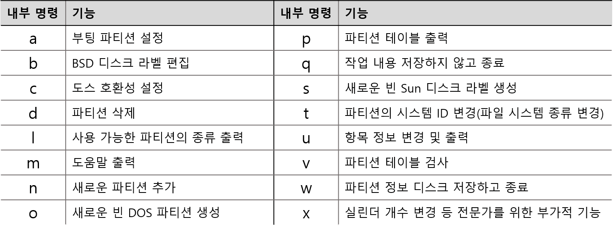

리눅스 디스크 추가 및 관리
===

### 디스크 추가 단계


### 디스크 파티션 나누기

✔파티션이란

하나의 디스크를 독립된 영역으로 구분하는 것이다.

디스크 전체를 하나의 파티션으로 사용할 수도 있고, 여러 개의 파티션으로 나누어 사용할 수도 있다.

✔ 디스크 장치의 이름

디스크 장치의 이름을 알아야 디스크 관련 작업을 할 수 있다.

- IDE 컨트롤러 :  `/dev/hd`
- SCSI, SATA 컨트롤러 : `/dev/sd`
- 최근에는 구분 없이 모두 `/dev/sd`로 시작하는 이름을 사용한다.
- 컨트롤러에 연결되는 디스크의 순서에 따라 `/dev/sd` 의 끝 부분에 알파벳이 추가된다.
    - `/dev/sda` → `/dev/sdb` → `/dev/sd`

✔ 디스크 장치의 이름과 파티션 표시

파티션 표시 : 디스크 장치 이름의 뒤에 숫자를 붙여 표시한다.

- 첫 번째 디스크 전체 장치 이름 -    `/dev/sda`
- 디스크의 첫째 파티션 - `/dev/sda0`
- 디스크의 둘째 파티션 - `/dev/sda1`

👉 **fdisk 명령**

- fdisk [옵션] [장치명]
- 디스크의 파티션 생성, 삭제, 보기 등 파티션을 관리한다.
- root 계정에서 사용할 수 있다.
- 옵션
    - `-b <크기>` : 섹터 크기 지정(512, 1024, 2048, 4096)
    - `-l` : 파티션 테이블 출력
- fdisk 내부 명령

    
- 파티션을 나눌 때 정할 것!
    - 디스크의 전체 크기와 용도를 고려하여 몇 개의 파티션으로 나눌 것인가
    - 각 파티션의 크기는 얼마로 할 것인지

```bash
sudo fdisk -l

# 장치명을 인자로 지정해야 함
sudo fdisk /dev/sdb

# 새로운 파티션 생성
n   # Command
p   # Select
1   # Partition number
# (Using default value 2048)
+500M # Last sector

p # 파티션 정보 출력
w # 디스크게 저장 및 종료
```


