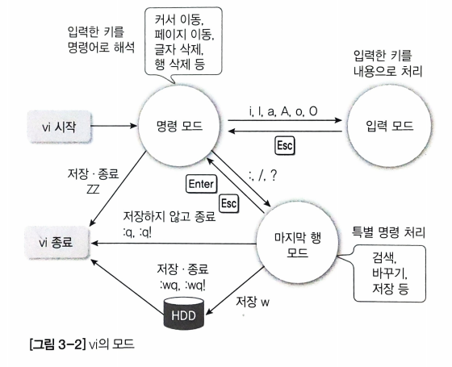

Linux 문서 편집기
=================

#### 화면 단위 편집기 : __vi__

vi는 모드형 편집기이다.  
모드형은 입력 모드와 명령 모드가 구분되어 있다.
- 입력 모드: 텍스트를 입력할 수 있는 모드
- 명령 모드: 텍스트를 수정하거나 삭제하고 복사와 붙이기 등 편집을 하는 모드
- 마지막 행 모드: ex 편집기의 명령



> ex는 행 단위 편집기이다. 단독으로 사용하기 보다는 vi에 연결하여 vi를 더욱 강력하게 하는 다양한 기능을 제공한다.

#### vi는 처음에 자동으로 명령 모드로 시작한다!
구동하자마자 바로 입력하는 키는 모두 명령으로 해석된다!  
대문자와 소문자를 구별하며, 입력 모드로 가려면 i, I, a, A, o, O를 입력하면 된다.

#### 입력 모드로 전환되면 입력하는 키는 내용으로 인식되어 버퍼에 저장된다!

#### 마지막 행 모드로 가려면 :, /, ? 중 하나를 입력하면 된다!


__vi의 저장과 종료 명령키__
|구분|명령|기능|
|-|-|:-:|
|마지막 행 모드|:q|vi에서 작업한 것이 없을 때 그냥 종료한다|
|마지막 행 모드|:q!|작업한 내용을 저장하지 않고 종료한다|
|마지막 행 모드|:w[파일명]|작업한 내용을 저장만 한다, 파일명 지정 시 새 파일로 저장한다|
|마지막 행 모드|:wq, :wq!|작업한 내용을 저장하고 vi를 종료한다|
|명령 모드|ZZ (shift+zz)|작업한 내용을 저장하고 vi를 종료한다|

> 마지막 행 모드의 명령에서 !는 강제의 의미

__입력 모드 전환 명령키__
|명령|기능|
|-|:-:|
|i|커서 앞에 입력한다|
|a|커서 뒤에 입력한다|
|o|커서가 위치한 행의 다음 행에 입력한다|
|I|커서가 위치한 행의 첫 칼럼으로 이동하여 입력한다|
|A|커서가 위치한 행의 마지막 칼럼으로 이동하여 입력한다|
|O|커서가 위치한 행의 앞 행에 입력한다|

```
vi test.txt 
// 명령 모드에서 i 명령키 입력

linux study  // Enter 키 입력하면 다음 행으로 이동
Hallo~       // Esc 키 입력하면 명령 모드로 전환
```

__커서 이동 명령 키__
|명령|기능|
|-|:-:|
|k|커서를 한 행 위로 이동한다|
|j|커서를 한 행 아래로 이동한다|
|l|커서를 한 글자 오른쪽으로 이동한다|
|h|커서를 한 글자 왼쪽으로 이동한다|
|^ 또는 O|커서를 현재 행의 처음으로 이동한다|
|$|커서를 현재 행의 마지막으로 이동한다|
|-|커서를 앞 행의 처음으로 이동한다|
|+ 또는 Enter|커서를 다음 행의 처음으로 이동한다|

__화면 이동 명령 키__
|명령|기능|
|-|:-:|
|^u|반 화면 위로 이동한다|
|^d|반 화면 아래로 이동한다|
|^b|한 화면 위로 이동한다|
|^f|한 화면 아래로 이동한다|
|^y|화면을 한 행만 위로 이동한다|
|^e|화면을 한 행만 아래로 이동한다|

__특정 행으로 바로 이동 키__
|명령|기능|
|-|:-:|
|G (Shift+g)|파일의 마지막 행으로 이동한다|
|행 번호G(Shift+g)|지정한 행 번호로 이동한다|
|:행 번호|지정한 행 번호로 이동한다(마지막 행 모드)|
|:$|파일의 마지막 행으로 이동한다(마지막 행 모드)|

__내용 수정 명령 키__
|명령|기능|
|-|:-:|
|r|커서가 위치한 글자를 다른 글자로 수정한다|
|cw, #cw|커서 위치부터 현재 단어의 끝까지 수정한다|
|s, #s|커스 위치부터 Esc키를 입력할 때까지 수정한다|
|cc|커서가 위치한 행의 내용을 모두 수정한다|
|C|커서 위치부터 행의 끝까지 수정한다|

> #에서는 수정할 글자의 수를 지정한다

__내용 삭제 명령 키__
|명령|기능|
|-|:-:|
|x, #x|커서 위치의 글자를 삭제한다|
|dw, #dw|커서 위치의 단어를 삭제한다|
|dd, #dd|커서 위치의 행을 삭제한다|
|D (shift+d)|커서 위치부터 행의 끝까지 삭제한다|

__이전 명령 취소 명령 키__
|명령|기능|
|-|:-:|
|u|명령을 취소한다|
|U|해당 행에서 한 모든 명령을 취소한다|
|:e!|마지막으로 저장한 내용 이후의 것을 버리고 새로 작업한다|

__복사하기, 잘라내기, 붙이기 명령 키__
|명령|기능|
|-|:-:|
|yy, #yy|커서가 위치한 행을 복사한다|
|p|커서가 위치한 행의 아래쪽에 붙인다|
|P|커서가 위치한 행의 위쪽에 붙인다|
|dd, #dd|삭제와 같은 기능으로 커서가 위치한 행을 잘라둔다|

> 해당 기능들을 사용하면 내용이 임시 버퍼에 저장된다.   
> 명령 사용 후 다른 명령을 사용하지 말고 즉시 원하는 위치로 이동하여 붙이기를 하는 것이 좋다.

__범위 지정 명령 키__
|명령|기능|
|-|:-:|
|1, $ 또는 %|1행부터 마지막 행까지 지정한다|
|1,.|1행부터 커서가 있는 행까지 지정한다|
|.,$|커서가 있는 행부터 마지막 행까지 지정한다|
|,-3|현재 행과 이전 세 번째행까지(총 네 행) 지정한다|
|10,20|10행부터 20행까지 지정한다|

> . 는 커서가 위치한 현재 행을 나타냄  
> $ 는 마지막 행을 나타냄  
> % 는 전체 행을 나타냄

__마지막 행 모드에서 복사하기, 잘라내기, 붙이기 명령 키__
|명령|기능|
|-|:-:|
|:#y|#로 지정한 행을 복사한다|
|:<범위>y|범위로 지정한 행을 복사한다|
|:#d|#로 지정한 행을 잘라낸다|
|:<범위>d|범위로 지정한 행을 잘라낸다|
|:pu|현재 행 다음에 버퍼의 내용을 붙인다|
|:#pu|#으로 지정한 행 다음에 버퍼의 내용을 붙인다|

__검색 명령 키__
|명령|기능|
|-|:-:|
|/문자열|문자열을 아래 방향으로 검색한다|
|?문자열|문자열을 위 방향으로 검색한다|
|n|원래 찾던 방향으로 다음 문자열을 검색한다|
|N|역방향으로 다음 문자열을 검색한다|

__바꾸기 명령 키__
|명령|기능|
|-|:-:|
|:s/문자열1/문자열2|커서가 위치한 행에서 첫 번째로 나오는 문자열1을 문자열2로 바꾼다|
|:%s/문자열1/문자열2/g|파일 전체에서 모든 문자열1을 문자열2로 바꾼다|
|:<범위>s/문자열1/문자열2|범위 내 모든 행의 각 행에서 첫 번째로 나오는 문자열1을 문자열2로 바꾼다|
|:<범위>s/문자열1/문자열2/g|범위 내 모든 행에서 문자열1을 문자열2로 바꾼다|
|:<범위>s/문자열1/문자열2/gc|범위 내 모든 행에서 문자열1을 문자열2로 바꿀 때 수정할지 여부를 묻는다|

---------
#### 알아두면 좋을 명령
__파일 관련 명령 키__
|명령|기능|
|-|:-:|
|:r 파일명|지정한 파일을 읽어들여 현재 커서 위치에 삽입한다|
|:e 파일명|지정한 파일로 전환한다 (기존 파일을 :w로 저장한 뒤 실행)|
|:n|vi 시작 시 여러 파일을 지정했을 경우 다음 파일로 작업을 이동한다|

__셀 명령 실행 명령 키__
|명령|기능|
|-|:-:|
|:! 셸 명령|vi 작업을 잠시 중단하고 셸 명령을 실행한다(Enter키 입력시 다시 vi로 돌아감)|
|:sh|vi를 잠시 빠져나가서 셸 명려을 실행한다(exit 명령 시 vi로 돌아감)|

__기타 명령 키__
|명령|기능|
|-|:-:|
|Ctrl+l|현재 화면을 다시 출력한다|
|Ctrl+g|현재 행 번호를 마지막 행에 출력한다|
|Shift+j|현재 행과 아랫행을 연결하여 하나의 행으로 만든다|
|.|바로 직전에 했던 명령을 반복한다|
|~|커서가 위치한 곳의 글자의 대소문자를 바꾼다|


