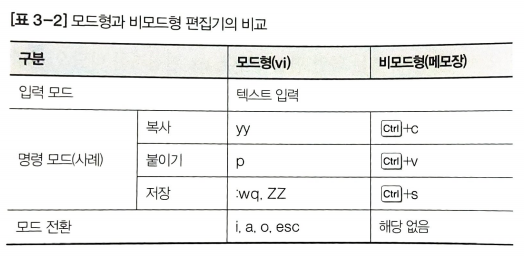

Shell
=====

Shell(셸, 쉘)은 리눅스 커널과 사용자를 연결해주는 역할을 수행한다.  
사용자가 입력한 내용을 해석하여 관련 명령을 실행하고  
명령의 실행 결과를 사용자에게 출력해준다.  

#### Shell의 기능

1. 명령어 해석
   - 프롬프트: 셸이 사용자의 명령을 기다리고 있음을 나타내는 표시
2. 프로그래밍
   - 셸 스크립트: 셸의 프로그래밍 기능으로 여러 명령 사용하여 반복적으로 수행하는 작업을 하나의 프로그램으로 만든 것
3. 사용자 환결 설정
   - 초기화 파일: 명령 경로 설정, 기본 권한 설정, 다양한 환경 변수등을 설정할 수 있다.

#### Shell의 종류

- 본 셸(bourne shell)
   - 단순하고 처리 속도가 빠름
   - 시스템 관리 작업 수행의 기반
   - 명령 이름 sh
- C 셸(C shell)
   - 본 셸의 기능 확장, 크키가 커지고 처리 속도가 느리나 사용자 편의 기능 포함
   - 구문 형식이 c 언어와 같음
   - 명령 이름 csh
- 콘 셸(Korn shell)
   - 본 셸과의 호환성, c 셸의 특징도 포함함
   - 속도가 빠름
   - 명령 이름 ksh
- 배시 셸(bash shell)
   - 본 셸과의 호환성, c 셸과 콘 셸의 편의 기능도 포함함
   - GPL을 따르는 공개 sw로서 리눅스의 기본 셸로 제공됨
   - 명령 이름 bash
   - 특징
        - alias 기능(명령어 단축 기능)
        - history 기능
        - 자동 이름 완성 기능
- 대시 셸(dash shell)
   - 본 셸보다 작은 크기로 시스템 기본 셸로 사용됨
   - 장점: 부팅 시 셸 스크립트를 빠르게 실행시키고 파일 크기가 작고 신뢰성이 높음
   - /bin/sh확인시 dash로 심벌릭 링크되어 있음

> GPL(GNU General Public License, GUN 일반 공중 사용 허가서)

#### Shell의 구분

- 프롬프트(prompt) 기호
   - '$' : 배시 셸 표시
   - '#' : 시스템 관리자 표시
- 로그인 셸
   - 로그인 시 수행되는 기본 셸
   - logout 명령으로 셸 종료
   - su -l [사용자명]: 지정된 사용자 명으로 로그인 셸 시작
- 비 로그인 셸
   - GUI 환경에서 터미널 수행 시 나타나는 셸
   - exit 명령으로 셸 종료
   - su [사용자명]: 지정된 사용자 명으로 사용자만 전환(초기화 스크립트가 실행되지 않음)
- 서브 셸
   - 현재 셸 안에서 실행되는 셸
   - 현재 셸의 자식 프로세스로 실행됨
   - exit 명령으로 셸 종료
   - 부모 셸의 환경 변수를 전달받아 사용할 수 있음

#### Shell의 명령어 형식

명령어(command) 옵션(options) 인수(arguments) 형식

> 인수(arguments)는 명령어나 옵션의 대상을 지정한다.

#### Shell의 기본 명령

1. 기본 셸 확인
   - grep [사용자명] /etc/passwd
2. 기본 셸 변경
   - chsh [옵션] [셸]
   - 옵션
      - -ㅣ: 사용 가능한 셸 표시(/etc/shells 파일에 지정된 셸 출력)
      - -s shell [셸의 절대 경로]: 지정하는 셸로 로그인 셸 변경. 사용자 지정도 가능 (예시: chsh -s /bin/sh user1)
