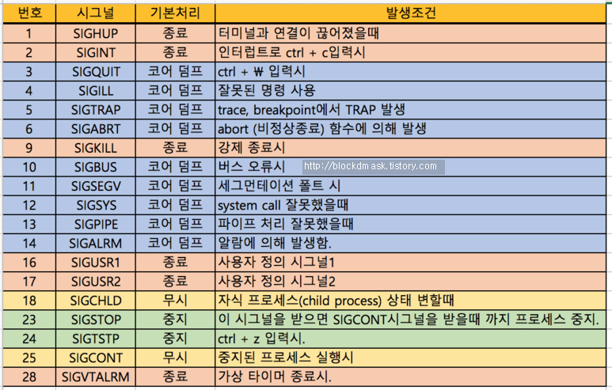

# 프로세스 관리의 개념과 유형

### 프로세스의 개념

- 프로세스는 CPU와 메모리를 할당받아 실행시키는 프로그램이다.
- 프로세스들마다 고유의 프로세스 ID(PID)를 할당받는다.
    - 가장 먼저 실행되는 프로세스는 init이다. init의 PID는 1이다.
    - 프로세스 init에 의해 다른 모든 프로세스들이 시작된다.

 

### 프로세스의 유형

1. 포그라운드 프로세스와 백그라운드 프로세스
    
    프로세스는 실행 형태에 따라 포그라운드(foreground) 프로세스와 백그라운드(background) 프로세스로 나뉜다.
    
    - 포그라운드(Foreground) 프로세스
        - 사용자와 상호 작용하는 프로세스
        - 터미널에 직접 연결되어 입출력을 주고받는 프로세스
        - 명령 입력 후 수행 종료까지 기다려야 하는 프로세스
        - 화면에서 실행되는 것이 보이는 프로세스
    - 백그라운드(Background) 프로세스
        - 사용자와 직접적인 대화를 하지 않고 뒤에서 실행되는 프로세스
        - 사용자의 입력에 관계없이 실행되는 프로세스
        - 실행은 되지만 화면에 나타나지 않고 실행되는 프로세스
        
2. fork()와 exec()
    
    사용자가 새로운 프로세스를 생성하기 위해 사용하는 시스템 호출 함수로는 fork()와 exec()가 있다.
    
    - fork() 함수
        - 새로운 프로세스를 만들 때 기존 프로세스를 복제하는 방식을 사용한다.
        - 새로운 프로세스를 위한 메모리를 할당한다.
        - 새로 생성된 프로세스는 원래의 프로세스와 똑같은 코드를 가지고 있다.
        - 원본 프로세스를 부모 프로세스라고 부르고, 새로 복제된 프로세스를 자식 프로세스라고 부른다.
    - exec() 함수
        - 호출하는 프로세스가 새로운 프로세스로 변경되는 방식이다.
        - 새로운 프로세스를 위한 메모리를 할당하지 않는다.
        - 호출한 프로세스의 메모리에 새로운 프로세스의 코드를 덮어씌워 버린다.
        - exec()를 호출한 프로세스가 아닌 exec()에 의해 호출된 프로세스만 메모리에 남게 된다.
        
3. 데몬(Daemon)
    - 리눅스 시스템이 부팅 시 자동으로 실행되는 백그라운드 프로세스이다.
    - 메모리에 상주하면서 사용자의 특정 요청이 오면 즉시 실행되는 대기 중인 서버 프로세스이다.
    - 주기적이고 지속적인 서비스 요청을 처리하기 위해 실행된다.
    - 사용자들은 이 프로세스들을 볼 수 있는 권한이 없다.
    - 리눅스에서 데몬을 실행하는 방법 세 가지
        - standalone 데몬
            - 서비스가 요청이 들어오기 전에 서비스가 메모리에 상주하는 단독 실행 방식
            - 독립적으로 수행되며 서비스 요청에 응답하기 위해 항상 메모리에 상주
            - 빠른 응답속도를 요하는 경우에 사용
            - 메모리에 항상 상주하므로 메모리 점유로 인한 서버 부하가 큼
            - 실행 스크립트 위치 : /etc/inetd.d
        - inetd 데몬(슈퍼 데몬)
            - ineitd는 다른 데몬들의 상위에 존재하는 standalone 데몬
            - ineitd는 자체적으로는 하나의 독립 데몬이지만 여러 가지 다른 서비스들을 제어하고 관리
            - 보안상의 이유로 리눅스 커널 2.4 버전부터 xinetd(extended inetd)가 inetd 역할을 수행
        - inetd 타입 데몬
            - inetd 타입 데몬들은 직접 서비스를 가동하지 못하고 inetd 데몬이 활성화가 되어야만 해당 서비스 제공
            - Telnet, FRP, rlogin과 같은 데몬들이 inetd 타입 데몬에 해당
            - inetd 서비스 요청이 종료되면 inetd 타입 데몬들도 자동으로 종료
            - 실행 스크르립트 파일 위치 : /etc/xindtd.d
            
    1. 시그널(Signal)
        - 시그널은 프로세스에게 이벤트 발생을 전달해주는 소프트웨어 인터럽트이다.
        - 시그널이 프로세스에게 전달될 때 발생하는 4가지 상황
            - SIG_IGN (SIG_PF)1   : 운영체제에 의해 시그널이 무시된다.
            - SIG_ERR (SIG_PF)-1  : 운영체제는 프로그램을 강제로 종료한다.
            - SIG_DFL (SIF_PF)0     : 지정한 시그널 처리 루틴을 실행한다.
            - SIG_HOLD (SIG_PF)2 : 시그널이 블로킹된다.
        - 시그널 리스트 확인 : kill -l
        - 지정된 이벤트의 시그널이 프로세스에 전달될 때 어떤 상황(기본 동작)이 발생하는지를 나타낸 표
        
        
        

---

참고 및 출처

[[UNIX] 시그널(Signal) 기본설명 및 함수 (tistory.com)](https://blockdmask.tistory.com/23)
