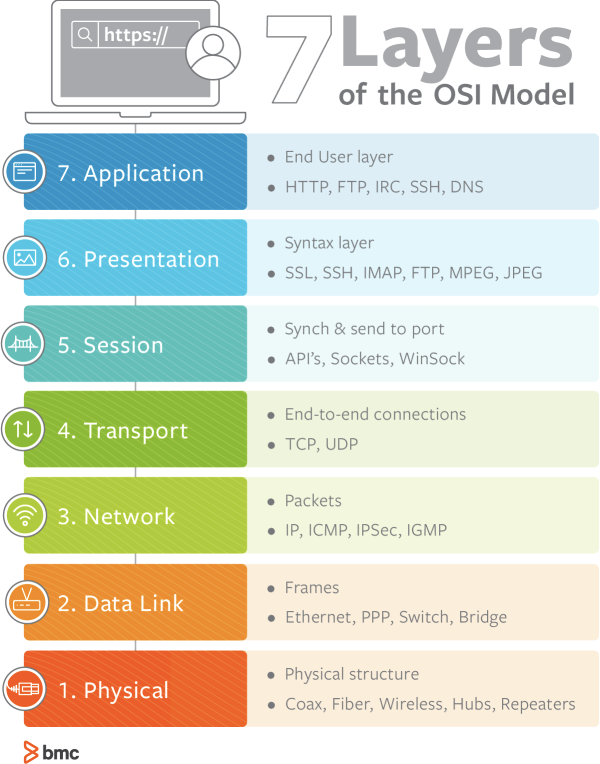
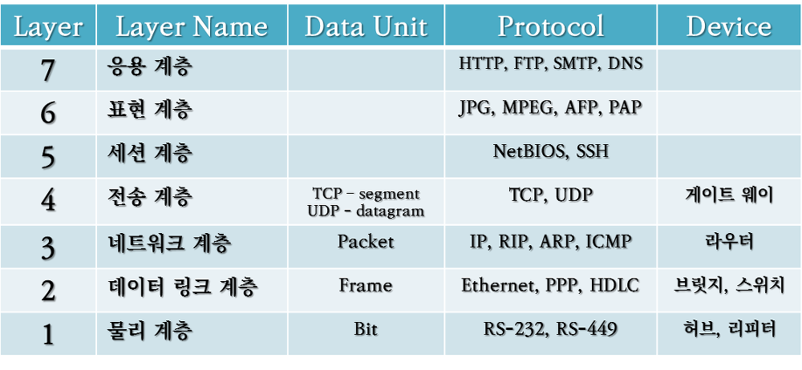

## 7. 애플리케이션 계층(Application Layer)

역할: 사용자/어플리케이션이 네트워크에 접근할 수 있도록 해줌

전송 단위: 메시지(Message)

**HTTP, FTP, IRC, SSH, SMTP, Telnet**
>- HTTP(HyperText Transfer Protocol, 80/tcp, 80/udp): W3 상에서 정보를 주고 받을 수 있는 프로토콜.
>- FTP(File Transfer Protocol, 21/tcp): tcp/ip 기반으로 서버와 클라이언트 사이의 파일 전송을 하기 위한 프로토콜.
>- IRC(Internet Relay Chat, 194/tcp): TCP 기반 실시간 인터넷 채팅 프로토콜. 디스코드의 하위버전이라고 생각하면 쉽다.
>- SSH(Secure Shell, 22/tcp): 네트워크 상의 다른 컴퓨터에 로그인하거나 원격 시스템에서 명령을 실행하고 다른 시스템으로 파일을 복사할 수 있도록 해 주는 응용 프로그램 또는 프로토콜.
>- Telnet(23/tcp): 인터넷이나 로컬 영역 네트워크 연결에 쓰이는 네트워크 프로토콜. 암호화되지 않은 텍스트 통신을 한다.
>- SMTP(Simple Mail Transfer Protocol, port 25/tcp): 인터넷에서 이메일을 보내기 위해 이용되는 프로토콜
>- POP3(Post Office Protocol Version3, port 110/tcp): 원격 서버로부터 이메일을 가져오는 프로토콜

## 6. 표현 계층(Presentation Layer)

운영체제의 한 부분.

역할: 입출력되는 데이터를 응용프로그램에 맞춰 변환 

→ 인코딩/디코딩, 암호화/복호화이 이루어진다.

전송 단위: 메시지(Message)

**SSL, SSH, IMAP, JPEG, MPEG, ASCII, JPG, GIF**
>- SSL(Secure Socket Layer)
>- SSH(Secure shell)
>- JPEG(Joint Photographic Experts Group)
>- MPEG(Moing Picture Experts Group)
>- GIF(Graphics Interchange Format)
>- ASCII(American Standard Code for Information Interchange)

## 5. 세션 계층

역할: 포트 기반으로 세션을 연결합니다.

→ 통신 장치간의 동기화, 오류복구

전송 단위: 메시지(Message)

**SSL, TLS, WinSock, API's, Sockets**
>- SSL(Secure Socket Layer)
>- TLS(Transfer Layer Security)
## 4. 전송 계층

통신을 활성화하기 위한 계층

역할: 패킷 생성&전송, 오류 제어

전송단위: TCP - Segment, UDP - Datagram

**TCP, UDP**
>- TCP(Transfer Control Protocol)
>- UDP(User Datagram Protocol)

## 3. 네트워크 계층

역할: 데이터를 목적지까지 가장 안전하고 빠르게 전달(라우팅), 주소부여(IP)

전송단위: 패킷(Packet)

**IP, IPsec, ICMP, IGMP, ARP**
>- IP(Internet Protocol)
>- ICMP(Internet Control Message Protocol): IP 프로토콜을 이용하여 오류 메시지를 전송하고 수신할 때 사용한다.
>- IGMP(Internet Group Management Protocol): 호스트 컴퓨터와 인접 라우터가 멀티캐스트 그룹 멤버십을 구성하는 데 사용되는 통신 프로토콜
>- ARP(Address Resolution Protocol): IP 주소를 물리적 네트워크 주소로 대응시키기 위해 사용되는 프로토콜

## 2. 데이터 링크 계층

역할: 정보의 오류와 흐름을 관리(오류 제어, 흐름 제어)

전송단위: 프레임(Frame)

**Ethernet, 브리지, 스위치, PPP, HDLC**
>- PPP(Point-to-Point Protocol): 두 통신 노드 간의 직접적인 연결을 위해 일반적으로 사용하는 프로토콜. 인증, 암호화를 통한 전송 및 데이터 압축 기능을 제공한다.
>- HDLC(Highlevel Data-Link Control): 컴퓨터 데이터 통신에 적합한 전송제어방식. 점대점, 다중점 링크에서 반이중, 전이중 통신을 모두 지원하도록 설계되었다.

## 1. 물리 계층

역할: 전기 데이터의 전송을 담당

전송단위: 비트(bit)

**통신 케이블, 리피터, 허브**

---

---
## 질문
### Q. OSI 7 layer를 나눈 이유는 무엇인가?

A. 통신이 일어나는 과정이 나눠져 있어 단계별로 파악할 수 있기 때문입니다.

파악하기 쉬우므로 그만큼 관리하기 쉽기 때문입니다.

(모듈화를 한 이유와 비슷함)
