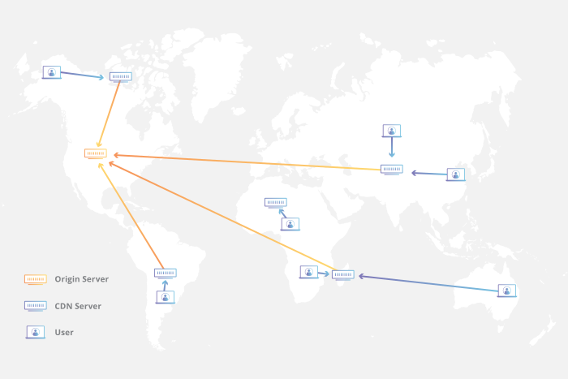

# CDN

### CDN(Contents Delivery Network)이란?

지리적 제약 없이 사용자에게 웹 콘텐츠를 빠르고 안전하게 전송할 수 있는 **콘텐츠 전송 기술**이다. 

- 서버와 사용자 사이의 물리적인 거리를 줄여 콘텐츠 로딩에 소요되는 시간을 최소화한다.
- 각 지역에 캐시 서버(**PoP**, Points of presence)를 **분산 배치**해, 최종 사용자의 요청에 원본 서버가 아닌 캐시 서버가 콘텐츠를 전달한다.

→ 네트워크 엣지에서 콘텐츠를 캐싱하여 웹사이트 성능을 개선한다.

 

: Edge Cloud란?

네트워크의 디바이스에게 컴퓨팅 파워를 분산해주는 기술 구조이다.

중앙의 Cloud에선 대용량/고성능 처리가 필요한 작업을 하고, Edge에서는 초저지연/초연결이 필요한 작업을 수행한다.

 

### CDN의 작동

- 속도와 연결을 위해 다양한 IXP에 서버를 배치한다.
    - IXP는 인터넷 서비스 제공자간의 인터넷 트래픽을 상호 액세스하기 위한 인터넷 연동 서비스이다.
- 표준 클라이언트/ 서버 데이터 전송을 최적화한다.

 

### CDN의 장점

1. 웹사이트 로딩 시간 개선
    - 가장 가까운 CDN 서버를 사용하여 콘텐츠를 제공하므로 페이지 로딩 시간이 빨라진다.
2. 대역폭 비용 절감
    - 캐싱과 기타 최적화를 사용하여 원본 서버가 제공해야 하는 데이터 양을 줄이고 웹사이트 소유자의 호스팅 비용을 줄일 수 있다. (원본 서버가 요청에 응답할 때마다 대역폭이 소비된다.)
3. 콘텐츠 가용성 및 이중화
    - CDN은 분산되어 있어 다수의 원본 서버보다 더 많은 트래픽을 처리하고 하드웨어 장애를 견딜 수 있다.
4. 웹사이트 보안 개선
    - DDoS 완화, 보안 인증 개선, 기타 최적화를 제공한다. (TLS/SSL 인증)
    

 

### CDN을 사용하는 경우

세계적으로 인터넷을 통한 비즈니스를 운영하거나 그래픽 이미지, 동영상 파일 등의 콘텐츠를 웹사이트에서 제공한다면 CDN 서비스가 필요하다.

활용 사례 → Netflix, Airbnb, Facebook, 해외 서비스를 지원하는 각종 게임 회사

 

---

출처 및 참고

[What is a CDN? | How do CDNs work? | Cloudflare](https://www.cloudflare.com/ko-kr/learning/cdn/what-is-a-cdn/)

[[클라우드 이해] CDN이란? | 가비아 라이브러리 (gabia.com)](https://library.gabia.com/contents/infrahosting/8985/)
