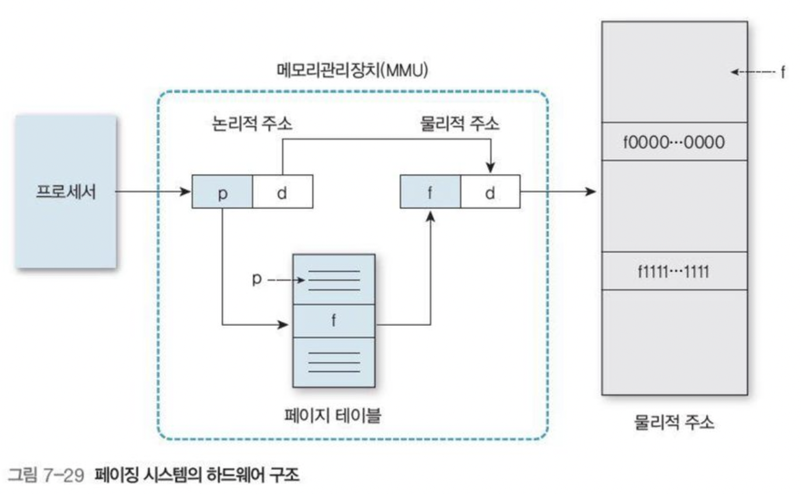
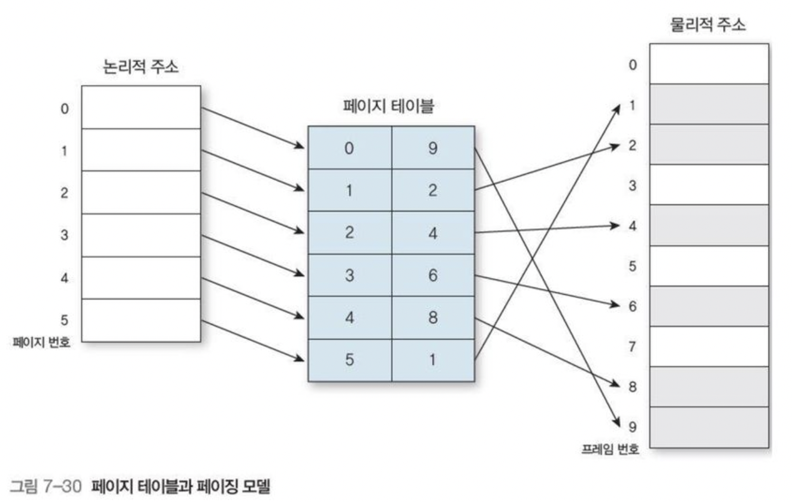
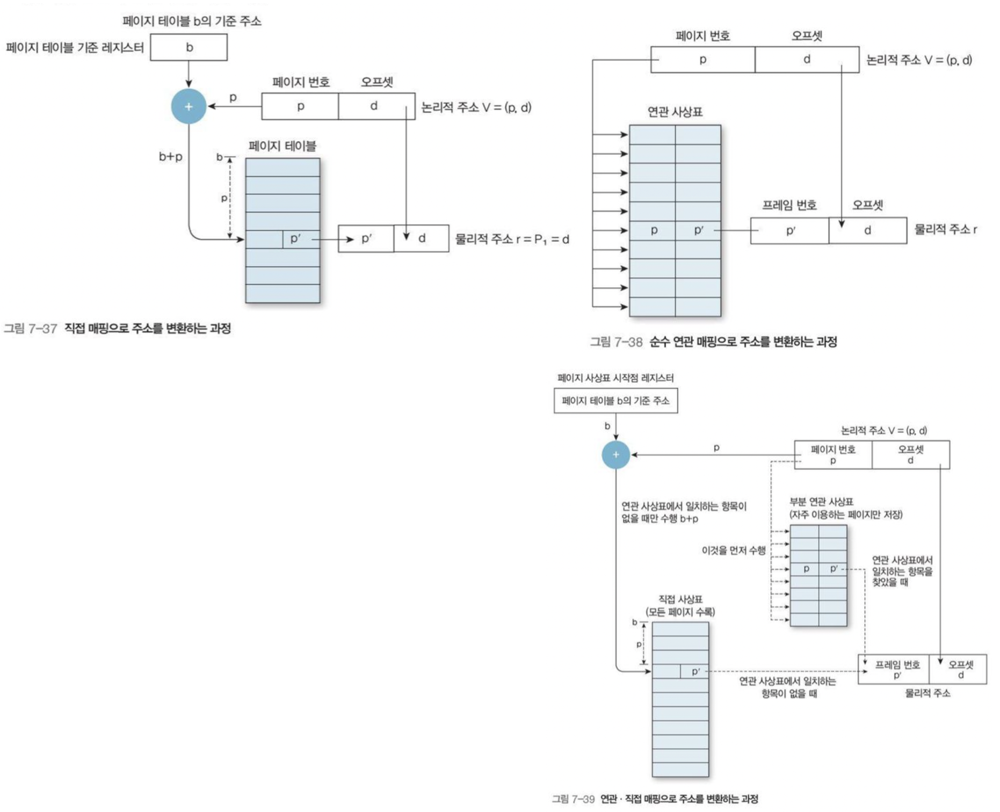
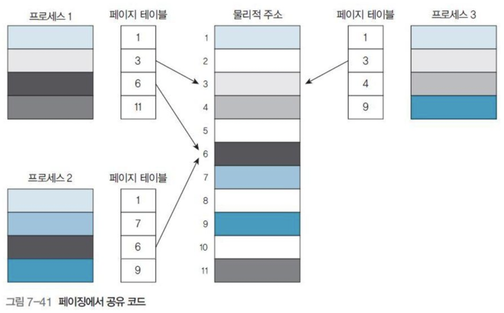

# 분산 메모리 할당

> = 비연속 메모리 할당

분산 메모리 할당 방법은 **페이징 기법**과 **세그먼테이션** 기법, **페이지화된 세그먼테이션** 기법의 3가지 종류가 있다.

- 외부 단편화를 해결할 수 있다.
- 내부 단편화를 최소화할 수 있다.

# 페이징

**프로세스를 크기가 동일한 페이지로 나누고**

**메인 메모리도 고정 크기 블록**(= **프레임 = 페이지 프레임**)으로 **나눠서** 

**프레임에 페이지를 적재**하는 방법

- (장점) 외부 단편화가 발생하지 않는다.

- 마지막 페이지에 할당된 페이지가 프레임 크기에 완전히 차지 않을 경우, 내부 단편화가 발생한다.
    - 내부 단편화를 최소화 하려면 페이지 크기를 작게 하면 되지만 페이지 테이블 유지가 부담된다.

- 페이지 테이블이 필요하다.
    - 메모리의 **빈 프레임을 조사**하여 프로세스를 적재할 위치를 파악한다.
    - 프로세스의 페이지를 빈 프레임에 적재하도록 준비한다.
    - 프로세스에 필요한 페이지를 결정하여 페이지 번호를 부여한다.

## 페이징 원리

### 페이지 테이블(= 페이지 맵 테이블, PMT, Page Map Table)

  

- **논리적 주소를 물리적 주소로 변환**한다.

    - 논리적 주소는 페이지 번호 p와 변위(offset) d로 구성된다.
    - 페이지 번호 p를 테이블의 index로 사용하여 p 위치에 저장된 f값을 얻는다.
      - f는 메모리의 페이지 기준 주소(= 메인 메모리의 프레임 번호)가 된다.
    - 기준 주소 f + 오프셋 d = 메인 메모리의 물리적 주소

- 별도의 레지스터에 구성되거나 메인 메모리에 배치된다.

- 페이지 테이블은 **페이지 번호(페이지의 논리적 주소)** 와 **페이지 프레임 주소(물리적 주소)** 를 가지고 있다.

    

      
    

## 다중 단계 페이징 시스템

논리적 주소가 클수록 물리적 주소로 변환하는 과정에서 필요한 페이지 테이블 크기도 증가하므로

메모리에 더 큰 적재 공간이 필요하다. ⇒ 메모리 낭비

이 문제는 실제 참조할 페이지가 있는 영역에서만 단계별(n단계) 페이지 테이블을 설정하는 페이징 시스템을 구성하여 해결할 수 있다.

## 페이지 테이블의 구현

페이지 테이블은 크기가 매우 커서 어떻게 관리하느냐가 중요하다.

페이지 테이블은 크기가 커서 레지스터로 구현하기 적합하지 않다.(레지스터가 비싸기 때문)

**페이지 테이블은 메모리**에 두고 **페이지 테이블 기준 레지스터(PTBR, Page Table Base Register)은 페이지 테이블을 가리킨다.**

- (이 구조의 장점) 다른 페이지 테이블을 사용하려면 레지스터 값만 바꾸면 되므로 **문맥 교환 시간이 줄어든다.**
- (이 구조의 단점) 페이지 번호와 실제 물리적 주소를 위한 2번의 메모리 액세스가 필요하므로 **메모리 액세스 시간이 길어 속도가 느려진다.**

PTBR 사용의 단점은 **연관 레지스터** 또는 **변환 우선참조 버퍼(TLB, Translation Look-aside Buffer)** 로 해결할 수 있다.

## 연관 레지스터를 이용한 해결 방법

연관 레지스터를 3가지 방법을 통해 논리적 주소를 물리적 주소로 변환한다.

- 직접 매핑 주소 변환
- 연관 매핑 주소 변환
- 연관·직접 매핑을 결합한 주소 변환

### 직접 매핑(direct mapping)으로 주소 변환

메모리나 캐시에 페이지 테이블을 유지한다.

페이지 테이블은 메모리에 두고 페이지 테이블 기준 레지스터(PTBR, Page Table Base Register)은 페이지 테이블을 가리킨다. 

(위에서 말한 페이지 테이블 구현 방법)

### 연관 매핑(associative mapping)으로 주소 변환

PTBR 없이 페이지 테이블을 연관 레지스터에 넣는다. 

페이지 주소와 프레임 주소를 키와 값으로 연관시킨다.

- 속도가 매우 빠르나 하드웨어가 매우 비싸다.

### 연관·직접 매핑을 결합한 주소 변환

최근 사용한 페이지만 연관 레지스터에 유지하고

연관 레지스터에 해당 페이지가 없을 때만 직접 매핑을 한다.

- 메모리의 '지역성'을 적절히 활용한다.

  

## 공유 페이지

페이징 시스템은 시분할 환경에서 공통적으로 사용되는 코드(**공유 코드**)를 공유할 수 있다.

공유 코드로 메모리 낭비를 줄일 수 있다.

### 공유 코드

- = 재진입 코드(reentrant code) = 순수 코드(pure code)
    - 재진입을 허용한다.
    - 오직 읽을 수만 있고 수정할 수 없다.
- 공유 라이브러리 코드에도 활용된다.
- 모든 프로세스에서 공유코드의논리적 주소 공간은 동일한 물리적 주소로 매핑된다.

  

